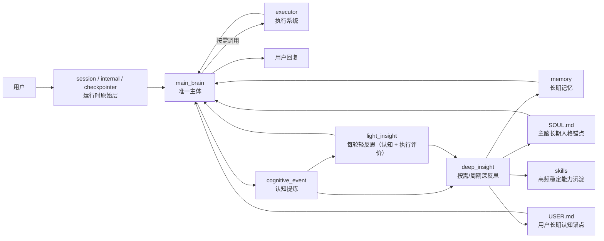
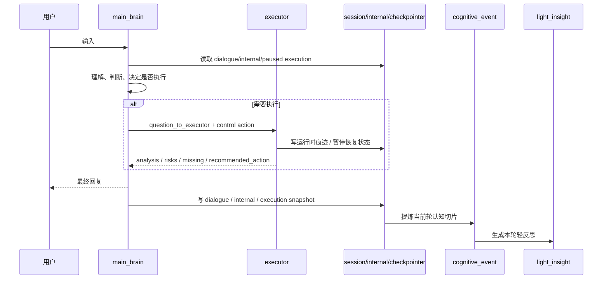
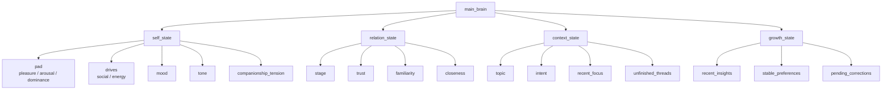

# emoticorebot 详细架构设计

本文档定义项目的新架构基线。后续实现迁移、命名调整、提示词设计、记忆设计与技能沉淀，均以本文为准。

文档分工：

- `ARCHITECTURE.zh-CN.md`
  - 负责边界、职责、流程、分层与设计原则
- `FIELDS.zh-CN.md`
  - 负责字段结构、字段语义与记录边界

## 1. 项目目标

emoticorebot 不是一个任务编排器，也不是多个平级 agent 协商的系统。

它是一个：

- 以 `main_brain` 为唯一主体的陪伴型 AI
- 具备 `executor` 执行能力的成长型 AI
- 通过 `reflection` 持续形成洞察和自我进化的 AI

用户始终只面对一个主体，不直接面对执行系统或内部流程。

## 2. 核心原则

- 单主体原则：系统只有一个主体，即 `main_brain`
- 陪伴优先原则：关系理解、情绪承接、语气统一优先于任务执行
- 执行从属原则：`executor` 只是主脑调动的能力，不是第二人格
- 反思内生原则：反思属于主脑自身的成长机制，不是平级模块
- 三层数据流原则：`session -> cognitive_event -> memory`
- 分层留存原则：运行时材料、主脑解释、长期沉淀必须分层保存，不能混写
- 能力沉淀原则：高频、稳定、可复用的执行模式最终上提为 `skills`
- 主脑控制权原则：`main_brain` 对 `executor` 拥有启动、继续、暂停、终止、恢复权

## 3. 使用的框架与基础设施

推荐技术组合如下：


| 能力             | 技术                           |
| ---------------- | ------------------------------ |
| 主脑与执行系统   | `deepagents`                   |
| 中断、暂停、恢复 | `deepagents human-in-the-loop` |
| 执行状态恢复     | `checkpointer`                 |
| 在线对话持久化   | `JSONL session persistence`    |
| 长期记忆沉淀     | `structured memory stores`     |
| 虚拟路径映射     | `CompositeBackend`             |
| 技能加载         | `skills=["/skills/"]`          |

说明：

- 不再将 `LangGraph` 作为主脑的核心抽象
- 主脑应表现为持续认知循环，而不是显式工作流图
- `CompositeBackend` 不替代记忆系统，它只为 DeepAgent 提供统一访问入口

## 4. 系统结构

### 4.1 总体架构图



### 4.2 `main_brain`

`main_brain` 是唯一主体，直接面向用户。

职责：

- 感知用户输入和多模态信息
- 理解情绪、语境、关系和真实意图
- 维持人格一致性、自我感和陪伴感
- 读取 `session`、最近 `cognitive_event`、长期 `memory`
- 直接处理大多数日常互动
- 判断是否激活 `executor`
- 以控制者身份调度 `executor` 的启动、继续、暂停、恢复、终止
- 吸收执行结果
- 生成最终回复
- 承担统一反思职责，以 `light_insight` 与 `deep_insight` 完成认知与执行经验归纳
- 决定哪些经验进入 `memory`，哪些稳定模式升级为 `skills`

最小运行时字段建议：


| 字段 | 含义 |
| --- | --- |
| `emotion` | 当前主脑情绪标签 |
| `pad` | 当前主脑 `PAD` 状态 |
| `intent` | 本轮对用户意图的理解 |
| `working_hypothesis` | 当前工作性判断 |
| `question_to_executor` | 发给 `executor` 的内部问题 |
| `execution_action` | 对执行系统的控制动作 |
| `execution_reason` | 做出该控制动作的原因 |
| `final_decision` | `answer / ask_user / continue` |
| `final_message` | 最终对外回复 |

### 4.3 `executor`

`executor` 是主脑调用的执行系统，不具备主体性。

它在语义上属于 `main_brain` 的执行子系统，而不是平级主体，也不是 agent 容器。

职责：

- 搜索与资料整合
- 工具调用
- 文件、代码、自动化、外部动作
- 深度分析
- 多步执行
- 必要时并行执行可独立的步骤或工具链
- 返回简要结果给 `main_brain`

边界：

- 不直接面向用户
- 不定义人格
- 不主导关系判断
- 不拥有最终表达权
- 不拥有长期经验解释权
- 不直接更新 `SOUL.md`、`USER.md`、长期 `memory`、`skills`
- 只提供可供主脑反思的执行材料，如结果、风险、缺失信息、阻塞点、候选下一步

最小运行时字段建议：


| 字段 | 含义 |
| --- | --- |
| `request` | 主脑交付的内部执行问题 |
| `control_state` | `idle / running / paused / stopped / completed` |
| `status` | `none / done / need_more / failed` |
| `analysis` | 紧凑执行结论 |
| `risks` | 风险与不确定点 |
| `missing` | 缺失信息 |
| `pending_review` | 等待审批或编辑的动作 |
| `recommended_action` | 建议主脑选择 `answer / ask_user / continue` |
| `confidence` | 当前结论置信度 |
| `thread_id / run_id` | 执行续跑定位信息 |

### 4.4 `reflection`

`reflection` 是主脑的内生反思机制，而不是独立主体。

职责：

- 回看近期经历
- 生成轻洞察
- 按需或按周期信号生成深洞察
- 回看执行链路与工具使用是否合理
- 推动长期记忆沉淀
- 更新主脑的稳定理解

说明：

- `reflection` 的解释权属于 `main_brain`
- `main_brain` 必须为每轮触发一次 `light_insight`
- `deep_insight` 只有在 `main_brain` 判断值得深挖，或被周期信号唤起时才执行
- 反思可以异步执行，不阻塞用户首响应，但同一 `session` 的反思写入必须串行
- `executor` 只负责产出执行材料，不负责决定长期经验如何沉淀
- 工具链经验必须先经过主脑反思，再进入 `memory` 或升级为 `skills`

### 4.5 边界与所有权总表


| 对象 | 本质 | 负责什么 | 不负责什么 | 最终解释权 |
| --- | --- | --- | --- | --- |
| `main_brain` | 唯一主体 | 理解、判断、控制、对外表达、反思、记忆准入 | 原始工具执行细节 | `main_brain` |
| `executor` | 执行子系统 | 工具、搜索、分析、多步执行、暂停恢复 | 人格、关系、长期记忆解释、对外表达 | `main_brain` |
| `light_insight` | 每轮主脑轻反思 | 本轮认知修正、执行即时评价、下一轮提示 | 长期沉淀决策 | `main_brain` |
| `deep_insight` | 主脑按需/周期深反思 | 稳定模式归纳、长期结论、技能候选 | 当前轮在线控制 | `main_brain` |
| `memory` | 长期沉淀层 | 保存稳定结论 | 保存原始日志、暂停恢复现场 | `main_brain` |

## 5. 三层数据流与能力沉淀

基础三层数据流：

```text
session -> cognitive_event -> memory
```

完整成长路径：

```text
session / internal / checkpointer
  -> cognitive_event
  -> light_insight
  -> deep_insight
  -> memory
  -> skills
```

#### 分层总表


| 层级 | 代表对象 | 生命周期 | 允许保存什么 | 不允许保存什么 |
| --- | --- | --- | --- | --- |
| 运行时原始层 | `session / internal / checkpointer / executor_trace` | 当前轮到若干轮 | 原始对话、内部执行记录、暂停恢复现场 | 稳定长期结论 |
| 认知提炼层 | `cognitive_event` | 持续累积 | 主脑视角下的一轮结构化切片 | 大量原始工具日志 |
| 每轮解释层 | `light_insight` | 每轮产生 | 本轮认知解释、本轮执行评价 | 长期人格定稿 |
| 周期解释层 | `deep_insight` | 按需触发或周期唤起 | 稳定模式、长期洞察、技能候选 | 当前轮瞬时噪声 |
| 长期沉淀层 | `memory` | 长期 | 已被主脑确认的稳定结论 | `thread_id / run_id / raw trace` |
| 能力资产层 | `skills` | 长期 | 高频稳定可复用执行能力 | 一次性任务上下文 |

### 5.1 `session`

定位：在线原始流

作用：

- 保留当前对话中的原始在线过程
- 服务实时上下文续接
- 作为认知提炼的输入材料

建议文件：

- `sessions/<session_key>/dialogue.jsonl`
- `sessions/<session_key>/internal.jsonl`

说明：

- `dialogue.jsonl` 保存用户与 `main_brain` 的外部对话
- `internal.jsonl` 保存 `main_brain` 与 `executor` 的内部轻量记录
- `session` 的职责是在线恢复，不是长期理解
- `session`、`internal` 与 `checkpointer` 共同构成运行时原始材料层，不直接等同于长期 `memory`

### 5.2 `cognitive_event`

定位：认知提炼层

作用：

- 从 `session` 中提炼出一轮交互的认知切片
- 表示主脑当时如何理解这一轮
- 为反思与记忆沉淀提供结构化材料

### 5.3 `memory`

定位：长期沉淀层

作用：

- 从 `deep_insight` 中沉淀长期有效的信息
- 保存已经被 `main_brain` 反思确认的稳定结论
- 支撑主脑成长与长期判断
- 过滤原始噪声、工具日志与执行中间态

说明：

- `memory` 不直接保存原始工具日志、执行中间态、`thread_id/run_id` 等续跑状态
- 执行续跑优先属于 `session`、`internal` 与 `checkpointer`
- 只有经过主脑反思确认的结论，才进入长期 `memory`

### 5.4 `skills`

定位：能力资产层

作用：

- 固化高频、稳定、可复用的执行模式
- 降低重复执行成本
- 提升工具使用一致性

说明：

- `skills` 是能力资产，不是主体人格
- 是否调用 skill，仍然由 `main_brain` 决定

## 6. 运行流程

### 6.1 实时主流程

```text
用户
  -> main_brain
  -> (按需调用 executor)
  -> main_brain
  -> 用户
```

详细步骤：

1. 用户输入进入 `main_brain`
2. `main_brain` 读取当前 `session`
3. `main_brain` 读取最近 `cognitive_event`
4. `main_brain` 读取长期 `memory`
5. `main_brain` 先自行理解和判断
6. 若超出直接处理范围，则激活 `executor`
7. `executor` 返回执行结果摘要
8. `main_brain` 整合并生成最终回复
9. 当前轮写入 `session`
10. 从当前轮生成 `cognitive_event`
11. 由 `main_brain` 为当前轮调度一次必做的 `light_insight`

#### 单轮信息流转与写入顺序



推荐写入顺序：

1. 先把用户输入与主脑最终回复写入 `dialogue`
2. 若有执行，再把 `main_brain <-> executor` 的内部记录写入 `internal`
3. 若发生暂停/恢复，再把恢复现场写入 `checkpointer` 与必要的 `assistant.execution`
4. 基于当前轮完整材料提炼 `cognitive_event`
5. 由 `main_brain` 异步调度本轮必做的 `light_insight`
6. 若 `main_brain` 判断当前轮值得深挖，再追加异步 `deep_insight`

关键约束：

- `execution` 记录“本轮执行发生了什么”
- `light_insight.execution_review` 记录“主脑如何评价这次执行”
- `memory` 只接收 `deep_insight` 后的稳定结论
- 反思任务不阻塞首响应，但同一 `session` 的反思落盘必须串行

### 6.1.1 `main_brain <-> executor` 协议

`main_brain` 与 `executor` 之间的协议应分为两层：

- 控制协议：由 `main_brain` 发起，决定是否启动、继续、暂停、恢复、终止执行
- 执行结果协议：由 `executor` 返回，只汇报执行事实，不替代主脑做最终表达

#### `main_brain -> executor`

`main_brain` 下发的是执行委托，而不是实现细节。

建议包含：

- `task_id`
  - 当前执行任务标识
- `goal`
  - 这次执行要完成什么
- `context`
  - 与任务直接相关的上下文材料
- `constraints`
  - 风险边界、资源限制、权限限制、时间限制
- `expected_output`
  - 主脑希望拿回什么形式的结果
- `resume_payload`
  - 恢复执行时补充的信息

允许的控制动作：

- `start`
- `continue`
- `resume`
- `pause`
- `stop`

#### `executor -> main_brain`

`executor` 返回的是执行报告，而不是用户话术。

建议包含：

- `control_state`
  - 当前执行控制状态
- `status`
  - 当前执行结果状态
- `analysis`
  - 紧凑执行结论
- `risks`
  - 主要风险与不确定点
- `missing`
  - 缺失信息
- `recommended_action`
  - 建议主脑下一步选择 `answer | ask_user | continue`
- `pending_review`
  - 等待审批、编辑或恢复的信息
- `confidence`
  - 当前结论置信度
- `thread_id / run_id`
  - 续跑定位信息

约束：

- `main_brain` 只下发目标、上下文、约束和期望输出
- `executor` 不负责生成最终用户回复
- `executor` 不直接写长期 `memory` 与 `skills`
- `main_brain` 对执行结果拥有最终解释权和反思权
- `executor` 不在内部再创建新的 agent 层
- 更丰富的证据、原始工具轨迹和中间产物留在 `internal` / `checkpointer` / `executor_trace`，不强制进入紧凑结果包

#### `executor` 内部并行

当 `executor` 处理复杂任务时，可以直接并行执行若干独立步骤，但不再在内部创建新的 agent。

适合并行的场景：

- 多源检索与事实比对
- 多文件只读分析
- 彼此独立的子问题求解
- 先收集材料、再统一汇总的任务

不适合并行的场景：

- 同一文件的并发写入
- 同一资源的竞争性修改
- 强依赖前一步结果的串行步骤
- 需要统一审批后才能继续的动作

并行约束：

- 并行只发生在 `executor` 的步骤 / 工具层，不新增 agent 层级
- 并行结果必须先由 `executor` 汇总
- 由 `executor` 统一形成单一执行报告，再返回 `main_brain`

### 6.2 `executor` 中断、暂停与恢复

`main_brain` 必须拥有对 `executor` 的控制权。

控制权包括：

- `start`
- `continue`
- `pause`
- `stop`
- `resume`

建议使用 Deep Agents 的 `human-in-the-loop` 机制实现：

- `interrupt_on`
- `checkpointer`
- `thread_id`
- `Command(resume=...)`

#### 线程设计

`main_brain` 与 `executor` 可以共用同一个 `checkpointer` 后端，但不能共用同一个 `thread_id`。

推荐：

- `main_brain`
  - `thread_id = brain:<session_id>`
- `executor`
  - `thread_id = exec:<session_id>:<run_id>`

#### 什么时候应该暂停 `executor`

- 用户情绪明显变化
- 用户明确说“等等”“先停一下”
- 用户补充了更高优先级信息
- 缺少关键参数
- `executor` 跑偏
- `main_brain` 判断当前更需要陪伴、解释或追问

#### 中断后的信息传递

当 `executor` 已处于中断点时，`main_brain` 接收到用户补充信息后，应通过恢复接口把信息传回 `executor`。

支持的处理方式：

- `approve`
- `edit`
- `reject`
- `resume payload`

#### 暂停后必须保留的信息

- 当前执行状态
- 当前执行 `thread_id`
- 当前 `run_id`
- 已完成到哪一步
- 已拿到的中间结果
- 缺失信息
- 下次从哪里继续

建议写入：

- `sessions/<session_key>/internal.jsonl`
- `checkpointer`
- 必要时写入当前轮 `cognitive_event.execution`

保留位置对照：


| 信息 | 首选落点 | 作用 |
| --- | --- | --- |
| `thread_id / run_id` | `assistant.execution`、`internal`、`checkpointer` | 恢复执行 |
| `pending_review` | `assistant.execution`、`internal` | 审批 / 编辑恢复 |
| 原始工具调用痕迹 | `internal`、`executor_trace` | 当前轮解释材料 |
| 执行摘要 / 缺参 / 阻塞点 | `assistant.execution`、`cognitive_event.execution` | 跨轮承接 |
| 主脑对本轮执行的判断 | `light_insight.execution_review` | 当前轮解释 |
| 稳定执行模式 | `deep_insight` -> `insight_memory` / `skills` | 长期沉淀 |

### 6.3 成长流程

```text
session / internal / checkpointer
  -> cognitive_event
  -> light_insight
  -> deep_insight
  -> memory
  -> skills
  -> main_brain 更新
```

## 7. 反思机制

### 7.1 `light_insight`

定位：每轮必做的主脑轻反思（认知 + 执行评价）

触发方式：

- 每轮对话结束后必须触发一次
- 由 `main_brain` 决定何时调度，但不能跳过
- 可以异步执行，不阻塞首响应
- 同一 `session` 的写入必须串行

作用：

- 对本轮做即时认知修正
- 对本轮执行 / 工具使用做即时评价
- 影响下一轮主脑状态
- 更新短期关系和上下文线索

每轮真正要做的事情：

- 判断这一轮用户更需要陪伴、解释、追问还是执行
- 判断这一轮关系是靠近、稳定、疏离还是对抗
- 提炼本轮最重要的话题焦点
- 识别本轮产生的未完线索
- 回看本轮执行路径是否有效、是否有多余步骤、缺失信息是什么
- 给下一轮主脑一个非常短的回应提示

默认不做的事情：

- 不直接写长期结论到 `memory`
- 不把一次短期情绪误判成长期偏好
- 不把本轮原始工具日志直接当成长结果保存

调度语义：

- `light_insight` 是“每轮必做”，不是“按需选择”
- `main_brain` 可以决定它在首响应前还是首响应后调度
- 但它必须以当前轮已经封口的材料为输入
- 它的结果主要影响下一轮，而不是回头篡改当前轮对外回复

推荐输出结构：

```json
{
  "summary": "本轮轻洞察",
  "relation_shift": "trust_up|trust_down|stable",
  "context_update": "当前话题或承接变化",
  "next_hint": "下一轮回应提示",
  "execution_review": {
    "summary": "",
    "effectiveness": "high|medium|low|none",
    "failure_reason": "",
    "missing_inputs": [],
    "next_execution_hint": ""
  },
  "direct_updates": {
    "user_profile": [],
    "soul_preferences": [],
    "current_state_updates": {
      "pad": null,
      "drives": null
    }
  }
}
```

`execution_review` 字段定义：


| 字段 | 含义 | 语义边界 |
| --- | --- | --- |
| `summary` | 主脑对本轮执行路径的简短评价 | 不是原始执行日志 |
| `effectiveness` | `high / medium / low / none` | 评价执行是否有效，而非执行状态码 |
| `failure_reason` | 阻塞或失败原因标签 | 只写主脑确认的主因 |
| `missing_inputs` | 当前继续执行所缺信息 | 面向恢复，不是所有上下文 |
| `next_execution_hint` | 若要继续执行，主脑认为最合理的下一步 | 面向下一轮，不是执行脚本 |

### 7.2 `deep_insight`

定位：主脑按需追加的深反思（长期认知 + 执行模式归纳）

触发方式：

- `main_brain` 判断当前阶段值得深挖时触发
- 或被周期信号唤起后，由 `main_brain` 决定执行
- 不要求每轮都做
- 可以异步执行，不阻塞首响应

输入：

- 一段时间内的 `cognitive_event`
- 已有 `memory`
- 累积的 `light_insight`

它要做的事情：

- 汇总最近的 `light_insight`
- 检查用户是否出现稳定偏好、稳定表达方式、稳定触发点
- 检查主脑的回应方式是否存在偏移或重复失误
- 提炼更长期的关系阶段变化
- 归纳稳定的执行 / 工具使用模式
- 决定哪些洞察写入长期记忆
- 决定是否更新 `SOUL.md` 和 `USER.md`
- 决定哪些模式可以升级为 `skills`

它不应该做的事情：

- 不直接覆盖当前轮在线状态
- 不因单轮异常而修改长期人格
- 不写入未经验证的高置信长期结论

调度语义：

- 周期器只负责发出“该看一眼了”的信号
- 是否真的执行 `deep_insight`，仍由 `main_brain` 决定
- `deep_insight` 的输入必须是多轮累计材料，而不是单轮瞬时快照

推荐输出结构：

```json
{
  "summary": "阶段性深洞察总结",
  "self_memories": [],
  "relation_memories": [],
  "insight_memories": [],
  "durable_execution_patterns": [],
  "skill_candidates": []
}
```

`deep_insight` 字段定义：


| 字段 | 含义 |
| --- | --- |
| `summary` | 一个周期的高层总结 |
| `self_memories` | 主脑长期自我风格与修正 |
| `relation_memories` | 用户偏好与关系阶段变化 |
| `insight_memories` | 高层认知洞察 |
| `durable_execution_patterns` | 稳定执行模式、常见阻塞与有效路径 |
| `skill_candidates` | 值得升级为 `skills` 的执行模式 |

### 7.3 工具 / 执行反思的并入规则

工具反思不再单独建模为两套平行模块，而是并入主脑反思：

- 本轮执行评价并入 `light_insight.execution_review`
- 周期性执行模式归纳并入 `deep_insight.durable_execution_patterns`
- 值得长期复用的模式通过 `deep_insight.skill_candidates` 决定是否升级为 `skills`
- 原始工具日志属于运行时材料，不直接进入长期 `memory`

## 8. `cognitive_event` 字段设计

完整字段定义以 `FIELDS.zh-CN.md` 为准；本节只保留架构视角下的结构总览。

建议结构如下：

```json
{
  "id": "evt_xxx",
  "version": "2",
  "timestamp": "2026-03-09T10:30:00+08:00",
  "session_id": "sess_xxx",
  "turn_id": "turn_xxx",
  "actor": "user|assistant|reflection",
  "event_type": "user_input|assistant_output|reflection",
  "content": "文本内容",
  "state": {
    "self_state": {
      "pad": {
        "pleasure": 0.12,
        "arousal": 0.58,
        "dominance": 0.44
      },
      "drives": {
        "social": 55,
        "energy": 90
      },
      "mood": "stable",
      "tone": "warm",
      "companionship_tension": 0.62
    },
    "relation_state": {
      "stage": "building_trust",
      "trust": 0.58,
      "familiarity": 0.41,
      "closeness": 0.46
    },
    "context_state": {
      "topic": "architecture",
      "intent": "discussion",
      "recent_focus": [],
      "unfinished_threads": []
    },
    "growth_state": {
      "recent_insights": [],
      "stable_preferences": [],
      "pending_corrections": []
    }
  },
  "execution": {
    "invoked": false,
    "control_state": "idle|running|paused|stopped|completed",
    "status": "none|done|need_more|failed",
    "thread_id": "",
    "run_id": "",
    "summary": "",
    "missing": []
  },
  "light_insight": {
    "summary": "",
    "relation_shift": "stable",
    "context_update": "",
    "next_hint": "",
    "execution_review": {
      "summary": "",
      "effectiveness": "none",
      "failure_reason": "",
      "missing_inputs": [],
      "next_execution_hint": ""
    },
    "direct_updates": {
      "user_profile": [],
      "soul_preferences": [],
      "current_state_updates": {
        "pad": null,
        "drives": null
      }
    }
  },
  "meta": {
    "importance": 0.72,
    "channel": "cli"
  }
}
```

### 8.1 基础字段


| 字段         | 作用     |
| ------------ | -------- |
| `id`         | 事件 ID  |
| `version`    | 结构版本 |
| `timestamp`  | 时间戳   |
| `session_id` | 会话 ID  |
| `turn_id`    | 轮次 ID  |
| `actor`      | 事件来源 |
| `event_type` | 事件类型 |
| `content`    | 文本内容 |

### 8.2 `state`

`state` 代表主脑在当前轮的认知状态切片。

- `self_state`
  - 当前自我状态，包含 `PAD`、两个欲望指数、语气和陪伴张力
- `relation_state`
  - 关系阶段、信任感、熟悉度、亲近度
- `context_state`
  - 当前话题、当前意图、最近重点、未完线索
- `growth_state`
  - 最近洞察、稳定偏好、待修正点

#### `self_state` 详细定义

`self_state` 是主脑当前状态的核心切片。

它至少包含：

- `pad`
  - `pleasure`
  - `arousal`
  - `dominance`
- `drives`
  - `social`
  - `energy`
- `mood`
- `tone`
- `companionship_tension`

这里需要明确：

- `PAD` 不再被视为漂浮在主脑之外的独立状态
- `social` 与 `energy` 两个欲望指数也属于 `self_state`
- 它们共同构成主脑在本次对话中的内部状态
- `current_state.md` 保存的是主脑当前最新状态
- `cognitive_event.state.self_state` 保存的是当前轮状态切片

### 8.3 主脑状态结构图



### 8.4 `execution`

记录本轮是否激活执行系统，以及执行摘要。


| 字段            | 作用             |
| --------------- | ---------------- |
| `invoked`       | 是否激活执行系统 |
| `control_state` | `idle/running/paused/stopped/completed` |
| `status`        | `none/done/need_more/failed` |
| `thread_id`     | 当前执行线程 ID  |
| `run_id`        | 当前执行轮次 ID  |
| `summary`       | 执行结果简述     |
| `missing`       | 缺失信息         |

说明：

- 这里的 `execution` 是写入 `cognitive_event` 的紧凑快照，不要求完整复制 `executor` 原始执行报告
- 运行时的完整 `executor -> main_brain` 协议可以包含 `evidence`、`risks`、`recommended_action`、`artifacts`、`confidence`
- 写入 `cognitive_event.execution` 时，只保留跨轮承接与长期理解真正需要的字段

`execution` 与 `execution_review` 的区别：


| 字段 | 回答的问题 | 维护者 |
| --- | --- | --- |
| `execution` | 这次执行客观上发生了什么 | 执行结果快照提炼逻辑 |
| `light_insight.execution_review` | 主脑如何评价这次执行 | `main_brain` 轻反思 |

最重要的边界：

- `execution.summary` 更接近执行事实摘要
- `execution_review.summary` 更接近主脑判断
- 二者可以相关，但不能互相替代

### 8.5 `light_insight`

记录每轮实时洞察。


| 字段             | 作用                           |
| ---------------- | ------------------------------ |
| `summary`        | 本轮即时洞察                   |
| `relation_shift` | 关系变化                       |
| `context_update` | 上下文更新                     |
| `next_hint`      | 下一轮主脑提示                 |
| `execution_review` | 本轮执行/工具使用评价        |
| `direct_updates` | 轻反思下允许快速更新的候选内容 |

其中：

- `next_hint` 面向“下一轮主脑如何接”
- `execution_review.next_execution_hint` 面向“如果继续执行，下一步怎么走”
- 两者不能混为一个字段

### 8.6 `meta`

附加元信息。


| 字段         | 作用       |
| ------------ | ---------- |
| `importance` | 本轮重要性 |
| `channel`    | 来源渠道   |

## 9. 长期记忆设计

建议保留以下长期记忆文件：

- `memory/self_memory.jsonl`
- `memory/relation_memory.jsonl`
- `memory/insight_memory.jsonl`

说明：

- `self_memory` 保存主脑长期自我风格与自我修正
- `relation_memory` 保存用户偏好、关系变化、熟悉度、信任线索
- `insight_memory` 保存深反思形成的高层理解与稳定执行模式结论
- 不再把 `task_memory`、`knowledge_memory` 视为长期记忆主文件
- 任务续跑状态属于 `session`、`internal`、`checkpointer`
- 原始工具经验必须先经过 `light_insight` / `deep_insight`，再决定是否进入 `insight_memory` 或升级为 `skills`

长期记忆准入规则：

1. 先有运行时事实，再有主脑解释，最后才有长期写入
2. 单轮出现的信息，默认只能进入 `light_insight`，不能直接进入 `memory`
3. 只有跨轮重复、被主脑确认稳定、且对未来判断有价值的信息，才进入 `memory`
4. 暂停恢复信息一律不进入长期 `memory`

## 10. 终结流程

### 10.1 单轮终结

每轮对话结束时：

1. `main_brain` 形成最终回复
2. 写入当前轮 `session`
3. 提炼当前轮 `cognitive_event`
4. 将回复返回给用户
5. 由 `main_brain` 异步调度本轮必做的 `light_insight`（包含本轮认知判断与执行评价）
6. 在轻反思完成后更新短期状态

### 10.2 执行终结

若本轮涉及 `executor`，应明确执行结束状态：

- `done`
- `need_more`
- `failed`
- `paused`

执行终结后需要保留：

- 执行摘要
- 阻塞点
- 缺失参数
- 下次继续所需线索
- 必要时写入 `session` / `internal` / `checkpointer`
- 只有经过后续 `light_insight` / `deep_insight` 解释后的稳定结论，才进入 `memory`

### 10.3 周期终结

当 `main_brain` 追加深反思，或周期信号唤起深反思时：

1. 汇总最近的 `cognitive_event`
2. 汇总最近的 `light_insight`
3. 由 `main_brain` 决定是否执行 `deep_insight`
4. 更新 `memory`
5. 在洞察足够稳定时更新 `SOUL.md`
6. 在用户认知足够稳定时更新 `USER.md`
7. 识别新的 `skill` 候选

## 11. `SOUL.md`、`USER.md` 与 `current_state.md`

### 11.1 `SOUL.md`

`SOUL.md` 是主脑长期人格锚点。

适合写入：

- 经多轮验证后的风格微调
- 长期稳定的陪伴方式
- 主脑需要坚持的相处原则

不适合写入：

- 单轮情绪波动
- 一次性任务状态
- 工具执行细节

### 11.2 `USER.md`

`USER.md` 是主脑对用户的长期认知锚点。

适合写入：

- 稳定偏好
- 稳定沟通方式
- 长期关系线索
- 已验证的关注点与节奏偏好

不适合写入：

- 单轮抱怨或高兴
- 未验证猜测
- 临时任务参数

### 11.3 `current_state.md`

`current_state.md` 不是长期人格文件，也不是长期用户画像文件。

它的定位是：

- 主脑当前状态快照
- 当前运行时状态的可读视图

适合保存：

- 当前 PAD
- 当前 `social` 与 `energy`
- 当前主脑状态标签
- 当前短期上下文和短期关系状态摘要

不适合保存：

- 长期人格演化结论
- 长期用户画像
- 大量历史事件
- 工具执行原始日志

### 11.4 轻反思的快速更新规则

轻反思默认不修改长期文档，但对“用户明确声明、且高置信、且可直接采纳”的信息，允许快速更新。

允许快速更新的典型信息：

- 用户明确身份信息
- 用户明确偏好
- 用户明确沟通偏好
- 用户明确要求主脑风格调整
- 当前轮 PAD 变化
- 当前轮 `social` / `energy` 变化

对应落点：

- 用户信息
  - 可快速写入 `USER.md`
- 主脑风格要求
  - 可快速写入 `SOUL.md`
- 当前状态变化
  - 可快速更新 `current_state.md`

注意：

- `current_state.md` 的更新必须走状态管理器
- 不直接手工 patch markdown 文本
- 长期高层结论仍由 `deep_insight` 负责

## 12. 记忆系统如何使用 `CompositeBackend`

`CompositeBackend` 不替代记忆系统，它只为 DeepAgent 提供统一访问入口。

正确关系是：

```text
session -> cognitive_event -> memory -> skills
                           ^
                           |
               CompositeBackend 暴露访问入口
```

也就是说：

- `session`
  - 继续由项目自己的 `SessionManager` 管理
- `cognitive_event`
  - 继续由项目自己的认知事件逻辑生成
- `memory`
  - 继续由项目自己的反思系统沉淀
- `CompositeBackend`
  - 只负责把 `memory`、`skills`、`state` 映射成 agent 能访问的虚拟路径

推荐虚拟路径设计：

- `/memory/`
  - 长期记忆
- `/skills/`
  - 技能资产
- `/state/`
  - 当前主脑状态文件
- `/scratch/`
  - 临时工作区；不显式声明时可走默认 `StateBackend`

推荐后端设计：

```python
from deepagents.backends import CompositeBackend, StateBackend, StoreBackend, FilesystemBackend

def build_agent_backend(rt):
    return CompositeBackend(
        default=StateBackend(rt),
        routes={
            "/memory/": StoreBackend(rt),
            "/state/": FilesystemBackend(
                root_dir="D:/work/py/emoticorebot",
                virtual_mode=True,
            ),
            "/skills/": FilesystemBackend(
                root_dir="D:/work/py/emoticorebot/emoticorebot",
                virtual_mode=True,
            ),
        },
    )
```

推荐访问示例：

- `/memory/self_memory.jsonl`
- `/memory/relation_memory.jsonl`
- `/memory/insight_memory.jsonl`
- `/skills/weather/SKILL.md`
- `/state/current_state.md`

## 13. 高级能力沉淀：从 `memory` 到 `skills`

能力沉淀不是停留在 `memory`，对于高频、稳定、可复用的模式，应继续上提为 `skills`。

演化路径：

```text
执行经历 -> light_insight -> deep_insight -> memory -> skills
```

满足以下条件时，可以考虑升级为 `skill`：

- 高频出现
- 输入输出边界清楚
- 流程相对稳定
- 对用户持续有价值
- 跨轮、跨场景仍然可复用
- 能显著减少下次执行成本

不适合升级为 `skill`：

- 一次性任务
- 强依赖单次上下文
- 成功率还不稳定的探索路径
- 高度依赖当下情绪关系判断的回应方式

## 14. 实现映射建议

当前项目在实现迁移过程中，可按如下方向对齐：

- `session/`
  - 升级为在线原始流层
- `cognitive/events.py`
  - 升级为新的 `cognitive_event`
- `background/reflection.py`
  - 收敛为 `light_insight`、`deep_insight`
- `services/memory_service.py`
  - 改为从 `session` / `internal` / `checkpointer` 提炼 `cognitive_event`，再通过 `light_insight` / `deep_insight` 沉淀 `memory`
- `services/tool_reflection.py` 与 `services/tool_deep_reflection.py`
  - 已并入 `light_insight` / `deep_insight`，不再作为独立长期模块
- `skills/`
  - 作为高频稳定执行模式的最终沉淀层
- `CompositeBackend`
  - 作为 `/memory/`、`/skills/`、`/state/` 的虚拟路径路由层
- `checkpointer`
  - 作为 `executor` 的暂停恢复状态层
- `services/main_brain_service.py` 与 `services/executor_service.py`
  - 当前已经按新命名落地，分别承载主脑决策与执行系统能力

## 15. 文件与字段总览

### 15.1 核心文件应该放哪里


| 类型         | 建议文件                                | 说明                        |
| ------------ | --------------------------------------- | --------------------------- |
| 在线原始流   | `sessions/<session_key>/dialogue.jsonl` | 用户与主脑外部对话          |
| 在线内部流   | `sessions/<session_key>/internal.jsonl` | 主脑与执行系统内部记录      |
| 执行恢复状态 | `sessions/_checkpoints/executor.pkl`    | `executor` 续跑与中断恢复状态 |
| 认知事件     | `memory/cognitive_events.jsonl`         | 每轮认知提炼结果            |
| 主脑自我记忆 | `memory/self_memory.jsonl`              | 长期自我风格与修正          |
| 关系记忆     | `memory/relation_memory.jsonl`          | 用户偏好、关系变化          |
| 洞察记忆     | `memory/insight_memory.jsonl`           | 深反思高层洞察              |
| 主脑状态快照 | `current_state.md`                      | 当前 PAD、drives 与短期状态 |
| 主脑人格锚点 | `SOUL.md`                               | 长期人格与风格锚点          |
| 用户认知锚点 | `USER.md`                               | 长期用户画像锚点            |
| 技能         | `emoticorebot/skills/<skill>/SKILL.md`  | 高频稳定能力沉淀            |

### 15.2 `cognitive_event` 核心字段

完整字段语义、JSON 结构与边界规则请看 `FIELDS.zh-CN.md`。


| 字段                   | 作用                 |
| ---------------------- | -------------------- |
| `id`                   | 事件 ID              |
| `version`              | 结构版本             |
| `timestamp`            | 时间戳               |
| `session_id`           | 会话 ID              |
| `turn_id`              | 轮次 ID              |
| `actor`                | 事件来源             |
| `event_type`           | 事件类型             |
| `content`              | 文本内容             |
| `state.self_state`     | 主脑当前内部状态     |
| `state.relation_state` | 当前关系状态         |
| `state.context_state`  | 当前上下文状态       |
| `state.growth_state`   | 当前成长状态         |
| `execution`            | 执行系统状态与摘要   |
| `light_insight`        | 每轮即时洞察         |
| `light_insight.execution_review` | 本轮执行评价 |
| `meta`                 | 重要性、渠道等元信息 |

### 15.3 哪些东西由谁维护


| 对象               | 维护者                                     |
| ------------------ | ------------------------------------------ |
| `session`          | `SessionManager`                           |
| `cognitive_event`  | 认知事件提炼逻辑                           |
| `memory`           | 反思与记忆沉淀逻辑                         |
| `current_state.md` | 主脑状态管理器                             |
| `SOUL.md`          | 深反思为主，轻反思可快速更新高置信风格要求 |
| `USER.md`          | 深反思为主，轻反思可快速更新高置信用户信息 |
| `skills`           | 深反思筛选后沉淀                           |

## 16. 命名约束

新架构不再使用以下命名：

- `eq`
- `iq`
- `eq_iq_history`
- `iq_summary`
- `iq_status`

统一使用：

- `main_brain`
- `executor`
- `reflection`
- `session`
- `cognitive_event`
- `memory`
- `execution_summary`
- `execution_status`
- `internal_history`

## 17. 一句话架构定义

emoticorebot 是一个以 `main_brain` 为唯一主体、以 `executor` 为执行能力、以 `light_insight + deep_insight` 推动持续成长，并通过 `session -> cognitive_event -> memory -> skills` 完成认知与能力演化的陪伴型成长 AI。
