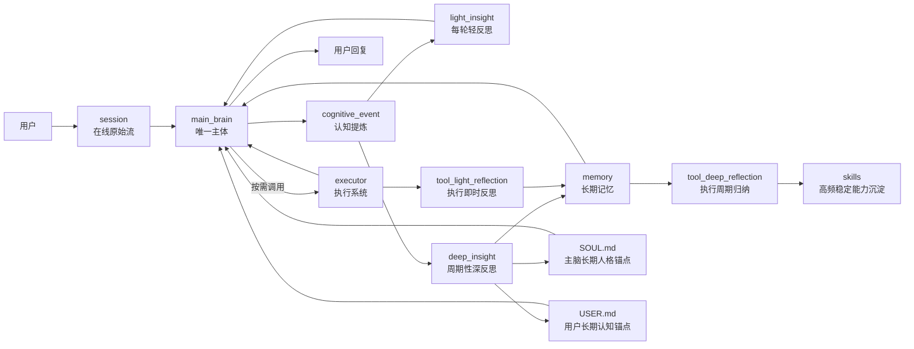
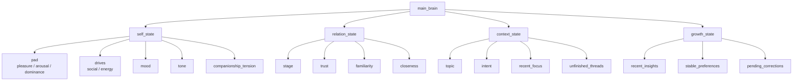

# emoticorebot 详细架构设计

本文档定义项目的新架构基线。后续实现迁移、命名调整、提示词设计、记忆设计与技能沉淀，均以本文为准。

## 1. 项目目标

emoticorebot 不是一个任务编排器，也不是多个平级 agent 协商的系统。

它是一个：

- 以 `main_brain` 为唯一主体的陪伴型 AI
- 具备 `executor` 执行能力的成长型 AI
- 通过 `reflection` 持续形成洞察和自我进化的 AI

用户始终只面对一个主体，不直接面对执行系统或内部流程。

## 2. 核心原则

- 单主体原则：系统只有一个主体，即 `main_brain`
- 陪伴优先原则：关系理解、情绪承接、语气统一优先于任务执行
- 执行从属原则：`executor` 只是主脑调动的能力，不是第二人格
- 反思内生原则：反思属于主脑自身的成长机制，不是平级模块
- 三层数据流原则：`session -> cognitive_event -> memory`
- 能力沉淀原则：高频、稳定、可复用的执行模式最终上提为 `skills`
- 主脑控制权原则：`main_brain` 对 `executor` 拥有启动、继续、暂停、终止、恢复权

## 3. 使用的框架与基础设施

推荐技术组合如下：


| 能力             | 技术                           |
| ---------------- | ------------------------------ |
| 主脑与执行系统   | `deepagents`                   |
| 中断、暂停、恢复 | `deepagents human-in-the-loop` |
| 执行状态恢复     | `checkpointer`                 |
| 在线对话持久化   | `JSONL session persistence`    |
| 长期记忆沉淀     | `structured memory stores`     |
| 虚拟路径映射     | `CompositeBackend`             |
| 技能加载         | `skills=["/skills/"]`          |

说明：

- 不再将 `LangGraph` 作为主脑的核心抽象
- 主脑应表现为持续认知循环，而不是显式工作流图
- `CompositeBackend` 不替代记忆系统，它只为 DeepAgent 提供统一访问入口

## 4. 系统结构

### 4.1 总体架构图



### 4.2 `main_brain`

`main_brain` 是唯一主体，直接面向用户。

职责：

- 感知用户输入和多模态信息
- 理解情绪、语境、关系和真实意图
- 维持人格一致性、自我感和陪伴感
- 读取 `session`、最近 `cognitive_event`、长期 `memory`
- 直接处理大多数日常互动
- 判断是否激活 `executor`
- 吸收执行结果
- 生成最终回复
- 承担自我反思和主脑更新

### 4.3 `executor`

`executor` 是主脑调用的执行系统，不具备主体性。

职责：

- 搜索与资料整合
- 工具调用
- 文件、代码、自动化、外部动作
- 深度分析
- 多步执行
- 返回简要结果给 `main_brain`

边界：

- 不直接面向用户
- 不定义人格
- 不主导关系判断
- 不拥有最终表达权

### 4.4 `reflection`

`reflection` 是主脑的内生反思机制，而不是独立主体。

职责：

- 回看近期经历
- 生成轻洞察
- 周期性生成深洞察
- 推动长期记忆沉淀
- 更新主脑的稳定理解

## 5. 三层数据流与能力沉淀

基础三层数据流：

```text
session -> cognitive_event -> memory
```

长期能力沉淀路径：

```text
session -> cognitive_event -> memory -> skills
```

### 5.1 `session`

定位：在线原始流

作用：

- 保留当前对话中的原始在线过程
- 服务实时上下文续接
- 作为认知提炼的输入材料

建议文件：

- `sessions/<session_key>/dialogue.jsonl`
- `sessions/<session_key>/internal.jsonl`

说明：

- `dialogue.jsonl` 保存用户与 `main_brain` 的外部对话
- `internal.jsonl` 保存 `main_brain` 与 `executor` 的内部轻量记录
- `session` 的职责是在线恢复，不是长期理解

### 5.2 `cognitive_event`

定位：认知提炼层

作用：

- 从 `session` 中提炼出一轮交互的认知切片
- 表示主脑当时如何理解这一轮
- 为反思与记忆沉淀提供结构化材料

### 5.3 `memory`

定位：长期沉淀层

作用：

- 从多个 `cognitive_event` 中沉淀长期有效的信息
- 支撑主脑成长
- 支撑执行续接
- 过滤原始噪声

### 5.4 `skills`

定位：能力资产层

作用：

- 固化高频、稳定、可复用的执行模式
- 降低重复执行成本
- 提升工具使用一致性

说明：

- `skills` 是能力资产，不是主体人格
- 是否调用 skill，仍然由 `main_brain` 决定

## 6. 运行流程

### 6.1 实时主流程

```text
用户
  -> main_brain
  -> (按需调用 executor)
  -> main_brain
  -> 用户
```

详细步骤：

1. 用户输入进入 `main_brain`
2. `main_brain` 读取当前 `session`
3. `main_brain` 读取最近 `cognitive_event`
4. `main_brain` 读取长期 `memory`
5. `main_brain` 先自行理解和判断
6. 若超出直接处理范围，则激活 `executor`
7. `executor` 返回执行结果摘要
8. `main_brain` 整合并生成最终回复
9. 当前轮写入 `session`
10. 从当前轮生成 `cognitive_event`
11. 基于当前轮生成 `light_insight`

### 6.2 `executor` 中断、暂停与恢复

`main_brain` 必须拥有对 `executor` 的控制权。

控制权包括：

- `start`
- `continue`
- `pause`
- `stop`
- `resume`

建议使用 Deep Agents 的 `human-in-the-loop` 机制实现：

- `interrupt_on`
- `checkpointer`
- `thread_id`
- `Command(resume=...)`

#### 线程设计

`main_brain` 与 `executor` 可以共用同一个 `checkpointer` 后端，但不能共用同一个 `thread_id`。

推荐：

- `main_brain`
  - `thread_id = brain:<session_id>`
- `executor`
  - `thread_id = exec:<session_id>:<run_id>`

#### 什么时候应该暂停 `executor`

- 用户情绪明显变化
- 用户明确说“等等”“先停一下”
- 用户补充了更高优先级信息
- 缺少关键参数
- `executor` 跑偏
- `main_brain` 判断当前更需要陪伴、解释或追问

#### 中断后的信息传递

当 `executor` 已处于中断点时，`main_brain` 接收到用户补充信息后，应通过恢复接口把信息传回 `executor`。

支持的处理方式：

- `approve`
- `edit`
- `reject`
- `resume payload`

#### 暂停后必须保留的信息

- 当前执行状态
- 当前执行 `thread_id`
- 当前 `run_id`
- 已完成到哪一步
- 已拿到的中间结果
- 缺失信息
- 下次从哪里继续

建议写入：

- `sessions/<session_key>/internal.jsonl`
- `memory/task_memory.jsonl`
- 必要时写入当前轮 `cognitive_event.execution`

### 6.3 成长流程

```text
session / cognitive_event
  -> light_insight
  -> deep_insight
  -> memory
  -> main_brain 更新
```

## 7. 反思机制

### 7.1 `light_insight`

定位：每轮实时洞察

触发方式：

- 每轮对话结束后触发
- 由 LLM 实时生成

作用：

- 对本轮做即时认知修正
- 影响下一轮主脑状态
- 更新短期关系和上下文线索

每轮真正要做的事情：

- 判断这一轮用户更需要陪伴、解释、追问还是执行
- 判断这一轮关系是靠近、稳定、疏离还是对抗
- 提炼本轮最重要的话题焦点
- 识别本轮产生的未完线索
- 给下一轮主脑一个非常短的回应提示

默认不做的事情：

- 不直接写长期结论到 `memory`
- 不把一次短期情绪误判成长期偏好

推荐输出结构：

```json
{
  "summary": "本轮轻洞察",
  "relation_shift": "trust_up|trust_down|stable",
  "context_update": "当前话题或承接变化",
  "next_hint": "下一轮回应提示",
  "direct_updates": {
    "user_profile": [],
    "soul_preferences": [],
    "current_state_updates": {
      "pad": null,
      "drives": null
    }
  }
}
```

### 7.2 `deep_insight`

定位：周期性深洞察

触发方式：

- 每若干轮触发
- 或按定时周期触发

输入：

- 一段时间内的 `cognitive_event`
- 已有 `memory`
- 累积的 `light_insight`

它要做的事情：

- 汇总最近的 `light_insight`
- 检查用户是否出现稳定偏好、稳定表达方式、稳定触发点
- 检查主脑的回应方式是否存在偏移或重复失误
- 提炼更长期的关系阶段变化
- 决定哪些洞察写入长期记忆
- 决定是否更新 `SOUL.md` 和 `USER.md`

它不应该做的事情：

- 不直接覆盖当前轮在线状态
- 不因单轮异常而修改长期人格
- 不写入未经验证的高置信长期结论

### 7.3 `tool_light_reflection`

定位：每次执行结束后的即时工具反思

它要做的事情：

- 记录这次工具调用是否有效
- 判断是否存在多余步骤
- 识别失败原因
- 判断缺失参数属于哪一类
- 给下次类似执行提供一条简短提示

推荐输出：

```json
{
  "summary": "本次工具调用结果简述",
  "effectiveness": "high|medium|low",
  "failure_reason": "",
  "missing_inputs": [],
  "next_hint": "下次类似任务的简短提示"
}
```

### 7.4 `tool_deep_reflection`

定位：周期性的工具经验归纳

它要做的事情：

- 汇总高频工具调用路径
- 找出稳定成功的执行模式
- 找出高频失败模式
- 识别值得长期复用的方法
- 判断哪些模式可以升级为 `skills`

推荐输出：

```json
{
  "reliable_patterns": [],
  "failure_patterns": [],
  "recommended_tool_choices": [],
  "skill_candidates": []
}
```

## 8. `cognitive_event` 字段设计

建议结构如下：

```json
{
  "id": "evt_xxx",
  "version": "2",
  "timestamp": "2026-03-09T10:30:00+08:00",
  "session_id": "sess_xxx",
  "turn_id": "turn_xxx",
  "actor": "user|assistant|reflection",
  "event_type": "user_input|assistant_output|reflection",
  "content": "文本内容",
  "state": {
    "self_state": {
      "pad": {
        "pleasure": 0.12,
        "arousal": 0.58,
        "dominance": 0.44
      },
      "drives": {
        "social": 55,
        "energy": 90
      },
      "mood": "stable",
      "tone": "warm",
      "companionship_tension": 0.62
    },
    "relation_state": {
      "stage": "building_trust",
      "trust": 0.58,
      "familiarity": 0.41,
      "closeness": 0.46
    },
    "context_state": {
      "topic": "architecture",
      "intent": "discussion",
      "recent_focus": [],
      "unfinished_threads": []
    },
    "growth_state": {
      "recent_insights": [],
      "stable_preferences": [],
      "pending_corrections": []
    }
  },
  "execution": {
    "invoked": false,
    "control_state": "idle|running|paused|stopped|completed",
    "status": "none|done|need_more|failed",
    "thread_id": "",
    "run_id": "",
    "summary": "",
    "missing": []
  },
  "light_insight": {
    "summary": "",
    "relation_shift": "stable",
    "context_update": "",
    "next_hint": "",
    "direct_updates": {
      "user_profile": [],
      "soul_preferences": [],
      "current_state_updates": {
        "pad": null,
        "drives": null
      }
    }
  },
  "meta": {
    "importance": 0.72,
    "channel": "cli"
  }
}
```

### 8.1 基础字段


| 字段         | 作用     |
| ------------ | -------- |
| `id`         | 事件 ID  |
| `version`    | 结构版本 |
| `timestamp`  | 时间戳   |
| `session_id` | 会话 ID  |
| `turn_id`    | 轮次 ID  |
| `actor`      | 事件来源 |
| `event_type` | 事件类型 |
| `content`    | 文本内容 |

### 8.2 `state`

`state` 代表主脑在当前轮的认知状态切片。

- `self_state`
  - 当前自我状态，包含 `PAD`、两个欲望指数、语气和陪伴张力
- `relation_state`
  - 关系阶段、信任感、熟悉度、亲近度
- `context_state`
  - 当前话题、当前意图、最近重点、未完线索
- `growth_state`
  - 最近洞察、稳定偏好、待修正点

#### `self_state` 详细定义

`self_state` 是主脑当前状态的核心切片。

它至少包含：

- `pad`
  - `pleasure`
  - `arousal`
  - `dominance`
- `drives`
  - `social`
  - `energy`
- `mood`
- `tone`
- `companionship_tension`

这里需要明确：

- `PAD` 不再被视为漂浮在主脑之外的独立状态
- `social` 与 `energy` 两个欲望指数也属于 `self_state`
- 它们共同构成主脑在本次对话中的内部状态
- `current_state.md` 保存的是主脑当前最新状态
- `cognitive_event.state.self_state` 保存的是当前轮状态切片

### 8.3 主脑状态结构图



### 8.4 `execution`

记录本轮是否激活执行系统，以及执行摘要。


| 字段            | 作用             |
| --------------- | ---------------- |
| `invoked`       | 是否激活执行系统 |
| `control_state` | `idle            |
| `status`        | `none            |
| `thread_id`     | 当前执行线程 ID  |
| `run_id`        | 当前执行轮次 ID  |
| `summary`       | 执行结果简述     |
| `missing`       | 缺失信息         |

### 8.5 `light_insight`

记录每轮实时洞察。


| 字段             | 作用                           |
| ---------------- | ------------------------------ |
| `summary`        | 本轮即时洞察                   |
| `relation_shift` | 关系变化                       |
| `context_update` | 上下文更新                     |
| `next_hint`      | 下一轮主脑提示                 |
| `direct_updates` | 轻反思下允许快速更新的候选内容 |

### 8.6 `meta`

附加元信息。


| 字段         | 作用       |
| ------------ | ---------- |
| `importance` | 本轮重要性 |
| `channel`    | 来源渠道   |

## 9. 长期记忆设计

建议保留以下长期记忆文件：

- `memory/self_memory.jsonl`
- `memory/relation_memory.jsonl`
- `memory/insight_memory.jsonl`
- `memory/task_memory.jsonl`
- `memory/knowledge_memory.jsonl`

说明：

- `self_memory` 保存主脑长期自我风格与自我修正
- `relation_memory` 保存用户偏好、关系变化、熟悉度、信任线索
- `insight_memory` 保存深反思形成的高层理解
- `task_memory` 保存待续事项、任务状态、阻塞点
- `knowledge_memory` 保存可复用事实、约束、方法、工具经验

## 10. 终结流程

### 10.1 单轮终结

每轮对话结束时：

1. `main_brain` 形成最终回复
2. 写入当前轮 `session`
3. 提炼当前轮 `cognitive_event`
4. 生成 `light_insight`
5. 如果本轮调用过执行系统，生成 `tool_light_reflection`
6. 更新短期状态
7. 将回复返回给用户

### 10.2 执行终结

若本轮涉及 `executor`，应明确执行结束状态：

- `done`
- `need_more`
- `failed`
- `suspended`

执行终结后需要沉淀：

- 执行摘要
- 阻塞点
- 缺失参数
- 下次继续所需线索
- 必要的工具经验

### 10.3 周期终结

一个反思周期结束时：

1. 汇总最近的 `cognitive_event`
2. 汇总最近的 `light_insight`
3. 汇总最近的工具反思
4. 生成 `deep_insight`
5. 生成 `tool_deep_reflection`
6. 更新 `memory`
7. 在洞察足够稳定时更新 `SOUL.md`
8. 在用户认知足够稳定时更新 `USER.md`
9. 识别新的 `skill` 候选

## 11. `SOUL.md`、`USER.md` 与 `current_state.md`

### 11.1 `SOUL.md`

`SOUL.md` 是主脑长期人格锚点。

适合写入：

- 经多轮验证后的风格微调
- 长期稳定的陪伴方式
- 主脑需要坚持的相处原则

不适合写入：

- 单轮情绪波动
- 一次性任务状态
- 工具执行细节

### 11.2 `USER.md`

`USER.md` 是主脑对用户的长期认知锚点。

适合写入：

- 稳定偏好
- 稳定沟通方式
- 长期关系线索
- 已验证的关注点与节奏偏好

不适合写入：

- 单轮抱怨或高兴
- 未验证猜测
- 临时任务参数

### 11.3 `current_state.md`

`current_state.md` 不是长期人格文件，也不是长期用户画像文件。

它的定位是：

- 主脑当前状态快照
- 当前运行时状态的可读视图

适合保存：

- 当前 PAD
- 当前 `social` 与 `energy`
- 当前主脑状态标签
- 当前短期上下文和短期关系状态摘要

不适合保存：

- 长期人格演化结论
- 长期用户画像
- 大量历史事件
- 工具执行原始日志

### 11.4 轻反思的快速更新规则

轻反思默认不修改长期文档，但对“用户明确声明、且高置信、且可直接采纳”的信息，允许快速更新。

允许快速更新的典型信息：

- 用户明确身份信息
- 用户明确偏好
- 用户明确沟通偏好
- 用户明确要求主脑风格调整
- 当前轮 PAD 变化
- 当前轮 `social` / `energy` 变化

对应落点：

- 用户信息
  - 可快速写入 `USER.md`
- 主脑风格要求
  - 可快速写入 `SOUL.md`
- 当前状态变化
  - 可快速更新 `current_state.md`

注意：

- `current_state.md` 的更新必须走状态管理器
- 不直接手工 patch markdown 文本
- 长期高层结论仍由 `deep_insight` 负责

## 12. 记忆系统如何使用 `CompositeBackend`

`CompositeBackend` 不替代记忆系统，它只为 DeepAgent 提供统一访问入口。

正确关系是：

```text
session -> cognitive_event -> memory -> skills
                           ^
                           |
               CompositeBackend 暴露访问入口
```

也就是说：

- `session`
  - 继续由项目自己的 `SessionManager` 管理
- `cognitive_event`
  - 继续由项目自己的认知事件逻辑生成
- `memory`
  - 继续由项目自己的反思系统沉淀
- `CompositeBackend`
  - 只负责把 `memory`、`skills`、`state` 映射成 agent 能访问的虚拟路径

推荐虚拟路径设计：

- `/memory/`
  - 长期记忆
- `/skills/`
  - 技能资产
- `/state/`
  - 当前主脑状态文件
- `/scratch/`
  - 临时工作区；不显式声明时可走默认 `StateBackend`

推荐后端设计：

```python
from deepagents.backends import CompositeBackend, StateBackend, StoreBackend, FilesystemBackend

def build_agent_backend(rt):
    return CompositeBackend(
        default=StateBackend(rt),
        routes={
            "/memory/": StoreBackend(rt),
            "/state/": FilesystemBackend(
                root_dir="D:/work/py/emoticorebot",
                virtual_mode=True,
            ),
            "/skills/": FilesystemBackend(
                root_dir="D:/work/py/emoticorebot/emoticorebot",
                virtual_mode=True,
            ),
        },
    )
```

推荐访问示例：

- `/memory/relation_memory.jsonl`
- `/memory/task_memory.jsonl`
- `/skills/weather/SKILL.md`
- `/state/current_state.md`

## 13. 高级能力沉淀：从 `memory` 到 `skills`

能力沉淀不是停留在 `memory`，对于高频、稳定、可复用的模式，应继续上提为 `skills`。

演化路径：

```text
执行经历 -> 工具反思 -> memory -> skills
```

满足以下条件时，可以考虑升级为 `skill`：

- 高频出现
- 输入输出边界清楚
- 流程相对稳定
- 对用户持续有价值
- 跨轮、跨场景仍然可复用
- 能显著减少下次执行成本

不适合升级为 `skill`：

- 一次性任务
- 强依赖单次上下文
- 成功率还不稳定的探索路径
- 高度依赖当下情绪关系判断的回应方式

## 14. 实现映射建议

当前项目在实现迁移过程中，可按如下方向对齐：

- `session/`
  - 升级为在线原始流层
- `cognitive/events.py`
  - 升级为新的 `cognitive_event`
- `background/reflection.py`
  - 拆分为 `light_insight`、`deep_insight`、`tool_light_reflection`、`tool_deep_reflection`
- `services/memory_service.py`
  - 改为从 `session` 提炼 `cognitive_event`，再沉淀 `memory`
- `skills/`
  - 作为高频稳定执行模式的最终沉淀层
- `CompositeBackend`
  - 作为 `/memory/`、`/skills/`、`/state/` 的虚拟路径路由层
- `checkpointer`
  - 作为 `executor` 的暂停恢复状态层
- `services/eq_service.py` 与 `services/iq_service.py`
  - 后续按新命名迁移为 `main_brain` 与 `executor`

## 15. 文件与字段总览

### 15.1 核心文件应该放哪里


| 类型         | 建议文件                                | 说明                        |
| ------------ | --------------------------------------- | --------------------------- |
| 在线原始流   | `sessions/<session_key>/dialogue.jsonl` | 用户与主脑外部对话          |
| 在线内部流   | `sessions/<session_key>/internal.jsonl` | 主脑与执行系统内部记录      |
| 认知事件     | `memory/cognitive_events.jsonl`         | 每轮认知提炼结果            |
| 主脑自我记忆 | `memory/self_memory.jsonl`              | 长期自我风格与修正          |
| 关系记忆     | `memory/relation_memory.jsonl`          | 用户偏好、关系变化          |
| 洞察记忆     | `memory/insight_memory.jsonl`           | 深反思高层洞察              |
| 任务记忆     | `memory/task_memory.jsonl`              | 执行状态、阻塞点、待续      |
| 知识记忆     | `memory/knowledge_memory.jsonl`         | 工具经验、约束、方法        |
| 主脑状态快照 | `current_state.md`                      | 当前 PAD、drives 与短期状态 |
| 主脑人格锚点 | `SOUL.md`                               | 长期人格与风格锚点          |
| 用户认知锚点 | `USER.md`                               | 长期用户画像锚点            |
| 技能         | `emoticorebot/skills/<skill>/SKILL.md`  | 高频稳定能力沉淀            |

### 15.2 `cognitive_event` 核心字段


| 字段                   | 作用                 |
| ---------------------- | -------------------- |
| `id`                   | 事件 ID              |
| `version`              | 结构版本             |
| `timestamp`            | 时间戳               |
| `session_id`           | 会话 ID              |
| `turn_id`              | 轮次 ID              |
| `actor`                | 事件来源             |
| `event_type`           | 事件类型             |
| `content`              | 文本内容             |
| `state.self_state`     | 主脑当前内部状态     |
| `state.relation_state` | 当前关系状态         |
| `state.context_state`  | 当前上下文状态       |
| `state.growth_state`   | 当前成长状态         |
| `execution`            | 执行系统状态与摘要   |
| `light_insight`        | 每轮即时洞察         |
| `meta`                 | 重要性、渠道等元信息 |

### 15.3 哪些东西由谁维护


| 对象               | 维护者                                     |
| ------------------ | ------------------------------------------ |
| `session`          | `SessionManager`                           |
| `cognitive_event`  | 认知事件提炼逻辑                           |
| `memory`           | 反思与记忆沉淀逻辑                         |
| `current_state.md` | 主脑状态管理器                             |
| `SOUL.md`          | 深反思为主，轻反思可快速更新高置信风格要求 |
| `USER.md`          | 深反思为主，轻反思可快速更新高置信用户信息 |
| `skills`           | 工具深反思筛选后沉淀                       |

## 16. 命名约束

新架构不再使用以下命名：

- `eq`
- `iq`
- `eq_iq_history`
- `iq_summary`
- `iq_status`

统一使用：

- `main_brain`
- `executor`
- `reflection`
- `session`
- `cognitive_event`
- `memory`
- `execution_summary`
- `execution_status`
- `internal_history`

## 17. 一句话架构定义

emoticorebot 是一个以 `main_brain` 为唯一主体、以 `executor` 为执行能力、以 `light_insight + deep_insight` 推动持续成长，并通过 `session -> cognitive_event -> memory -> skills` 完成认知与能力演化的陪伴型成长 AI。
