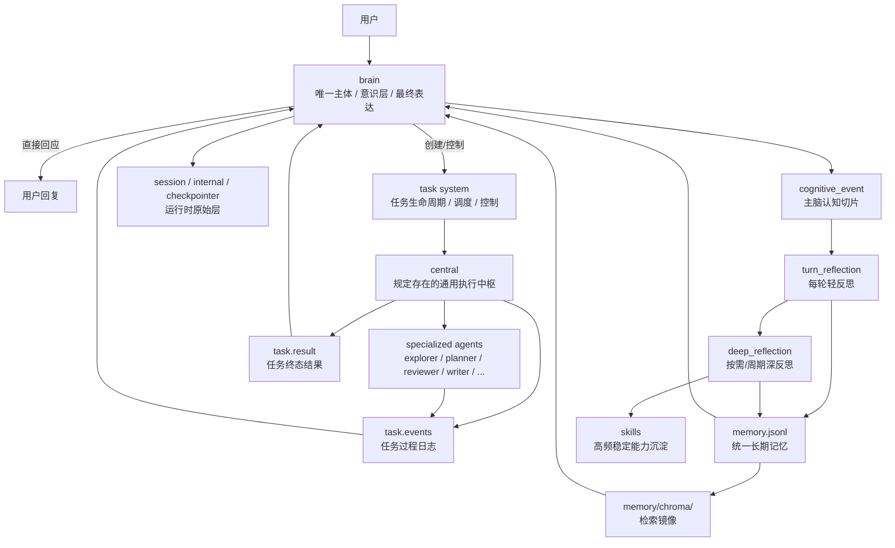
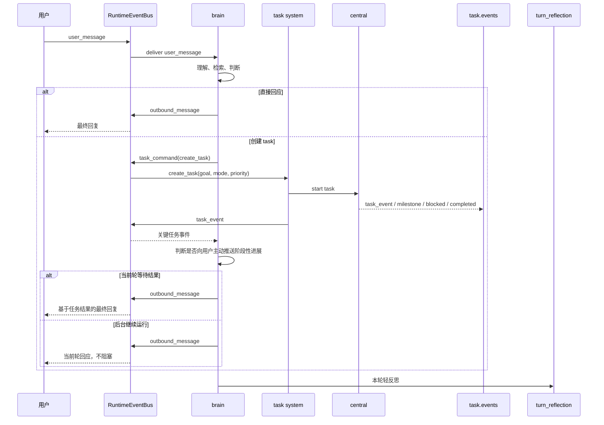

# emoticorebot 详细架构设计

本文档定义项目当前目标架构的基线。

后续实现迁移、命名调整、提示词设计、记忆设计、任务系统设计与技能沉淀，均以本文为准。

文档分工：

- `ARCHITECTURE.zh-CN.md`
  - 负责边界、职责、流程、分层与设计原则
- `FIELDS.zh-CN.md`
  - 负责字段结构、字段语义与记录边界

---

## 1. 项目目标

emoticorebot 不是一个普通任务编排器，也不是多个平级 agent 协商人格的系统。

它是一个：

- 以 `brain` 为唯一主体的陪伴型 AI
- 同时具备理性、感性、判断、决策与反思能力的 AI
- 通过 `task system` 处理复杂、长周期、高消耗工作的 AI
- 通过 `central + specialized agents` 获得机器执行能力的 AI
- 通过反思、长期记忆与技能沉淀不断成长的 AI

用户始终只面对一个主体，即 `brain`。

用户不直接面对任务系统、执行代理、工具调用链或内部子 agent。

---

## 2. 顶层定义

emoticorebot 的顶层结构定义为：

- 一个唯一主体：`brain`
- 一个统一运行时通信总线：`RuntimeEventBus`
- 一个任务运行层：`task system`
- 一个规定存在的通用执行 agent：`central`
- 一组专项能力 agent：`specialized agents`
- 一套成长机制：`turn_reflection + deep_reflection + memory + skills`

其中：

- `brain` 是意识层、主体层、对外表达层
- `RuntimeEventBus` 是统一运行时通信面
- `task system` 是任务生命周期与控制层
- `central` 是任务执行层中规定存在的通用执行中枢
- `specialized agents` 是任务内部的专项能力单元
- `memory` 与 `skills` 是长期成长资产

当前架构不再保留 `executor` 这一顶层概念。

### 2.1 正式命名

本文档正式命名统一使用：

- `brain`
- `central`
- `specialized agents`
- `subagent`

其中：

- `brain` 对应 `emoticorebot/agent/brain.py`
- `central` 对应 `emoticorebot/agent/central/central.py`
- `subagent` 对应 `emoticorebot/agent/central/subagent/`

### 2.2 当前代码目录落点

当前代码已经收敛为单一 `agent/` 根目录：

```text
emoticorebot/
  agent/
    brain.py
    cognitive.py
    context.py
    model.py
    reply_utils.py
    state.py
    central/
      central.py
      skills.py
      subagent/
    reflection/
      deep.py
      memory.py
      skill.py
      turn.py
    tool/
      manager.py
      mcp.py
```

目录约束：

- 不再保留 `services/` 作为业务落点
- 不再保留 `core/` 作为主流程落点
- 不再恢复旧的 `brain/`、`agents/` 顶层目录
- `brain` 固定落在 `agent/brain.py`
- `central` 的当前实现固定落在 `agent/central/central.py`
- `specialized agents` 的当前实现固定落在 `agent/central/subagent/`
- 反思相关能力固定落在 `agent/reflection/`
- 工具相关能力固定落在 `agent/tool/`

---

## 3. 核心原则

- 单主体原则：系统只有一个真正面向用户的主体，即 `brain`
- 意识与机器分层原则：用户与 `brain` 交互，`brain` 再与机器执行系统交互
- 任务一等公民原则：复杂工作应被建模为 `task`，而不是强制压缩为单轮同步对话步骤
- 主脑知情原则：`brain` 必须持续知道任务的关键进展、阻塞、风险与结果
- 主脑叙述原则：任务过程必须可被 `brain` 转述为“我正在做什么”
- 主脑控制原则：`brain` 对任务拥有创建、暂停、恢复、改向、终止与接管权
- 统一 `RuntimeEventBus` 原则：`brain` 与 `task system` 的运行时通信统一经过 `RuntimeEventBus`
- 单进程优先原则：当前阶段运行时、任务系统与 `RuntimeEventBus` 统一在当前进程内实现
- 非阻塞原则：复杂任务允许后台持续运行，`brain` 不必一直阻塞等待
- 最终表达唯一原则：只有 `brain` 可以对用户产出最终回复
- 记忆解释唯一原则：长期 `memory` 的检索、解释与写入决策属于 `brain`
- 子系统从属原则：`central` 与 `specialized agents` 都是 `brain` 的内部能力组件，不是独立人格
- 事件优先原则：默认同步给 `brain` 的应是结构化 `task_event`，而不是无穷原始日志
- 事件归属明确原则：所有运行时事件必须明确 `channel`、`session_id`，任务相关事件还必须明确 `task_id`
- 统一成长原则：任务经验最终统一进入 `reflection -> memory -> skills` 的成长链路

---

## 4. 系统拓扑

### 4.1 总体架构图



### 4.2 一句话关系定义

- `brain` 是意识主体
- `task system` 是任务运行层
- `central` 是规定存在的通用执行 agent
- `specialized agents` 是专项能力单元
- `memory` 是统一长期记忆
- `skills` 是结晶后的能力资产

### 4.3 当前代码真实主链

当前代码已经落地的最小主链是：

```text
RuntimeEventBus
  -> EmoticoreRuntime
  -> run_turn_engine
  -> brain
  -> central
  -> reflection
```

对应文件为：

- `RuntimeEventBus`
  - `emoticorebot/runtime/event_bus.py`
- `EmoticoreRuntime`
  - `emoticorebot/runtime/runtime.py`
- `run_turn_engine`
  - `emoticorebot/runtime/turn_engine.py`
- `brain`
  - `emoticorebot/agent/brain.py`
- `central`
  - `emoticorebot/agent/central/central.py`
- `reflection`
  - `emoticorebot/agent/reflection/`

说明：

- `task system` 的架构语义仍然保留
- 当前代码的最小落地中，这部分职责主要由 `runtime/turn_engine.py`、`tasks/task_context.py`、`session/internal` 和执行上下文共同承载
- 也就是说，当前代码已经先完成“单主体 + central 执行层 + RuntimeEventBus + reflection”的主链闭合
- 后续如果补全更完整的 `task` 调度与对象层，也必须继续服从这条主链

---

## 5. 人机交互层定义

在 emoticorebot 中，人机交互不再是用户直接与执行系统交互，而是分为两层：

### 5.1 外部交互：我与意识的交互

外部交互路径是：

```text
用户 <-> brain
```

这层负责：

- 理解用户输入
- 感知情绪、关系与语境
- 维持主体连续性与陪伴感
- 对外解释“我正在做什么”
- 对外给出最终承诺与最终表达

因此，用户感知到的始终应该是：

- “是我在做这件事”
- 而不是“后台有若干 agent 在运作”

### 5.2 内部交互：意识与机器的交互

内部交互路径是：

```text
brain <-> task system / central / specialized agents / tools
```

这层负责：

- 创建任务
- 接收任务进展
- 发送控制命令
- 请求补充汇报
- 调整任务方向
- 暂停、恢复或终止任务

### 5.3 交互呈现原则

默认不应将低层原始工具日志直接暴露为用户界面主内容。

优先暴露给用户的应是经 `brain` 叙述化后的过程，例如：

- “我刚确认了当前实现的关键边界”
- “我正在继续检查下一层结构”
- “我发现这个任务现在卡在缺少输入”

也就是说：

- 对外呈现优先是主脑叙述化后的过程视图
- 对内保留完整 `raw_trace`

---

## 6. 角色定义

### 6.1 `brain`

`brain` 是系统唯一主体，直接面向用户。

它不是单纯的任务路由器，而是统一承担：

- 情绪理解
- 关系判断
- 语境理解
- 意图判断
- 风险权衡
- 决策与控制
- 反思与成长
- 最终表达

职责：

- 感知用户输入和上下文
- 理解情绪、语境、关系和真实意图
- 维持人格一致性、自我感和陪伴感
- 读取 `session`、最近 `cognitive_event`、长期 `memory`
- 检索与当前问题相关的长期记忆
- 判断当前问题应直接回应还是创建 `task`
- 在不需要重工具链和复杂长流程时，直接在 `brain` 层完成小任务
- 创建、控制、调整、终止任务
- 持续接收任务关键事件并形成“我正在做什么”的主体叙述
- 吸收任务结果并生成最终对外回复
- 执行 `turn_reflection` 与 `deep_reflection`
- 决定哪些内容进入长期 `memory`
- 决定哪些稳定模式升级为 `skills`

边界：

- `brain` 不需要亲自完成所有复杂任务拆分
- `brain` 不需要持续吞入全部低层执行日志
- `brain` 不应被长任务细节拖成第二个执行器

一句话定义：

`brain` 负责“理解、判断、知情、控制、表达、成长”。

### 6.2 `task system`

`task system` 是复杂任务的生命周期与控制层。

它不是第二主体，而是 `brain` 可操控的机器任务运行层。

它只有执行态、过程态与控制态记录，不拥有任何自己的记忆层。

职责：

- 创建 `task`
- 维护任务状态机
- 路由任务到 `central`
- 维护任务状态、任务事件与任务结果
- 接收来自 `brain` 的控制命令
- 将任务的关键变化投递给 `brain`
- 支持同步任务与异步任务
- 支持长任务跨轮持续存在

边界：

- 不拥有最终表达权
- 不解释长期记忆
- 不拥有自己的长期记忆
- 不直接检索任何长期 `memory`
- 只能消费 `brain` 裁剪后传入的 `task_context`
- 不定义人格

当前代码落点说明：

- 当前最小实现里，`task system` 还不是一个独立的重型调度进程
- 它的职责主要分散在 `runtime/runtime.py`、`runtime/turn_engine.py`、`tasks/task_context.py` 与 `session` 内部记录里
- 但这不改变它在架构上的语义：它仍然只负责任务生命周期、状态与控制，不拥有记忆权和最终表达权

### 6.3 `central`

`central` 是架构中规定存在的通用执行 agent。

当前代码中，它的实现名为 `central`，固定落点是 `emoticorebot/agent/central/central.py`。

它是复杂任务进入执行层后的统一入口，负责：

- 理解任务目标
- 拆解任务
- 安排执行步骤
- 在必要时调用 `specialized agents`
- 在没有合适 specialized agent 时直接执行
- 汇总阶段结果
- 生成 `task_event`
- 向 `task system` 回写任务状态与结果

边界：

- 不直接面向用户输出最终回复
- 不拥有长期记忆检索解释权
- 不拥有自己的记忆层
- 只能使用 `brain` 传入的任务上下文
- 不定义系统人格
- 不替代 `brain`

一句话定义：

`central` 负责“承接任务、规划执行、协调 specialized agents、持续汇报并完成通用执行”。

### 6.4 `specialized agents`

`specialized agents` 是 `central` 可调用的专项能力单元。

当前代码中，专项能力 agent 的统一目录为 `emoticorebot/agent/central/subagent/`。

它们不是独立人格，而是任务内部的专业工种。

典型角色例如：

- `explorer`
  - 负责探索、摸底、资料收集、结构调查
- `planner`
  - 负责复杂方案设计、路径规划、阶段拆分
- `reviewer`
  - 负责复查、质检、风险检查
- `writer`
  - 负责长文整理、成文、风格统一
- `researcher`
  - 负责专题研究与专题信息整合

拆分原则：

- 只有高频、边界稳定、收益明显的能力才值得拆为 specialized agent
- 早期阶段可以只保留少量 specialized agents
- 不应为了“看起来像多 agent”而过早增加数量

### 6.5 `reflection`

`reflection` 是主脑的内生反思机制，不是独立主体。

分为两类：

- `turn_reflection`
  - 每轮结束后的轻反思
- `deep_reflection`
  - 按需或周期触发的深反思

说明：

- 反思权与解释权属于 `brain`
- 任务系统与子 agent 只提供材料，不提供长期人格结论
- 反思结果可以进入长期 `memory`，但反思本身不是独立长期存储层

---

## 7. 任务模型

### 7.1 为什么复杂工作要建模成 `task`

复杂、耗时、高上下文消耗的工作，不应强行被压缩为单轮同步对话里的一个步骤。

更合理的方式是把它建模成可持续运行的 `task`，这样：

- `brain` 不必一直阻塞等待
- 任务可以跨轮持续推进
- `brain` 可以边陪用户对话，边掌握后台执行进度
- 主脑可以随时介入、改向、暂停或终止

### 7.2 `task` 的最小对象模型

一个 `task` 至少应包含：

- `task_id`
- `title`
- `goal`
- `status`
- `priority`
- `mode`
  - `sync | async`
- `owner_agent`
  - 当前固定为 `central`
- `created_by`
  - 默认是 `brain`
- `plan`
- `artifacts`
- `result_summary`
- `need_user_input`
- `created_at`
- `updated_at`

### 7.3 任务状态机

建议最小状态集合：

- `pending`
- `running`
- `waiting_input`
- `blocked`
- `paused`
- `completed`
- `failed`
- `cancelled`

语义：

- `waiting_input`
  - 任务继续前需要用户或主脑补充信息
- `blocked`
  - 任务暂时受外部条件阻塞，但不一定失败
- `paused`
  - 主脑主动暂停

### 7.4 同步任务与异步任务

- `sync task`
  - 当前轮希望拿到结果再回复用户
- `async task`
  - 允许后台运行，`brain` 不必等待

架构上必须同时支持这两类任务。

---

## 8. 主脑对任务的持续知情机制

### 8.1 主脑真正需要知道的不是全部原始日志

`brain` 需要持续知道任务的关键变化，但不需要默认吞下每一个工具调用细节。

主脑默认应知道的是：

- 任务已创建
- 任务开始执行
- 当前阶段是什么
- 已完成哪个里程碑
- 为什么要做下一步
- 出现了什么结果
- 是否被阻塞
- 是否需要用户补充信息
- 是否出现风险
- 是否已完成、失败或取消

也就是说：

- 主脑需要的是 `可理解、可转述、可控制` 的过程信息
- 而不是无限原始执行噪声

### 8.2 `task_event` 模型

任务过程应被持续记录为结构化 `task_event`。

其中：

- `stage`
  - 指任务当前所处的高层工作状态，而不是单次工具调用
- 阶段变化
  - 只在子目标、工作方式、负责者、任务状态或可用中间成果发生明显变化时触发
- 阶段性结果
  - 指已经足够稳定、足够有意义、足够让 `brain` 做下一步判断的中间成果

因此：

- 一次 `read_file` 或一次搜索命中通常不算阶段
- 从 `planning` 切到 `executing`
- 从 `executing` 切到 `reviewing`
- 从 `running` 切到 `blocked`
  这些才属于阶段变化

推荐字段：

- `event_id`
- `task_id`
- `stage`
- `action`
- `reason`
- `result`
- `next_action`
- `priority`
- `requires_attention`
- `created_at`

示例语义：

- `action`
  - 这一步做了什么
- `reason`
  - 为什么做这一步
- `result`
  - 得到了什么
- `next_action`
  - 下一步准备做什么

### 8.3 主脑的三项核心权利

对任务过程，`brain` 必须拥有：

- 持续知情权
- 主体叙述权
- 过程控制权

含义：

- 持续知情权
  - 主脑持续知道任务当前在做什么
- 主体叙述权
  - 主脑可以对外说“我刚刚做了什么、接下来准备做什么”
- 过程控制权
  - 主脑可以随时干预任务运行

### 8.4 `task.events` 与 `task.result`

任务过程建议分两层保存：

#### `task.events`

保存：

- 结构化 `task_event`
- 里程碑
- 阻塞点
- 风险信号
- 控制动作
- 阶段性结果

用途：

- 给 `brain` 持续感知任务状态
- 支撑主体叙述
- 用于过程复盘

#### `task.result`

保存：

- 最终完成状态
- 最终摘要
- 风险与缺失信息
- 建议下一步

用途：

- 给 `brain` 吸收任务结果
- 作为反思输入材料

### 8.5 `RuntimeEventBus` 运行时通信

`RuntimeEventBus` 是系统唯一的运行时通信总线。

当前阶段，它被定义为进程内总线，而不是外部消息中间件或外部任务调度服务。

它统一承载：

- 用户消息进入系统
- `brain` 对 `task system` 的控制命令
- `task system` 对 `brain` 的阶段性汇报
- 系统级通知与最终外发消息

它不是记忆层，也不是新的长期对象层。

关系是：

- `RuntimeEventBus`
  - 负责运行时实时传递
- `session / internal`
  - 负责保存外部与内部原始运行材料
- `task.events`
  - 负责保存任务阶段级过程事件
- `task.result`
  - 负责保存任务终态结果

统一总线不意味着语义混乱。

每条运行时事件都必须明确：

- `channel`
  - 外部通道，例如 `telegram / discord / cli`
- `session_id`
  - 所属会话
- `task_id`
  - 所属任务；非任务事件可为空
- `kind`
  - 事件大类，例如 `user_message / outbound_message / task_event / task_command / system_event`
- `source`
  - 谁发出的
- `target`
  - 发给谁
- `event_type`
  - 具体事件类型

最小通信方向建议为：

- `user / channel -> brain`
  - `user_message`
- `brain -> task system`
  - `task_command`
- `task system -> brain`
  - `task_event`
- `brain -> channel / user`
  - `outbound_message`

关键边界：

- `task system` 不直接决定是否向用户推送进展
- 是否向用户说什么，仍由 `brain` 决定
- `task system` 只负责把关键阶段变化通过 `RuntimeEventBus` 送达 `brain`

#### 粒度原则

对任务相关通信，`RuntimeEventBus` 默认应承载阶段级、里程碑级、阻塞级与结果级事件，而不是每次底层工具调用都触发一次。

主脑真正需要的是：

- 当前任务进入了哪个阶段
- 是否出现了可用的阶段性结果
- 是否出现阻塞、风险或需要补充输入
- 当前是否值得自己介入、控制或对外表达

---

## 9. 主脑对任务的控制模型

### 9.1 必备控制动作

`brain` 对任务应至少拥有以下控制动作：

- `create_task`
- `pause_task`
- `resume_task`
- `cancel_task`
- `steer_task`
- `reprioritize_task`
- `request_report`
- `takeover_task`

含义：

- `steer_task`
  - 主脑追加新指令，改变当前任务方向
- `request_report`
  - 立刻请求任务汇报当前做到哪一步
- `takeover_task`
  - 主脑直接接管当前任务

### 9.2 控制语义

- 是否开始执行，由 `brain` 决定
- 是否继续后台运行，由 `brain` 决定
- 是否因用户新信息而改道，由 `brain` 决定
- 是否因为关系、情绪或上下文变化而暂停，由 `brain` 决定
- 执行完成后如何回复用户，由 `brain` 决定

### 9.3 正确的失败 loop

当任务失败或阻塞时，不应让执行层无限自转。

正确 loop 是：

```text
task blocked / failed
  -> task.events
  -> brain 感知并再判断
  -> brain 决定追问、改向、继续、暂停或终止
  -> 如有必要再次推动 task
```

也就是说：

- 任务系统负责执行与汇报
- 再判断与解释仍属于 `brain`

---

## 10. 运行流程

### 10.1 实时主流程

```text
用户
  -> RuntimeEventBus
  -> brain
  -> (直接回复 或 创建 task)
  -> RuntimeEventBus
  -> 用户
```

详细步骤：

1. 用户输入先进入 `RuntimeEventBus`
2. `RuntimeEventBus` 按 `channel + session_id` 路由给 `brain`
3. `brain` 读取当前 `session`
4. `brain` 读取最近 `cognitive_event`
5. `brain` 检索长期 `memory`
6. `brain` 理解意图、情绪、关系与风险
7. `brain` 判断：
   - 直接回应
   - 创建同步任务
   - 创建异步任务
8. 若创建任务，则 `brain` 通过 `RuntimeEventBus` 发出 `task_command`
9. `task system` 消费命令并路由到 `central`
10. 当前代码里由 `central` 负责承接、规划并执行
11. `task system` 通过 `RuntimeEventBus` 将阶段性结果实时送达 `brain`
12. `brain` 基于阶段性信号判断是否继续后台运行、是否控制任务、是否对用户主动推送进展
13. 若任务完成，`brain` 生成 `outbound_message` 并通过 `RuntimeEventBus` 外发
14. 当前轮写入 `session`
15. 从当前轮生成 `cognitive_event`
16. 调度本轮必做的 `turn_reflection`
17. 如有必要，追加 `deep_reflection`

当前代码的最小落地说明：

- 上述第 8 到 11 步，在当前实现中主要由 `runtime/turn_engine.py -> agent/central/central.py` 显式串起
- `tasks/task_context.py` 负责整理任务上下文摘要
- 真实目录已经不再经过 `services/`、`core/` 或 `nodes/`

### 10.2 三种典型路径

#### 简单即时任务

```text
用户 -> brain -> 用户
```

适合：

- 陪伴对话
- 简单问答
- 不值得挂 task 的低步骤动作

#### 复杂同步任务

```text
用户 -> brain -> task system -> central -> brain -> 用户
```

适合：

- 需要当前轮拿到结果
- 但中间执行过程较复杂

#### 长周期异步任务

```text
用户 -> brain -> task system
用户继续与 brain 对话
task 后台运行并持续写入 task.events
task 完成 -> task.result -> brain -> 用户
```

适合：

- 长任务
- 高 token / 高上下文消耗任务
- 不应让主体长期失联的任务

### 10.3 单轮与任务并行时序



---

## 11. 数据分层

### 11.1 基础数据流

基础成长路径：

```text
session / task_runtime
  -> cognitive_event
  -> turn_reflection
  -> deep_reflection
  -> memory
  -> skills
```

### 11.2 分层总表

| 层级 | 代表对象 | 生命周期 | 允许保存什么 | 不允许保存什么 |
| --- | --- | --- | --- | --- |
| 原始层 | `session / internal / checkpointer` | 当前轮到若干轮 | 原始对话、控制动作、暂停恢复现场 | 稳定长期结论 |
| 过程层 | `task.events / task.result` | 任务存续期 | 主脑可读的进展、里程碑、阻塞、风险与终态结果 | 完整原始工具日志替代品 |
| 认知层 | `cognitive_event` | 持续累积 | 主脑视角下的一轮结构化认知切片 | 大量原始日志 |
| 反思层 | `turn_reflection / deep_reflection` | 每轮或按需/周期产生 | 本轮解释、阶段归纳、候选长期结论 | 最终长期存储真身 |
| 长期层 | `memory` | 长期 | 已蒸馏的稳定事实、经验、模式、提示 | 原始日志、完整续跑状态、完整技能正文 |
| 能力层 | `skills` | 长期 | 高频稳定可复用能力 | 一次性任务上下文 |
| 索引层 | `memory/chroma/` | 长期 | 向量镜像、检索辅助元数据、访问统计 | 人类可读语义源 |

### 11.3 分层原则

1. `session` 只保存外部对话与必要上下文
2. `internal` 保存内部机器控制过程
3. `task.events` 保存主脑应持续知道的关键过程
4. `cognitive_event` 只保存主脑视角下的认知切片
5. `turn_reflection` 与 `deep_reflection` 是机制，不是长期存储库
6. 长期只有一个统一 `memory`
7. 向量库只是 `memory` 的检索镜像
8. 稳定能力最终由 `skills` 承载

---

## 12. 统一长期记忆架构

### 12.1 为什么统一

长期记忆不再拆成多个平行主文件，而是统一成一个长期 `memory` 存储。

这样做的原因：

- 检索入口统一
- 结构更简单
- 更容易追加写入和人工审查
- 更适合向量镜像
- 更适合后续新增类型

### 12.2 存储模型

- `memory.jsonl`
  - 人类可读
  - append-only
  - 语义源头
- `memory/chroma/`
  - 基于 `Chroma PersistentClient` 的本地检索镜像
  - 存放向量、镜像元数据与访问统计
  - 可重建，不作为事实源头
- `memory/chroma/_access_stats.json`
  - 记录 `recall_count`、`last_retrieved_at`、`last_relevance_score`
  - 仅服务检索排序与观察，不回写事实语义

### 12.3 分类方式

统一长期 `memory` 通过字段区分，而不是通过多个主文件区分。

核心分类字段：

- `audience`
  - `brain | task | shared`
- `kind`
  - `episodic | durable | procedural`
- `type`
  - `user_fact`
  - `preference`
  - `goal`
  - `constraint`
  - `relationship`
  - `soul_trait`
  - `turn_insight`
  - `task_experience`
  - `error_pattern`
  - `workflow_pattern`
  - `skill_hint`

### 12.4 检索原则

长期记忆检索参考长期记忆模型的常见思路：

- `Importance`
  - 更重要的更容易被想起
- `Relevance`
  - 与当前问题更相关的更容易被想起
- `Recency`
  - 更近的内容在同等条件下轻度加权

关键边界：

- 只有 `brain` 直接检索长期 `memory`
- `central` 与 `specialized agents` 不直接决定长期记忆解释
- `task system` 本身不拥有记忆层
- 如任务需要上下文，应由 `brain` 先从长期 `memory` 中提炼相关信息，再以 `task_context` 形式传入任务

---

## 13. 反思与成长机制

### 13.1 `turn_reflection`

定位：每轮必做的轻反思，也是当前轮的快速直写入口。

作用：

- 回看本轮发生了什么
- 识别本轮问题与解决方式
- 回看本轮任务路径是否有效
- 生成下一轮承接提示
- 产出长期记忆候选
- 将高置信、低歧义的信息快速写回 `USER.md`、`SOUL.md`、`current_state.md`

实现约束：

- 不直接当作长期存储库
- 不重写整份 `USER.md`、`SOUL.md`、`current_state.md`
- 不把单轮噪声直接定格为长期人格或长期用户画像
- 不把原始工具日志直接当成长结果保存

### 13.2 `deep_reflection`

定位：按需或周期触发的深反思，用来做跨轮归纳与长期沉淀。

作用：

- 汇总多轮 `cognitive_event`
- 汇总多轮 `turn_reflection`
- 评估用户整体画像与稳定偏好
- 评估 `brain` 的稳定风格与修正方向
- 归纳任务经验、错误模式、工作流模式
- 发现可上提为 `skills` 的能力候选

实现约束：

- 不直接覆盖当前轮在线状态
- 不因单轮异常就修改长期人格
- 不写未经验证的高置信长期结论

### 13.3 从任务经验到技能的成长路径

能力演化路径：

```text
task experience
  -> task.events / task.result
  -> turn_reflection
  -> deep_reflection
  -> memory
  -> skills
```

适合升级为 `skill` 的模式：

- 高频出现
- 成功率稳定
- 输入输出边界清楚
- 流程相对稳定
- 跨场景仍能复用
- 能显著降低下次执行成本

---

## 14. `SOUL.md`、`USER.md` 与 `current_state.md`

### 14.1 `SOUL.md`

`SOUL.md` 是主脑长期人格锚点。

适合写入：

- 经多轮验证后的风格微调
- 长期稳定的陪伴方式
- 主脑需要坚持的相处原则

### 14.2 `USER.md`

`USER.md` 是主脑对用户的长期认知锚点。

适合写入：

- 稳定偏好
- 稳定沟通方式
- 长期关系线索
- 已验证的关注点与节奏偏好

### 14.3 `current_state.md`

`current_state.md` 是当前状态快照，不是长期人格文件，也不是长期用户画像文件。

适合保存：

- 当前 `PAD`
- 当前 `social / energy`
- 当前短期上下文和短期关系状态摘要
- 当前重要任务的高层概览

### 14.4 更新规则

- `turn_reflection` 可快速更新高置信、明确声明、可直接采纳的信息
- `turn_reflection` 对 `USER.md` / `SOUL.md` 的写入使用独立托管锚点块
- `current_state.md` 只接受小幅 `state_update` 增量，不接受整文件重写
- 长期高层结论仍应优先由 `deep_reflection` 决定

---

## 15. 基础设施与实现建议

### 15.1 推荐技术组合

| 能力 | 技术 |
| --- | --- |
| `brain` | `agent/brain.py` 中基于 `create_deep_agent` 的轻量主脑 agent + 自定义 orchestration |
| 运行时通信 | `RuntimeEventBus`（当前进程内统一事件总线） |
| `task system` | 项目自定义任务运行层 |
| `central` | `agent/central/central.py` + `deepagents` |
| `specialized agents` | `deepagents` subagents / custom compiled subagents |
| 中断、暂停、恢复 | `human-in-the-loop` 机制 + 项目自定义任务控制 |
| 执行状态恢复 | `checkpointer` |
| 在线对话持久化 | `JSONL session persistence` |
| 长期记忆源存储 | `memory.jsonl` |
| 长期记忆检索镜像 | `Chroma PersistentClient`（`memory/chroma/`） |
| 虚拟路径映射 | `CompositeBackend` |
| 技能加载 | `skills=["/skills/"]` |

当前阶段的实现边界：

- `RuntimeEventBus`、`task system` 与 `brain` 统一在当前进程内运行
- 当前不引入 `Temporal`、`Prefect` 一类外部任务调度框架
- `deepagents` 负责执行单元，不负责顶层调度
- 如后续出现跨进程、多 worker、外部高可用调度需求，再评估替换底层任务运行层

### 15.2 与 `deepagents` 的关系

本架构不是直接把默认 `create_deep_agent()` 的原始执行语义原封不动暴露为用户-facing 顶层主体。

更准确的做法是：

- `brain`
  - 作为更轻的顶层意识层
  - 同样使用 `create_deep_agent()` 创建
  - 但默认不承担重工具执行链，也不替代 `task system`
  - 主要负责理解、判断、最终表达，以及未来可直接承接的小任务
- `central`
  - 作为任务系统内部的 deep agent
  - 当前代码实现为 `agent/central/central.py`
- `specialized agents`
  - 作为 `central` 调用的 subagents
  - 当前代码目录为 `agent/central/subagent/`

这样做的原因：

- 顶层主体需要感性、关系与人格一致性
- 顶层主体也需要一个可扩展的 agent 壳，用来承接未来的小任务
- 任务系统需要长期任务生命周期与控制权
- 因此 `brain` 与 `central` 都可以基于 `deepagents`
- 但两者的工具权限、任务边界、上下文职责和对外语义必须严格不同

### 15.3 `CompositeBackend` 的正确位置

正确关系是：

```text
session / task_runtime -> cognitive_event -> memory -> skills
                                         ^
                                         |
                           CompositeBackend 暴露访问入口
```

也就是说：

- `session`
  - 继续由项目自己的 `SessionManager` 管理
- `task_runtime`
  - 继续由项目自己的任务系统管理
- `memory`
  - 继续由项目自己的反思系统沉淀
- `CompositeBackend`
  - 只负责把 `memory`、`skills`、`state` 暴露成 agent 可访问的虚拟路径

### 15.4 当前目录结构（已落地）

当前目录重构已经完成，不再处于“方案讨论”阶段。

本轮已经明确完成的收敛是：

- 顶层业务能力统一收敛到单一 `agent/` 根目录
- 不再使用 `services/` 作为主脑或执行层落点
- 不再使用 `core/` 作为 turn 主流程落点
- 不再保留 `executor` 作为顶层目录语义

当前推荐并已落地的目录结构如下：

```text
emoticorebot/
  runtime/
    event_bus.py
    runtime.py
    turn_engine.py
  agent/
    brain.py
    cognitive.py
    context.py
    model.py
    reply_utils.py
    state.py
    central/
      central.py
      skills.py
      subagent/
    reflection/
      deep.py
      memory.py
      skill.py
      turn.py
    tool/
      manager.py
      mcp.py
  tasks/
    task_context.py
```

当前目录职责定义：

- `runtime/`
  - 负责 `RuntimeEventBus`、turn 编排、运行时控制与调度入口
- `agent/brain.py`
  - 负责 `brain` 的判断、控制与最终表达
- `agent/central/central.py`
  - 负责 `central` 的当前实现
- `agent/central/subagent/`
  - 负责 specialized agents 的当前落点
- `agent/reflection/`
  - 负责 `turn_reflection`、`deep_reflection`、长期记忆与技能提示沉淀
- `agent/tool/`
  - 负责工具注册、MCP 连接、工具上下文与执行资源管理
- `tasks/task_context.py`
  - 负责任务上下文摘要与任务执行上下文裁剪

硬性约束：

- 后续新增主脑相关逻辑，优先进入 `agent/brain.py` 或 `agent/` 下对应模块
- 后续新增通用执行层逻辑，优先进入 `agent/central/`
- 后续新增 specialized agent，统一进入 `agent/central/subagent/`
- 后续新增反思逻辑，统一进入 `agent/reflection/`
- 后续新增工具层逻辑，统一进入 `agent/tool/`
- 不再新增新的 `services/`、`core/`、`agents/`、`brain/` 顶层语义目录

---

## 16. 文件落点建议

| 类型 | 建议文件 | 说明 |
| --- | --- | --- |
| 在线原始流 | `sessions/<session_key>/dialogue.jsonl` | 用户与主脑外部对话 |
| 在线内部流 | `sessions/<session_key>/internal.jsonl` | 主脑与任务系统内部记录 |
| 任务对象 | `sessions/<session_key>/tasks/<task_id>.json` | `session` 内任务对象，内含状态、`events` 与 `result` |
| 执行恢复状态 | `sessions/_checkpoints/...` | 任务续跑与中断恢复状态 |
| 认知事件 | `memory/cognitive_events.jsonl` | 每轮认知切片 |
| 统一长期记忆 | `memory/memory.jsonl` | 统一长期语义源 |
| 向量镜像 | `memory/chroma/` | 长期记忆检索镜像 |
| 向量访问统计 | `memory/chroma/_access_stats.json` | 检索命中次数、最近命中时间、最近相关分数 |
| 主脑状态快照 | `current_state.md` | 当前 PAD、短期关系状态与任务概览 |
| 主脑人格锚点 | `SOUL.md` | 长期人格与风格锚点 |
| 用户认知锚点 | `USER.md` | 长期用户画像锚点 |
| 技能 | `emoticorebot/skills/<skill>/SKILL.md` | 高频稳定能力沉淀 |

---

## 17. 命名与迁移约束

### 17.1 标准命名

统一使用：

- `brain`
- `task system`
- `task`
- `central`
  - 作为正式架构名与当前代码实现名
- `specialized agents`
- `subagent`
  - 作为当前代码目录名，用来承载 `specialized agents`
- `task_event`
- `turn_reflection`
- `deep_reflection`
- `session`
- `cognitive_event`
- `memory`
- `skills`

### 17.2 废弃命名

从顶层架构中移除：

- `executor`

如旧代码、旧提示词或旧文档仍出现 `executor`，应按语义迁移为：

- 复杂任务运行层
- `task system`
- `central`

具体映射取决于上下文，而不是机械替换。

---

## 18. 一句话架构定义

emoticorebot 是一个以 `brain` 为唯一主体、以 `task system` 承载复杂任务、以 `central` 作为规定存在的通用执行 agent、并在当前代码中收敛到单一 `agent/` 根目录与 `agent/central/central.py` 落点、以 `specialized agents` 提供专项能力、以 `turn_reflection + deep_reflection` 推动成长、以统一 `memory` 沉淀长期经验、并通过 `skills` 结晶高频稳定能力的陪伴型成长 AI。

