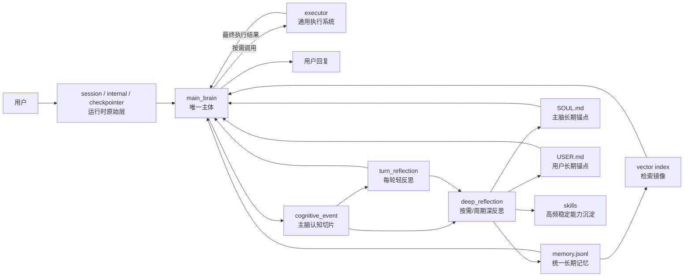
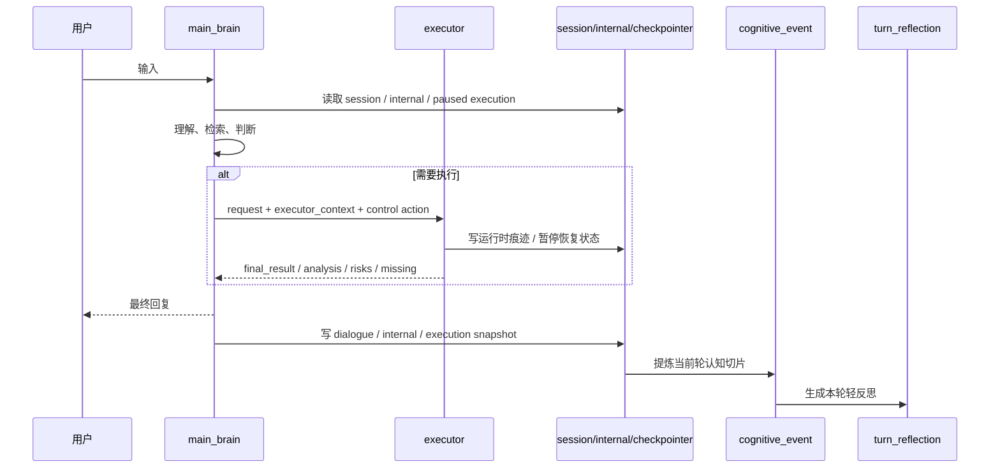

# emoticorebot 详细架构设计

本文档定义项目当前目标架构的基线。

后续实现迁移、命名调整、提示词设计、记忆设计与技能沉淀，均以本文为准。

文档分工：

- `ARCHITECTURE.zh-CN.md`
  - 负责边界、职责、流程、分层与设计原则
- `FIELDS.zh-CN.md`
  - 负责字段结构、字段语义与记录边界

---

## 1. 项目目标

emoticorebot 不是一个任务编排器，也不是多个平级 agent 协商的系统。

它是一个：

- 以 `main_brain` 为唯一主体的陪伴型 AI
- 同时具备理性、感性、判断、决策与反思能力的 AI
- 通过 `executor` 获得通用执行能力的成长型 AI
- 通过反思与长期记忆不断沉淀经验、形成技能的 AI

用户始终只面对一个主体，不直接面对执行系统或内部流程。

---

## 2. 核心原则

- 单主体原则：系统只有一个主体，即 `main_brain`
- 脑与执行分层原则：`main_brain` 负责理解、判断、决策、反思；`executor` 负责执行
- 理性与感性统一原则：理性与感性都属于 `main_brain`，而不是拆成两个主体
- 执行从属原则：`executor` 是执行子系统，不是第二人格
- 主脑控制权原则：`main_brain` 对 `executor` 拥有启动、继续、暂停、恢复、终止权
- 最终表达唯一原则：只有 `main_brain` 对用户输出最终回复
- 主脑检索唯一原则：只有 `main_brain` 检索长期 `memory`
- 统一长期记忆原则：长期记忆只有一个统一 `memory` 存储
- 分层留存原则：原始材料、认知切片、反思结果、长期沉淀必须分层保存
- 技能结晶原则：高频、稳定、可复用的执行模式最终上提为 `skills`
- 低往返原则：尽量减少无意义的大模型往返，减少中间态闲聊式汇报

---

## 3. 角色定义

### 3.1 `main_brain`

`main_brain` 是系统唯一主体，直接面向用户。

它不是单纯“陪伴层”，而是统一承担：

- 情绪理解
- 关系判断
- 语境理解
- 意图判断
- 风险权衡
- 决策与控制
- 反思与成长
- 最终表达

职责：

- 感知用户输入和上下文
- 理解情绪、语境、关系和真实意图
- 维持人格一致性、自我感和陪伴感
- 读取 `session`、最近 `cognitive_event`、长期 `memory`
- 检索与当前问题相关的长期记忆
- 判断是否需要调用 `executor`
- 以控制者身份调度 `executor`
- 吸收 `executor` 的最终执行结果
- 生成最终对外回复
- 执行 `turn_reflection` 与 `deep_reflection`
- 决定哪些内容进入长期 `memory`
- 决定哪些稳定模式升级为 `skills`

### 3.2 `executor`

`executor` 是 `main_brain` 调用的通用执行系统。

它更像中枢神经与手脚，而不是第二个大脑。

它可以是通用 agent，也可以在未来继续挂更多子 agent，但这些都属于执行子系统内部实现，不改变顶层架构。

职责：

- 搜索与资料整合
- 工具调用
- 文件、代码、自动化、外部动作
- 深度分析
- 多步执行
- 在必要时并行执行若干独立步骤
- 将执行结果汇总为单一最终结果返回给 `main_brain`

边界：

- 不直接面向用户
- 不定义人格
- 不主导关系判断
- 不拥有最终表达权
- 不拥有长期经验解释权
- 不直接检索长期 `memory`
- 不直接写长期 `memory`
- 不直接更新 `SOUL.md`、`USER.md`、`skills`

### 3.3 `reflection`

`reflection` 是主脑的内生反思机制，不是独立主体。

分为两类：

- `turn_reflection`
  - 每轮结束后的轻反思
- `deep_reflection`
  - 按需或周期触发的深反思

说明：

- 反思权和解释权属于 `main_brain`
- `executor` 只提供执行材料，不提供长期解释结论
- 反思的结果可以进入长期 `memory`，但反思本身不是独立长期存储层

---

## 4. 系统拓扑

### 4.1 总体架构图



### 4.2 一句话关系定义

- `main_brain` 是脑
- `executor` 是执行系统
- `memory` 是统一长期记忆
- `skills` 是结晶后的能力资产

---

## 5. 数据分层

### 5.1 基础数据流

基础三层数据流：

```text
session -> cognitive_event -> memory
```

完整成长路径：

```text
session / internal / checkpointer
  -> cognitive_event
  -> turn_reflection
  -> deep_reflection
  -> memory
  -> skills
```

### 5.2 分层总表

| 层级 | 代表对象 | 生命周期 | 允许保存什么 | 不允许保存什么 |
| --- | --- | --- | --- | --- |
| 原始层 | `session / internal / checkpointer / executor_trace` | 当前轮到若干轮 | 原始对话、原始工具调用、暂停恢复现场 | 稳定长期结论 |
| 认知层 | `cognitive_event` | 持续累积 | 主脑视角下的一轮结构化认知切片 | 大量原始工具日志 |
| 反思层 | `turn_reflection / deep_reflection` | 每轮或按需/周期产生 | 本轮解释、阶段归纳、候选长期结论 | 最终长期存储真身 |
| 长期层 | `memory` | 长期 | 已蒸馏的稳定事实、经验、模式、提示 | 原始日志、`thread_id`、`run_id`、完整技能正文 |
| 能力层 | `skills` | 长期 | 高频稳定可复用能力 | 一次性任务上下文 |
| 索引层 | `vector index` | 长期 | 向量、检索辅助字段、访问统计 | 人类可读语义源 |

### 5.3 分层原则

1. `session` 只保存原始数据
2. `cognitive_event` 只保存主脑视角下的认知切片
3. `turn_reflection` 与 `deep_reflection` 是机制，不是长期存储库
4. 长期只有一个统一 `memory`
5. `memory.jsonl` 是长期语义源
6. 向量库只是 `memory` 的检索镜像
7. 当同类 `skill_hint` 在长期 `memory` 中达到支持阈值后，可由规则式 materializer 写入 `workspace/skills/<skill>/SKILL.md`

---

## 6. 统一长期记忆架构

### 6.1 为什么统一

长期记忆不再拆成多个平行主文件，而是统一成一个长期 `memory` 存储。

这样做的原因：

- 检索入口统一
- 结构更简单
- 更容易追加写入和人工审查
- 更适合向量镜像
- 更适合后续新增类型

### 6.2 存储模型

- `memory.jsonl`
  - 人类可读
  - append-only
  - 语义源头
- `vector index`
  - 面向检索
  - 存放向量与访问统计
  - 可重建，不作为事实源头

### 6.3 分类方式

统一长期 `memory` 通过字段区分，而不是通过多个主文件区分。

核心分类字段：

- `audience`
  - `main_brain | executor | shared`
- `kind`
  - `episodic | durable | procedural`
- `type`
  - `user_fact`
  - `preference`
  - `goal`
  - `constraint`
  - `relationship`
  - `soul_trait`
  - `turn_insight`
  - `tool_experience`
  - `error_pattern`
  - `workflow_pattern`
  - `skill_hint`

### 6.4 检索原则

长期记忆检索参考 Stanford 小镇的长期记忆思路，但实现上收敛到当前架构：

- `Importance`
  - 更重要的更容易被想起
- `Relevance`
  - 与当前问题更相关的更容易被想起
- `Recency`
  - 更近的内容在同等条件下轻度加权

关键边界：

- 只有 `main_brain` 检索长期 `memory`
- `executor` 不直接检索长期 `memory`
- `main_brain` 检索后，只把和执行相关的记忆裁剪后传给 `executor`

传给 `executor` 的内容主要是：

- 执行经验
- 工具相关记忆
- `skill_hint`

---

## 7. `main_brain` 与 `executor` 的协作模型

### 7.1 顶层关系

架构上不是两个平级 deepagents，而是：

- 一个唯一主体：`main_brain`
- 一个被调用的通用执行系统：`executor`

### 7.2 控制权

`main_brain` 必须拥有以下控制动作：

- `start`
- `continue`
- `pause`
- `resume`
- `stop`

控制语义：

- 是否执行，由 `main_brain` 决定
- 如何继续执行，由 `main_brain` 决定
- 是否因为用户情绪变化或新信息而中断，由 `main_brain` 决定
- 执行完成后如何回复用户，由 `main_brain` 决定

### 7.3 返回契约

`executor` 应尽量返回最终执行结果，而不是阶段性闲聊式汇报。

推荐返回内容：

- `final_result`
- `analysis`
- `risks`
- `missing`
- `recommended_action`
- `pending_review`
- `confidence`
- `thread_id / run_id`

关键约束：

1. `executor` 返回的是执行报告，不是用户话术
2. `executor` 应先在内部汇总，再返回单一结果包
3. 所有执行结果都必须回到 `main_brain`
4. 最终对外表达只能由 `main_brain` 产生

### 7.4 失败后的 loop

当通用执行失败时，不应让 `executor` 在内部无限自转。

正确 loop 是：

```text
executor 失败或阻塞
  -> 返回 main_brain
  -> main_brain 进行 turn_reflection / 再判断
  -> main_brain 决定追问、改道、继续或终止
  -> 如有必要再次调用 executor
```

也就是说：

- 执行失败后的“轻反思、洞察、再决策”属于 `main_brain`
- `executor` 负责把问题做完，不负责长期解释失败的意义

### 7.5 `executor` 内部扩展

未来可以继续给 `executor` 增加更多内部子 agent 或并行步骤。

但这些都是执行系统内部实现，不改变顶层边界：

- 用户仍然只面对 `main_brain`
- 返回路径仍然必须是 `executor -> main_brain -> 用户`
- 长期记忆检索权仍然只在 `main_brain`

---

## 8. 运行流程

### 8.1 实时主流程

```text
用户
  -> main_brain
  -> (按需调用 executor)
  -> main_brain
  -> 用户
```

详细步骤：

1. 用户输入进入 `main_brain`
2. `main_brain` 读取当前 `session`
3. `main_brain` 读取最近 `cognitive_event`
4. `main_brain` 检索长期 `memory`
5. `main_brain` 先自行理解、判断、决定是否执行
6. 若需要执行，则由 `main_brain` 组装 `executor_context`
7. `executor` 执行并返回最终结果包
8. `main_brain` 整合结果并生成最终回复
9. 当前轮写入 `session`
10. 从当前轮生成 `cognitive_event`
11. 调度本轮必做的 `turn_reflection`
12. 如有必要，追加 `deep_reflection`

### 8.2 单轮信息流转



### 8.3 推荐写入顺序

推荐顺序：

1. 先写用户输入与主脑最终回复到 `session`
2. 若有执行，再写 `main_brain <-> executor` 的内部记录到 `internal`
3. 若发生暂停/恢复，再写 `checkpointer` 与必要执行快照
4. 基于当前轮完整材料提炼 `cognitive_event`
5. 由 `main_brain` 异步调度本轮必做的 `turn_reflection`
6. 若 `main_brain` 判断值得深挖，再追加异步 `deep_reflection`
7. 由反思将稳定结果写入统一长期 `memory`
8. 当模式足够稳定时，再上提为 `skills`

关键约束：

- 反思任务可以异步执行，不阻塞首响应
- 同一 `session` 的反思落盘必须串行
- 长期 `memory` 不直接接收原始日志和续跑状态

---

## 9. 反思机制

### 9.1 `turn_reflection`

定位：每轮必做的轻反思。

作用：

- 回看本轮发生了什么
- 识别本轮问题与解决方式
- 回看本轮执行路径是否有效
- 生成下一轮承接提示
- 产出长期记忆候选

每轮真正要做的事情：

- 判断这一轮用户更需要陪伴、解释、追问还是执行
- 提炼这一轮最重要的问题与焦点
- 判断执行是否有效、冗余、阻塞、缺参
- 给下一轮 `main_brain` 一个非常短的承接提示
- 提炼值得沉淀的本轮经验

它默认不做的事情：

- 不直接当作长期存储库
- 不把单轮噪声直接定格为长期人格或长期用户画像
- 不把原始工具日志直接当成成长结果保存

### 9.2 `deep_reflection`

定位：按需或周期触发的深反思。

作用：

- 汇总多轮 `cognitive_event`
- 汇总多轮 `turn_reflection`
- 评估用户整体画像与稳定偏好
- 评估 `main_brain` 的稳定风格与修正方向
- 归纳工具经验、错误模式、工作流模式
- 发现可上提为 `skills` 的能力候选

它不应该做的事情：

- 不直接覆盖当前轮在线状态
- 不因单轮异常就修改长期人格
- 不写未经验证的高置信长期结论

### 9.3 工具经验如何并入反思

工具与执行经验不再单独维护一套平行长期系统，而是统一并入主脑反思链：

- 本轮执行评价进入 `turn_reflection`
- 周期性执行模式归纳进入 `deep_reflection`
- 稳定结果进入统一 `memory`
- 高频稳定结果进一步升级为 `skills`

---

## 10. `memory` 到 `skills` 的成长路径

能力演化路径：

```text
执行经历
  -> turn_reflection
  -> deep_reflection
  -> memory
  -> skills
```

### 10.1 `memory` 保存什么

长期 `memory` 保存的是已经被主脑确认的稳定价值，例如：

- 用户稳定事实
- 用户稳定偏好
- 关系变化与长期线索
- 本轮有价值的执行经验
- 常见错误模式与解决路径
- 稳定工作流模式
- 已沉淀技能的 `skill_hint`

### 10.2 `skills` 保存什么

`skills` 保存的是已经结晶的能力资产，而不是一般记忆。

适合升级为 `skill` 的模式：

- 高频出现
- 成功率稳定
- 输入输出边界清楚
- 流程相对稳定
- 跨场景仍能复用
- 能显著降低下次执行成本

不适合升级为 `skill` 的模式：

- 一次性任务
- 强依赖单次上下文
- 成功率尚不稳定的探索路径
- 高度依赖当下关系判断的对话策略

关键边界：

- 完整技能正文进入 `skills`
- 长期 `memory` 只保留 `skill_hint`

---

## 11. `SOUL.md`、`USER.md` 与 `current_state.md`

### 11.1 `SOUL.md`

`SOUL.md` 是主脑长期人格锚点。

适合写入：

- 经多轮验证后的风格微调
- 长期稳定的陪伴方式
- 主脑需要坚持的相处原则

### 11.2 `USER.md`

`USER.md` 是主脑对用户的长期认知锚点。

适合写入：

- 稳定偏好
- 稳定沟通方式
- 长期关系线索
- 已验证的关注点与节奏偏好

### 11.3 `current_state.md`

`current_state.md` 是当前状态快照，不是长期人格文件，也不是长期用户画像文件。

适合保存：

- 当前 `PAD`
- 当前 `social / energy`
- 当前短期上下文和短期关系状态摘要

### 11.4 更新规则

- `turn_reflection` 可快速更新高置信、明确声明、可直接采纳的信息
- 长期高层结论仍应优先由 `deep_reflection` 决定
- `current_state.md` 属于状态管理，不应替代长期记忆

---

## 12. 基础设施与实现建议

### 12.1 推荐技术组合

| 能力 | 技术 |
| --- | --- |
| 主脑与执行系统 | `deepagents` |
| 中断、暂停、恢复 | `deepagents human-in-the-loop` |
| 执行状态恢复 | `checkpointer` |
| 在线对话持久化 | `JSONL session persistence` |
| 长期记忆源存储 | `memory.jsonl` |
| 长期记忆检索镜像 | `vector store / vector index` |
| 虚拟路径映射 | `CompositeBackend` |
| 技能加载 | `skills=["/skills/"]` |

说明：

- 不再将 `LangGraph` 作为主脑的核心抽象
- 主脑应表现为持续认知循环，而不是显式工作流图
- `CompositeBackend` 不替代记忆系统，只为 agent 暴露统一访问入口

### 12.2 `CompositeBackend` 的正确位置

正确关系是：

```text
session -> cognitive_event -> memory -> skills
                           ^
                           |
               CompositeBackend 暴露访问入口
```

也就是说：

- `session`
  - 继续由项目自己的 `SessionManager` 管理
- `cognitive_event`
  - 继续由项目自己的认知事件逻辑生成
- `memory`
  - 继续由项目自己的反思系统沉淀
- `CompositeBackend`
  - 只负责把 `memory`、`skills`、`state` 映射成 agent 可访问的虚拟路径

### 12.3 推荐虚拟路径

- `/memory/`
  - 长期记忆源与镜像入口
- `/skills/`
  - 技能资产
- `/state/`
  - 当前状态文件
- `/scratch/`
  - 临时工作区

---

## 13. 文件落点建议

| 类型 | 建议文件 | 说明 |
| --- | --- | --- |
| 在线原始流 | `sessions/<session_key>/dialogue.jsonl` | 用户与主脑外部对话 |
| 在线内部流 | `sessions/<session_key>/internal.jsonl` | 主脑与执行系统内部记录 |
| 执行恢复状态 | `sessions/_checkpoints/...` | `executor` 续跑与中断恢复状态 |
| 认知事件 | `memory/cognitive_events.jsonl` | 每轮认知切片 |
| 统一长期记忆 | `memory/memory.jsonl` | 统一长期语义源 |
| 向量镜像 | `memory/chroma/` | 长期记忆检索镜像 |
| 主脑状态快照 | `current_state.md` | 当前 PAD、drives 与短期状态 |
| 主脑人格锚点 | `SOUL.md` | 长期人格与风格锚点 |
| 用户认知锚点 | `USER.md` | 长期用户画像锚点 |
| 技能 | `emoticorebot/skills/<skill>/SKILL.md` | 高频稳定能力沉淀 |

---

## 14. 命名与迁移约束

### 14.1 命名收敛

统一使用：

- `main_brain`
- `executor`
- `turn_reflection`
- `deep_reflection`
- `session`
- `cognitive_event`
- `memory`
- `skills`

### 14.2 兼容命名

迁移阶段允许以下兼容解释：

- `light_insight` == `turn_reflection`
- `deep_insight` == `deep_reflection`

但新的正式设计文档以：

- `turn_reflection`
- `deep_reflection`

作为标准命名。

---

## 15. 一句话架构定义

emoticorebot 是一个以 `main_brain` 为唯一主体、以 `executor` 为通用执行系统、以 `turn_reflection + deep_reflection` 推动成长、以统一 `memory` 沉淀长期经验、并通过 `skills` 结晶高频稳定能力的陪伴型成长 AI。
