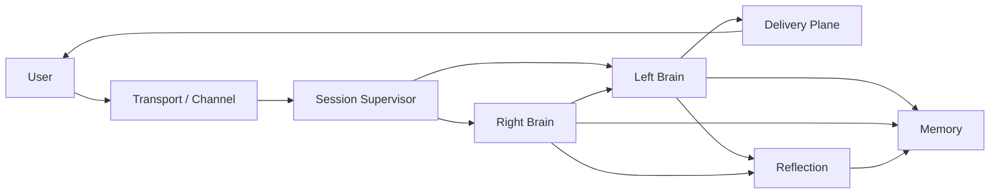

# 陪伴机器人统一架构：左脑 / 右脑、双输入、三投递

## 1. 文档目标

本文定义一套面向陪伴机器人的统一架构，用来同时支持：

1. 一问一答的单轮交互
2. 实时对话的流式交互
3. 右脑异步后台执行
4. 长期记忆与反思演化
5. 未来向具身机器人扩展

这套架构的核心不是“多 agent 协作”，而是“一个主体脑，内部有左脑和右脑两个子系统”。

对外始终只有一个人格、一个说话者、一个连续关系主体。

配套工程细化文档：

- [companion-left-right-brain-module-contracts.zh-CN.md](companion-left-right-brain-module-contracts.zh-CN.md)
- [companion-protocol-spec.zh-CN.md](companion-protocol-spec.zh-CN.md)

---

## 2. 总体原则

### 2.1 一个主体，不是多个角色

- 用户面对的是同一个陪伴体。
- 左脑和右脑是内部子系统，不是两个会互相争抢话语权的人格。
- 最终给用户看的内容必须来自同一个主体视角。

### 2.2 左脑主前台，右脑主后台

- 左脑负责前台交互、陪伴感、情绪接住、实时回应。
- 右脑负责理性分析、执行、工具、复杂判断、长耗时处理。
- 左脑永远优先保证“在场感”。
- 右脑默认异步，不阻塞左脑。

### 2.3 输入和投递解耦

系统不按“聊天系统 / 电话系统 / 推送系统”拆分，而按：

- 输入形态
- 内部处理
- 投递形态

来统一建模。

### 2.4 模块边界优先于实现细节

- 模块之间通过事件通信。
- 状态读取尽量走只读视图或查询接口。
- 模块内部可以直接调用。
- 不把所有事情都塞进一个“超级总管对象”里。

---

## 3. 核心抽象

### 3.1 两类输入

系统只定义两类输入：

#### `turn`

一次完整输入作为一个处理单元。

适用于：

- 文字聊天
- 单次语音转文本后提交
- App 中的一次提问
- Web 表单或 HTTP 请求

特点：

- 用户说完再处理
- 一次输入对应一个前台处理回合
- 可返回一条完整回复，也可流式返回该轮结果

#### `stream`

输入以持续流的形式进入系统。

适用于：

- 电话通话
- 语音陪伴
- 低延迟视频/语音交互
- 全双工场景

特点：

- 用户未说完时系统就可以开始理解
- 允许打断
- 允许边听边回应
- 前台会话是持续流，不是单轮锁步

### 3.2 三类投递

系统只定义三类投递方式：

#### `inline`

当前交互里直接给出完整结果。

适用于：

- 普通一问一答
- 低延迟直接回答
- 不需要后台继续处理的场景

例子：

- 用户发一条消息
- 系统立即回一条完整消息

#### `push`

当前轮先结束，之后再主动推送一条新的消息。

适用于：

- 后台处理需要更长时间
- 通道支持主动发消息
- 用户不需要一直在线等待

例子：

- 用户说“你整理好之后告诉我”
- 当前先回“我先处理”
- 处理结束后再主动发一条新消息

#### `stream`

系统持续输出多个片段，而不是一次性给完整结果。

适用于：

- SSE 文本流
- WebSocket / WebRTC 实时对话
- 语音边听边回

例子：

- 输出逐句或逐段生成
- 通话中持续回声、接话、回应

### 3.3 输入与投递的组合

两类输入和三类投递可以组合，但不是每种组合都同等常用。

| 输入 | 投递 | 典型场景 | 说明 |
|------|------|----------|------|
| `turn` | `inline` | 普通文字问答 | 最标准的一问一答 |
| `turn` | `push` | 单轮触发后台处理 | 当前结束，结果稍后通知 |
| `turn` | `stream` | SSE 文本流 | 仍然是单轮，只是结果分段输出 |
| `stream` | `stream` | 电话 / 实时语音 | 全双工主形态 |
| `stream` | `push` | 通话中发起长任务，挂断后再通知 | 实时会话结束后的补充结果 |
| `stream` | `inline` | 很少单独使用 | 一般可视为 `stream` 的最终收束 |

这里要明确：

- `SSE` 属于 `turn + stream`，不是全双工。
- 真正的实时对话通常是 `stream + stream`。
- `push` 是“轮后通知”，不是流式输出。

---

## 4. 模块划分

系统按职责划分为 4 个核心模块，加 2 个基础设施模块。

### 4.1 核心模块

#### `Left Brain`

左脑是前台主表达系统。

职责：

- 陪伴感
- 情绪承接
- 关系连续性
- 低延迟回应
- 实时对话中的即时反馈
- 解析 `user/task` 双槽输入
- 根据 `task` 槽与上下文决定是否启动右脑
- 将右脑结果包装成统一人格下的自然表达

左脑的目标不是最强推理，而是保证用户始终感受到“有人在这里”。

#### `Right Brain`

右脑是异步后台理性执行系统。

职责：

- 理性分析
- 事实判断
- 复杂推理
- 工具调用
- 长耗时执行
- 结果整理
- 风险审查

右脑可以使用 `DeepAgent` 一类深度执行器，但右脑不是用户的主体人格，只是主体脑内部的后台子系统。

在实现上，右脑 runtime 常驻存在；收到请求后立即启动一次 `DeepAgent` run。

其中：

- `audit_tool` 只是 `DeepAgent` 内部审核钩子
- 真正的 run 生命周期由右脑 runtime 统一控制
- 关键进展应持续回流给左脑，让用户可实时感知与随时停止

#### `Reflection`

反思系统负责慢速认知演化。

职责：

- 回看一轮交互的得失
- 识别稳定偏好
- 识别关系变化
- 调整人格策略
- 为长期记忆写入提案

反思不参与当前轮即时说话，而是用于“下一次更像同一个人”。

#### `Memory`

记忆系统负责长期与中短期状态的保存和读取。

建议分为两类：

- `Relationship Memory`
  - 关系状态
  - 用户偏好
  - 情绪轨迹
  - 熟悉度
  - 边界感
- `Fact / Working Memory`
  - 事实
  - 历史任务
  - 处理结果
  - 可检索上下文

### 4.2 基础设施模块

#### `Session Supervisor`

会话监督器不是大脑，而是交通调度层。

职责：

- 管理每个 session 的模式
- 管理 `turn / stream`
- 管理左脑活跃输出流
- 管理右脑后台作业额度
- 管理中断、取消、恢复
- 管理投递策略

#### `Delivery Plane`

统一投递层。

职责：

- 将内部结果投递成 `inline / push / stream`
- 适配 Telegram、Discord、电话、App、邮件等通道
- 保证消息幂等、重试、失败处理

---

## 5. 总体结构图



解释：

- 用户输入先进入 `Session Supervisor`
- `Session Supervisor` 将输入转交给左脑
- 左脑先解析 `user/task` 双槽并完成本轮策略收敛
- 左脑可按需启用内建轻量评分辅助
- `Session Supervisor` 按左脑策略同步或异步启动右脑
- `Left Brain` 负责前台回应
- `Right Brain` 按需启动，异步执行
- `Right Brain` 的结果回流给 `Left Brain`
- 最终由 `Delivery Plane` 决定怎么投递

---

## 6. 左脑内建识别与任务槽位机制

### 6.1 设计目标

默认由左脑完成识别与策略收敛，不强制新增独立识别模块。

左脑在入口侧要先做三件事：

- 读取 `user` 槽：用于当前轮前台回复
- 读取 `task` 槽：用于判断是否触发右脑
- 产出 `right_brain_strategy`：`skip / sync / async`

推荐输入模板：

```text
#######user#######
你好
#######task#######
r任务相关
```

其中 `task` 可为空；为空时左脑通常选择 `skip`。

可选启用内建评分辅助时，它的定位是辅助：

- 给左脑评分参考
- 给左脑路由建议
- 不替代左脑最终裁决

正式入口顺序固定为：

`raw input -> Session Supervisor -> Left Brain(解析 user/task) -> Session Supervisor 调度右脑 -> Delivery`

无论 `turn` 还是 `stream`，都不应绕过左脑直接把用户语义送入右脑执行。

### 6.2 推荐输出字段

建议左脑在识别阶段输出以下结构：

```json
{
  "affective_score": 0.82,
  "rational_score": 0.31,
  "task_score": 0.18,
  "urgency_score": 0.44,
  "risk_score": 0.12,
  "realtime_score": 0.76,
  "confidence": 0.88,
  "intent_tags": ["comfort", "companionship"],
  "emotion_tags": ["sad", "fatigue"],
  "route_hint": "left_only",
  "input_slots": {
    "user": "我今天好累，不想做任何事。",
    "task": ""
  },
  "right_brain_strategy": "skip",
  "invoke_right_brain": false
}
```

### 6.3 字段解释

- `affective_score`
  - 越高表示越应优先共情、陪伴、安抚
- `rational_score`
  - 越高表示越需要解释、分析、事实性组织
- `task_score`
  - 越高表示越像“要做事”，应考虑启动右脑
- `urgency_score`
  - 越高表示回复应更直接、更短、更快
- `risk_score`
  - 越高表示应提高约束与审查强度
- `realtime_score`
  - 越高表示越适合实时对话形态
- `confidence`
  - 越低表示左脑应保守处理，必要时先澄清
- `input_slots`
  - 左脑解析后的双槽输入结构：`user/task`
  - `task` 为空时通常走 `skip`
- `right_brain_strategy`
  - 左脑给 `Session Supervisor` 的正式右脑策略
  - 值域固定为 `skip / sync / async`

### 6.4 路由建议只做提示，不做裁决

`route_hint` 只是语义建议，例如：

- `left_only`
- `left_with_right`
- `right_review_first`
- `clarify_first`
- `safe_fallback`

真正用于启动右脑的是左脑输出的 `right_brain_strategy + invoke_right_brain`。  
`Session Supervisor` 消费左脑结果后，再发出对应 `right.command`。

最终怎么做，仍由主脑和会话监督器共同决定。

---

## 7. 左脑与右脑的协作关系

### 7.1 左脑永远存在

左脑是默认常开的。

原因：

- 陪伴机器人首先要有在场感
- 用户说话时必须有人接住
- 不能因为右脑慢，就让用户感到空白或断联

### 7.2 右脑按需启动

右脑不是每轮都重度参与，而是根据评分和规则触发。

触发条件示例：

- `task_score >= threshold`
- `rational_score >= threshold`
- `risk_score >= threshold`
- 当前对话模式要求更强事实性
- 当前用户明确要求查找、执行、规划、产出

### 7.3 左脑和右脑不是两个说话者

右脑产出的是：

- 分析结果
- 执行结果
- 拒绝原因
- 需要补充的信息
- 风险提示

左脑负责把这些内容翻译成：

- 对用户自然的话
- 保持人格一致的话
- 保持陪伴感的话

### 7.4 左脑与右脑的协作模式

#### 模式 A：左脑独立完成

适用于：

- 纯陪聊
- 安抚
- 轻闲聊
- 简单问答

流程：

- 左脑先解析 `user/task`（可选叠加小模型评分）
- 左脑直接回复
- 右脑不开或只做极轻量后台判断

#### 模式 B：左脑先接住，右脑补理性

适用于：

- 混合型输入
- 用户带情绪地问事实
- 用户边倾诉边请求建议

流程：

- 左脑先承接
- 右脑异步分析
- 左脑再融合后续表达

#### 模式 C：左脑前台，右脑执行

适用于：

- 明确要做事
- 需要工具
- 长耗时处理

流程：

- 左脑当前先说“我先处理”
- 右脑后台执行
- 完成后结果回流给左脑
- 左脑再通过 `push` 或会话内回插告诉用户

### 7.5 `turn` 模式下右脑的三种参与策略

在单轮输入模式下，右脑不是固定开启或固定关闭，而是只有三种正式参与策略：

#### `skip`

含义：

- 当前轮不启动右脑
- 左脑直接完成回复

适用于：

- 纯陪聊
- 轻闲聊
- 简单问答
- 左脑单独就能完成的承接性回复

#### `sync`

含义：

- 当前轮内同步调用右脑
- 左脑等待右脑的轻量结果
- 再给出统一主体回复

适用于：

- 需要一点理性判断
- 需要轻量核实
- 当前轮必须给出更稳妥的答案
- 但不值得拆成后台长作业

这里用户看到的仍然是一问一答，只是内部不是只有左脑，而是左脑在当前轮短暂等待右脑。

#### `async`

含义：

- 当前轮左脑先结束
- 右脑后台继续处理
- 完成后通过 `push` 回到用户

适用于：

- 需要更长时间执行
- 需要工具
- 需要产出文件、整理结果、查阅资料
- 当前轮不适合长时间等待

### 7.6 `turn` 模式的默认选择原则

建议默认规则：

- `task_score` 很低：`skip`
- `rational_score` 中高但处理很轻：`sync`
- `task_score` 高或执行时间不确定：`async`

因此，`turn` 模式并不排斥右脑，而是根据成本、时延和任务性动态选择 `skip / sync / async`。

---

## 8. 右脑的“受理”语义

为了避免把整个系统做成“多任务代理群”，右脑不再被描述成独立的任务平台，而被定义为：

**右脑受理并处理复杂请求的后台系统。**

这意味着当前代码里的 `create_task` 可以在语义上被重新定义为：

> 将一个请求送入右脑受理，而不表示它一定会被真正执行。

右脑收到后会立即启动 `DeepAgent`，并由 `audit_tool` 给出三种正式裁决：

1. `accept`
   - 返回“任务可以开始”，放行并继续执行
2. `reject`
   - 由工具直接发出终止信号
3. `answer_only`
   - 由工具直接发出终止信号，并只返回理性答案素材给左脑

右脑 runtime 收到 `reject / answer_only` 终止信号后，必须先通知左脑，再关停当前 run。

右脑内部不再维护“等待用户补充信息”的中间态；信息不足时，本次 run 直接结束。

这样 `create_task` 的语义就从“创建一个必须执行的任务”升级为“提交给右脑评估并处理”。

这更符合陪伴场景下“先受理，再判断，再表达”的内部逻辑。

---

## 9. 事件模型

### 9.1 事件分类

建议把事件分成 5 组：

说明：本节事件名用于流程示意；代码层正式常量命名以
`companion-protocol-spec.zh-CN.md` 的 `Topic/EventType` 定义为准。

#### 输入事件

- `input.turn.received`
- `input.stream.started`
- `input.stream.chunk`
- `input.stream.committed`
- `session.interrupt`


#### 左脑事件

- `left.reply.requested`
- `left.reply.ready`
- `left.stream.delta.ready`
- `left.followup.requested`

#### 右脑事件

- `right.job.requested`
- `right.job.accepted`
- `right.progress`
- `right.job.rejected`
- `right.result.ready`

#### 记忆与反思事件

- `memory.write.requested`
- `memory.write.committed`
- `reflection.turn.requested`
- `reflection.deep.requested`

#### 投递事件

- `output.inline.ready`
- `output.push.ready`
- `output.stream.open`
- `output.stream.delta`
- `output.stream.close`

### 9.2 事件边界原则

- 用户输入先发输入事件
- 左脑输出识别与策略事件（可选附带小模型评分）
- 左脑和右脑通过事件耦合，而不是互相硬编码调用
- 反思和记忆只消费结果事件，不阻塞前台
- 投递层只消费最终可投递事件，不参与业务判断

---

## 10. 典型流程

### 10.1 `turn + inline`

普通一问一答：

1. 收到一条完整输入
2. 左脑解析 `user/task` 双槽
3. 左脑生成当前轮回复
4. 投递层以 `inline` 发回
5. 记忆与反思异步执行

适用：

- 闲聊
- 简短建议
- 简单事实问答

这类场景下，右脑通常采用：

- `skip`
- 或轻量 `sync`

### 10.2 `turn + push`

单轮触发后台处理：

1. 收到一条完整输入
2. 左脑识别到 `task` 槽非空
3. 左脑当前先回复
4. 右脑后台启动 `DeepAgent` 并持续回流受理与进展
5. 完成后产生 `right.result.ready`
6. 左脑将其整理成新消息
7. 投递层用 `push` 发给用户

适用：

- “整理好后告诉我”
- “查完再发我”
- “你先去做，做好了通知我”

这类场景下，右脑采用：

- `async`

### 10.3 `turn + stream`

单轮流式输出：

1. 收到一条完整输入
2. 左脑开始生成单轮结果
3. 投递层以 `stream` 逐段发送
4. 输出结束关闭该次流

这里仍然是单轮，不是全双工。

这类场景最常见于网页对话中的 SSE 文本流。  
虽然用户看到的是分段输出，但交互本质仍然是一轮输入对应一轮结果。

这类场景下，右脑通常采用：

- `skip`
- 或轻量 `sync`

### 10.4 `stream + stream`

实时对话：

1. 输入流启动
2. 左脑持续接收增量输入
3. 左脑低延迟给出回声、接话、陪伴反馈
4. 左脑持续做轻量识别（可选叠加小模型）
5. 需要时启动右脑
6. 右脑分析结果回流左脑
7. 左脑将结果插入当前对话流

适用：

- 电话
- 语音陪伴
- 全双工交互

### 10.5 通话中触发长任务

1. 当前为 `stream + stream`
2. 用户提出需要长时间处理的事
3. 左脑先口头承接
4. 右脑后台执行
5. 如果会话仍在，则左脑在会话内回告
6. 如果会话结束，则改为 `push`

这样实时模式和异步通知模式可以自然衔接。

---

## 11. 并发与状态控制

### 11.1 单 session 原则

对单个 session：

- 左脑前台流同一时刻应只有一个活跃主输出流
- 右脑可以有限并发，但默认不暴露为“多任务代理群”

更推荐：

- 单 session 下右脑默认串行或小并发
- 多 session 下右脑全局有限并发

这样对用户体验更像“同一个右脑在持续思考”，而不是“内部跑了五个 agent”。

### 11.2 建议并发控制

- `per-session left stream = 1`
- `per-session right jobs = 1~2`
- `global right jobs = N`
- `global tool concurrency = M`

### 11.3 可取消与超时

右脑后台作业必须支持：

- 超时
- 取消
- 重试
- 幂等结果回传

否则一旦用户切换话题，多用户环境会迅速积压。

---

## 12. 记忆与反思的位置

### 12.1 左脑与记忆

左脑更关注：

- 用户关系
- 近期情绪
- 偏好
- 上下文连续性

### 12.2 右脑与记忆

右脑更关注：

- 事实
- 执行结果
- 工具产物
- 结构化上下文

### 12.3 反思的职责边界

反思不应负责：

- 当前轮即时回复
- 实时对话中的低延迟判断

反思应负责：

- 从左脑与右脑的结果中抽取长期模式
- 更新关系、风格、人格提案
- 生成长期记忆写入
- 异步自行拉取所需上下文，而不是要求右脑同步打包全部材料

---

## 13. 仓库落点建议

当前仓库应以本文架构为唯一目标收敛职责。

### 13.1 模块落点

| 目标模块 | 当前可承接模块 |
|------|------|
| `Left Brain` | `front/` + `brain/executive.py` 的前台表达部分 |
| `Right Brain` | `right/`（内部可使用 `DeepAgentExecutor` 作为执行引擎） |
| `Reflection` | `reflection/` + `memory/governor.py` |
| `Memory` | `memory/` + `session/thread_store.py` |
| `Session Supervisor` | `session/runtime.py` |
| `Delivery Plane` | `delivery/` + `channels/` + `runtime/transport_bus.py` |

### 13.2 实现顺序建议

1. 先固定左脑 `user/task` 双槽与策略输出
2. 将前台表达明确收敛为左脑
3. 将后台理性与执行明确收敛为右脑
4. 将输入协议明确收敛为 `turn / stream`
5. 将投递协议明确收敛为 `inline / push / stream`
6. 在此基础上再扩展实时感知与控制能力

---

## 14. 为什么这套架构适合陪伴机器人

这套架构适合陪伴机器人，而不只是工具机器人，原因在于：

1. 用户看到的是一个稳定主体，而不是多个系统拼接
2. 左脑保证在场感和情绪连续性
3. 右脑保证理性与执行能力
4. 记忆和反思负责长期关系演化
5. `turn / stream` 和 `inline / push / stream` 能同时覆盖文字、App、电话和未来具身机器人

它既能支持：

- 单轮问答
- App 异步通知
- 电话实时陪伴
- 后台持续执行

又不会把系统做成“企业任务编排平台”的感觉。

---

## 15. 最终定义

可以将本系统最终定义为：

> 一个面向陪伴场景的统一主体脑，包含左脑与右脑两个子系统。  
> 系统支持 `turn / stream` 两类输入，支持 `inline / push / stream` 三类投递。  
> 左脑负责前台陪伴与表达，右脑负责异步理性与执行，反思与记忆负责长期连续性。  
> 模块之间通过事件协作，以便后续在不破坏整体逻辑的前提下持续演进。
