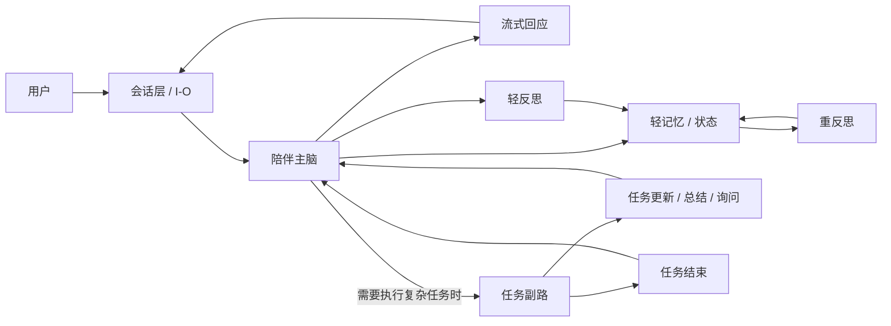

# EmotiCoreBot 陪伴主脑 + 任务副路简化架构

适用分支：`v3`

这份文档描述的是一版更收敛、更适合 `陪伴 + 复杂任务` 定位，并以 `双全工` 为目标的架构。

如需更细的实施级重构设计，见：

- [docs/dual-full-duplex-refactor.zh-CN.md](dual-full-duplex-refactor.zh-CN.md)

当前这版目标同样明确限定为 `当前进程内`：

- 不做持久化
- 不做跨进程恢复
- 进程退出后，session / task / trace / memory 一起失效

它不再把系统中心放在庞大的任务状态机和过多的事件类型上，而是回到三个核心问题：

1. 谁是用户感知到的主体
2. 复杂任务如何被纳入，而不反客为主
3. 主脑如何在保持实时感知的前提下，看到任务细节

---

## 1. 设计结论

这版架构的核心结论只有三条：

1. `陪伴主脑` 是主路，默认负责理解、回应、关系维护、轻记忆和轻反思。
2. `复杂任务` 是副路，只有在确实需要执行、搜索、生成产物或长流程处理时才进入。
3. `重反思` 是侧路，低频运行，不阻塞主路，也不接管任务流程。

用一句话概括：

`陪伴是默认工作模式，任务是按需进入的执行模式，反思是持续但不抢前台的演进机制。`

这里还要再补一个总目标：

这版架构不是只追求“更简单”，而是要用更简单的结构实现 `双全工`。

这里说的 `双全工`，不是让两个主体同时抢前台，而是同时满足三件事：

1. `主路不停`：当前 session 被新的稳定输入事件唤起时，主脑可以继续接住用户、继续回应用户。
2. `副路并行`：复杂任务可以在后台持续推进，而不是每次都被前台会话打断。
3. `细节持续回流`：任务副路的阶段信息和执行细节要持续流回主脑。

这里的 `主路不停` 不表示主路必须永久常驻。

更准确地说：

- 主路通过当前 `session` 被新的稳定输入事件唤起
- 这次前台处理完成后，如果没有继续保持的必要，可以下掉
- 但只要当前 `session` 里还有任务副路在运行或等待恢复，`session` 就不能关闭
- 只有当当前 `session` 下已经没有副路任务，才允许真正关闭 `session`

---

## 2. 总体结构

---

## 3. 三条主线

### 3.1 陪伴主路

陪伴主路是系统默认路径。

主脑在这条路径上负责：

- 接住用户当前输入
- 判断是直接回应还是转入任务
- 组织最终表达
- 维护会话连续性
- 触发轻记忆和轻反思

这条路径必须足够轻，不能被复杂任务实现细节拖慢。

### 3.2 任务副路

任务副路不是第二个主体，而是主脑调用的执行能力。

它的职责只有：

- 接收任务请求
- 接收恢复执行请求
- 持续回传任务细节
- 在合适的时机产出阶段总结
- 需要用户补充时发起询问
- 最终给出结束结果

任务副路不拥有用户关系，不负责人格表达，也不直接成为最终对话主体。

### 3.3 反思侧路

反思侧路分成两类：

- `轻反思`
- `重反思`

轻反思跟随每轮对话或任务结束之后触发，用来沉淀即时关系信息和短期稳定洞察。

重反思低频运行，用来整合较长窗口模式、偏好变化、人格更新，并写入进程内稳定记忆。

### 3.4 双全工约束

如果这版架构要称为 `双全工`，实现层至少要满足下面三条：

- 主脑前台会话不断流，不因为副路正在执行就失去回应能力
- 任务副路在后台独立推进，不因为用户又说了一句话就默认被杀掉
- 任务的 `事件 + trace` 持续回到主脑，而不是只在最终结束时一次性回传

如果后续代码做不到这三条，那么它只能算“有并发基础”，还不能算真正的 `双全工`。

### 3.5 Session 生命周期约束

这版架构里的前台主路，不要求永久常驻，而是跟 `session` 生命周期绑定。

规则如下：

1. 新的稳定输入事件进入后，唤起当前 `session` 的前台处理
2. 前台处理结束后，如果没有继续处理的必要，主路实例可以下掉
3. 只要当前 `session` 里还有至少一个任务副路处于 `running / waiting`，这个 `session` 就不能关闭
4. 只有当当前 `session` 下已经没有活跃副路，才允许关闭 `session`

这意味着：

- `主路可以短生命周期`
- `session 不一定短生命周期`
- `副路的存在会延长 session 生命周期`
- `session` 是主路和副路重新接上的上下文容器

### 3.6 Session / Instance / Task 三层模型

这里必须明确区分三个层级：

1. `session`
2. `前台实例`
3. `副路任务`

它们不是一个东西，也不应该共用同一套生命周期。

#### session

`session` 是上下文容器。

它负责承载：

- 会话摘要
- 任务摘要
- trace 索引
- 最近一次前台决策结果
- 与当前会话相关的轻记忆状态

对于不同交互形态，`session` 可以对应为：

- 聊天软件里的一段连续会话
- 一通电话
- 一次视频会话

#### 前台实例

`前台实例` 是一次短生命周期的前台处理。

它的特点是：

- 被新的稳定输入事件触发
- 处理完当前输入后即可退出
- 不保存长期上下文
- 进入时读取 `session`
- 退出前把必要结果写回 `session`

因此：

- 一个 `session` 里会出现很多个前台实例
- 不是一个 `session` 只对应一个前台实例

#### 副路任务

`副路任务` 是独立于前台实例的执行实体。

它的特点是：

- 属于某个 `session`
- 拥有自己的 `task_id`
- 可以持续运行或等待恢复
- 不依赖某个具体前台实例活着
- 会持续把细节和阶段信息回写到 `session`

所以正确关系是：

- `session` 是容器
- `前台实例` 是短命处理单元
- `副路任务` 是独立持续单元

### 3.7 什么算一次新的前台实例

前台实例的触发粒度不能过粗，也不能过细。

正确的触发单位应该是 `一次稳定输入`，而不是所有底层流片段。

对不同交互形态，建议这样定义：

- 聊天：`一条消息 = 一个新的前台实例`
- 语音通话：`一句稳定转写的话 = 一个新的前台实例`
- 视频通话：`一次稳定的多模态输入轮次 = 一个新的前台实例`

这里特别要避免两种错误：

1. 不要把整个 `session` 只做成一个前台实例
2. 不要把每个音频 chunk、每一帧视频都做成一个前台实例

否则前者会让前台过重，后者会让系统被事件风暴打穿。

---

## 4. 为什么要这样收敛

当前较重的架构有两个典型问题：

1. 把很多内部状态机细节暴露成事件名，例如 `started`、`assigned`、`planned`、`reviewing`、`approved`、`rejected`。
2. 把“主脑想知道全部细节”错误实现成“必须定义很多事件类型”。

这版简化架构的判断是：

- 主脑确实应该知道任务细节
- 但这些细节应该通过 `trace` 持续流入
- 不是通过不断增加事件名字来表达

所以这里做两个明确区分：

1. `事件` 负责表达值得广播的阶段变化
2. `trace` 负责表达连续、细粒度、实时的执行事实

---

## 5. 事件列表

这版架构保留 `9` 个核心业务事件。

如果把输入归一化层的 `INPUT_STABLE` 也算入总线，那么总线事件总数是 `10` 个。

### 5.1 任务事件

| 事件 | 用途 | 说明 |
| --- | --- | --- |
| `TASK_CREATE` | 创建任务 | 主脑确认进入复杂任务时发出 |
| `TASK_RESUME` | 恢复任务 | 主脑携带用户补充信息，恢复等待中的任务 |
| `TASK_UPDATE` | 普通更新 | 持续上报实时细节、过程变化、局部进展 |
| `TASK_SUMMARY` | 阶段总结 | 到达值得记录或播报的 checkpoint 时发出 |
| `TASK_CANCEL` | 取消请求 | 请求任务停止，不表示已经结束 |
| `TASK_ASK` | 任务询问 | 任务缺信息，需要用户补充时发出 |
| `TASK_END` | 最终结束 | 任务完成、失败或取消后的终态通知 |

### 5.2 反思事件

| 事件 | 用途 | 说明 |
| --- | --- | --- |
| `REFLECT_LIGHT` | 轻反思 | 每轮结束或任务结束后触发 |
| `REFLECT_DEEP` | 重反思 | 低频、重型、较长窗口整合 |

---

## 6. 不再保留的事件

以下概念不再作为独立事件存在：

- `started`
- `assigned`
- `planned`
- `reviewing`
- `approved`
- `rejected`
- `result`
- `failed`

原因很简单：

- 它们大多是内部流程节点
- 它们不是主脑真正需要订阅的“阶段边界”
- 它们会让事件面持续膨胀

这些信息如果还有价值，应当进入：

- `TASK_UPDATE`
- `TASK_SUMMARY`
- `TASK_END`
- `task_trace`

---

## 7. 任务内部状态

任务内部状态不再做复杂状态机，只保留三个状态：

| 状态 | 说明 |
| --- | --- |
| `running` | 任务执行中 |
| `waiting` | 等待用户补充信息 |
| `done` | 任务已结束 |

结束结果单独放到 `result` 字段：

| result | 说明 |
| --- | --- |
| `none` | 尚未结束 |
| `success` | 正常完成 |
| `failed` | 执行失败 |
| `cancelled` | 取消完成 |

关键原则：

- `failed` 不是状态
- `cancelled` 不是状态
- 它们都是 `done` 的结束结果

---

## 8. 最简任务状态机

| 当前状态 | 触发 | 下一个状态 |
| --- | --- | --- |
| `running` | 普通更新 | `running` |
| `running` | 需要用户补充 | `waiting` |
| `waiting` | 收到补充继续执行 | `running` |
| `running` | 执行成功 | `done(result=success)` |
| `running` | 执行失败 | `done(result=failed)` |
| `running` | 取消完成 | `done(result=cancelled)` |
| `waiting` | 执行失败 | `done(result=failed)` |
| `waiting` | 取消完成 | `done(result=cancelled)` |

内部实现只需要支持四种基本操作：

- `create_task()`
- `resume_task()`
- `update_task()`
- `close_task()`

---

## 9. 主脑为什么仍然能看到全部细节

因为这版架构不靠大量事件名传细节，而是靠 `task_trace`。

### 9.1 设计原则

- `事件` 表示阶段
- `trace` 表示事实流
- `主脑` 订阅少量事件，但持续读取全部细节

### 9.2 TaskTraceRecord

| 字段 | 类型 | 说明 |
| --- | --- | --- |
| `trace_id` | `str` | 细节记录 ID |
| `task_id` | `str` | 所属任务 |
| `ts` | `str` | 时间戳 |
| `kind` | `info | progress | summary | ask | warning | error` | 细节类型 |
| `message` | `str` | 给主脑看的描述 |
| `data` | `dict` | 附加结构化信息 |

### 9.3 设计意义

这意味着：

- 主脑可以实时知道任务每一步发生了什么
- 任务执行器可以高频上报细节
- 总线事件面仍然保持稳定
- 内部实现可以演化，而不必不断扩张事件枚举

---

## 10. 统一事件字段

所有核心事件建议统一带这些公共字段：

| 字段 | 说明 |
| --- | --- |
| `event_id` | 事件唯一 ID |
| `session_id` | 当前会话 ID |
| `task_id` | 任务 ID；非任务事件可空 |
| `source` | 事件来源模块 |
| `ts` | 时间戳 |
| `correlation_id` | 用于串联同一轮或同一任务 |

---

## 11. 事件 payload 建议

### 11.1 TASK_CREATE

| 字段 | 说明 |
| --- | --- |
| `request` | 任务请求 |
| `goal` | 任务目标 |
| `context` | 当前上下文 |
| `message` | 给主脑的创建说明，可选 |

### 11.2 TASK_RESUME

| 字段 | 说明 |
| --- | --- |
| `task_id` | 要恢复的任务 ID |
| `state` | 期望从 `waiting` 恢复到 `running` |
| `user_input` | 用户本次补充的信息 |
| `provided_inputs` | 结构化补充输入，可选 |
| `message` | 给主脑或执行器的恢复说明，可选 |

### 11.3 TASK_UPDATE

| 字段 | 说明 |
| --- | --- |
| `state` | 固定为 `running` |
| `message` | 当前更新说明 |
| `progress` | 进度，可选 |
| `stage` | 当前阶段，可选 |
| `trace_append` | 新增的 trace 记录列表 |

### 11.4 TASK_SUMMARY

| 字段 | 说明 |
| --- | --- |
| `state` | 通常为 `running` |
| `summary` | 阶段总结 |
| `stage` | 当前阶段 |
| `next_step` | 下一步，可选 |
| `trace_append` | 可选 |

### 11.5 TASK_CANCEL

| 字段 | 说明 |
| --- | --- |
| `reason` | 取消原因 |
| `by` | 发起者，如 `user` / `system` / `brain` |

### 11.6 TASK_ASK

| 字段 | 说明 |
| --- | --- |
| `state` | 固定为 `waiting` |
| `question` | 要问用户的问题 |
| `field` | 缺失字段，可选 |
| `why` | 为什么需要这个输入，可选 |
| `trace_append` | 可选 |

### 11.7 TASK_END

| 字段 | 说明 |
| --- | --- |
| `state` | 固定为 `done` |
| `result` | `success | failed | cancelled` |
| `summary` | 最终总结 |
| `output` | 最终产出，可选 |
| `error` | 失败信息，可选 |
| `trace_final` | 最终 trace，可选 |

### 11.8 REFLECT_LIGHT

| 字段 | 说明 |
| --- | --- |
| `reason` | 触发原因 |
| `scope` | 反思范围 |
| `snapshot` | 可选快照 |

### 11.9 REFLECT_DEEP

| 字段 | 说明 |
| --- | --- |
| `reason` | 触发原因 |
| `window` | 时间窗口 |
| `focus` | 反思重点，可选 |

---

## 12. 一个典型时序

### 12.1 纯陪伴轮

1. 用户进入会话层
2. 主脑直接理解并流式回应
3. 轮次结束后触发 `REFLECT_LIGHT`

这条路径没有任务事件。

### 12.2 复杂任务轮

1. 主脑判断当前需求应进入任务副路
2. 发出 `TASK_CREATE`
3. 执行器连续发 `TASK_UPDATE`
4. 到达稳定 checkpoint 时发 `TASK_SUMMARY`
5. 若缺信息则发 `TASK_ASK`
6. 用户补充后，主脑发出 `TASK_RESUME`
7. 恢复执行后继续发 `TASK_UPDATE`
8. 最终发 `TASK_END`
9. 结束后触发 `REFLECT_LIGHT`

### 12.3 较长窗口演进

1. 后台按低频策略触发 `REFLECT_DEEP`
2. 深反思整合较长窗口模式
3. 结果回写到轻记忆 / 进程内稳定记忆

---

## 13. 与当前代码的关系

当前代码已经有一些可以复用的结构基础：

- `TransportBus` 适合作为会话层双向 I-O
- `ExecutiveBrain` 适合作为陪伴主脑骨架
- `MemoryGovernor` 可以继续承担轻反思 / 重反思的治理职责

但如果以 `双全工` 为目标，并且 `不需要兼容现有设计`，那么当前实现并不是“再修一点”就够了，而是需要整体重构。

下面这部分不是增量兼容方案，而是按目标架构重新组织系统的判断。

### 13.1 当前代码离双全工差哪些点

1. `主路仍然是 turn-based，不是真正常驻主脑`

当前运行入口仍然更接近“收到一轮输入，产出一轮结果”的处理模型。

这意味着：

- 会话主脑不是持续在线的前台 actor
- 主路天然倾向于围绕单轮请求收敛
- 这不适合作为陪伴机器人长期在线的前台脑

2. `新输入默认会打断副路，不满足主路不停 + 副路并行`

当前代码对新输入的处理逻辑仍然偏向“抢占旧任务”。

这意味着：

- 用户一说新话，后台任务很可能被中断或取消
- 副路不是稳定并行，而是容易被前台会话抢掉执行权
- 这不符合你要的双全工目标

3. `任务系统仍然靠大状态机和大量事件名表达自己`

当前设计仍然保留了很多内部流程含义：

- `task.report.*`
- `task.event.*`
- `created / assigned / planned / reviewing / approved / rejected / result / failed`

这会导致：

- 任务系统把自己的内部过程暴露得太多
- 主脑要理解很多任务内部语义
- 架构复杂度继续堆在事件面和状态机上

4. `细节回流还不是 first-class trace stream`

虽然当前执行层内部已经能生成 `task_trace`，但它还不是主链路上的一等公民。

现在的问题是：

- 实时细节不是稳定地以 `trace_append` 方式持续回到主脑
- 很多细节仍然依赖零散 progress 字段或特定事件类型
- 主脑拿到的是“部分过程信号”，不是“完整事实流”

这和目标架构里“事件负责阶段，trace 负责细节”还不是一回事。

5. `主脑和任务副路的边界还不够清`

当前链路更像：

- 主脑做一部分决策
- runtime scheduler 再做一层归一化和流程推进
- planner / worker / reviewer 再按内部阶段流转

这会让任务副路内部结构直接影响整个系统外观。

双全工架构里更理想的关系应该是：

- 主脑只关心“要不要进任务、是否继续、怎么对用户表达”
- 任务副路只关心“怎么执行、怎么回流事实”
- 内部角色可以存在，但不应该决定总线表面语义

6. `任务副路还不是长期运行的独立体`

双全工要求任务副路像后台进程一样可持续推进。

而当前实现仍更接近“围绕一次输入启动一段执行，再尽快归并回当前轮次”。

这不利于：

- 长任务持续推进
- 用户中途插话但任务继续
- 主脑一边陪伴一边盯住任务变化

### 13.2 如果不考虑兼容，应该怎么调整

如果目标明确就是 `双全工`，并且不需要兼容旧设计，那么建议直接按下面的方向重构。

1. `重建顶层运行结构`

顶层只保留三个长期存在的运行体：

- `CompanionBrainRuntime`
- `TaskRuntime`
- `ReflectionRuntime`

其中：

- `CompanionBrainRuntime` 负责前台陪伴、表达、会话连续性
- `TaskRuntime` 负责所有复杂任务
- `ReflectionRuntime` 负责轻反思和重反思

不要再让一个混合型 runtime 同时承担前台会话、任务归一化、阶段调度这三种职责。

2. `把主路改成按 session 唤起的前台控制器`

主脑不应该再围绕“单轮请求 -> 单轮返回”建模，也不应该做成永久常驻大脑，而应该围绕“按 session 唤起、状态外置”的前台控制器建模。

这意味着：

- 用户每次输入都进入同一个 `session` 上下文
- 前台控制器按消息被唤起，处理完可退出
- 会话状态、任务摘要、记忆摘要都放在外部状态里
- 只要该 `session` 里仍然有副路任务，`session` 就继续存在
- 下次主路再被唤起时，仍能立刻接上后台任务变化

3. `把任务副路改成独立 task actor`

每个任务都应该是一个独立存在的执行实体，而不是某轮输入的附属品。

它应该具备：

- 独立 task_id
- 独立状态 `running / waiting / done`
- 独立 trace 缓冲
- 独立取消与恢复能力

只有这样，副路才真正能“并行存在”，而不是被前台轮次牵着走。

并且：

- task actor 属于某个 `session`
- 只要该 task actor 还活着，对应 `session` 就不能被关闭

4. `彻底废弃旧的大事件面，换成 9 个核心事件`

任务层对外只保留：

- `TASK_CREATE`
- `TASK_RESUME`
- `TASK_UPDATE`
- `TASK_SUMMARY`
- `TASK_CANCEL`
- `TASK_ASK`
- `TASK_END`

反思层只保留：

- `REFLECT_LIGHT`
- `REFLECT_DEEP`

旧的 `task.report.* / task.event.* / review.*` 语义，不必兼容，不必映射，直接退出主设计。

5. `彻底废弃旧的大状态机，只保留三态`

任务状态只保留：

- `running`
- `waiting`
- `done`

结束原因放进 `result`：

- `success`
- `failed`
- `cancelled`

不要再保留：

- `assigned`
- `planned`
- `reviewing`
- `approved`
- `rejected`

这些如果内部仍然有价值，也只能作为副路内部实现细节，不能再成为主链路状态语义。

6. `把 trace 提升为主链路的一等公民`

后续重构时，最关键的一步不是多加几个事件，而是把 `task_trace` 真正接到主链路上。

正确做法应该是：

- worker / tool / executor 产生的每一批新细节，直接形成 `trace_append`
- `TASK_UPDATE / TASK_SUMMARY / TASK_ASK / TASK_END` 都可以携带 `trace_append`
- 主脑持续消费这些 trace，而不是只在最后读一份总结

这样主脑才能真正“盯住副路”，而不是只在少数节点收到通知。

7. `取消“新输入默认等于取消任务”这套逻辑`

在双全工架构里：

- 新输入首先是主脑事件
- 只有当用户明确要停下某任务，或者主脑明确决定抢占任务时，才发 `TASK_CANCEL`
- 如果用户是在补充之前等待中的任务，就发 `TASK_RESUME`

也就是说：

- `新的用户消息 != 默认取消后台任务`

这条如果不改，双全工就不成立。

8. `主脑统一对外表达，任务副路不直接成为对话主体`

任务副路可以不断发：

- update
- summary
- ask
- end
- trace

但最终如何对用户说、说多少、什么时候说，应该由主脑统一决定。

这样才能保证：

- 陪伴主体不丢
- 对话风格一致
- 前台体验不会被副路内部实现绑架

9. `把 planner / worker / reviewer 降成纯内部实现`

如果以后还保留这些内部角色，也应该满足一个原则：

- 它们只是 `TaskRuntime` 内部的执行协作者
- 它们不再拥有面向系统其他模块的独立阶段语义

换句话说：

- 外面只看见任务副路
- 不应该再看见 planner / reviewer 生命周期

10. `按双全工重做验收标准`

以后判断代码是否达标，不再看“事件名齐不齐”“状态机完不完整”，而是只看三件事：

- 主脑能不能持续接住用户
- 任务能不能在后台稳定并行
- 细节能不能持续回流到主脑

只要这三条没同时成立，就不应把实现称为 `双全工`。

---

## 14. 最终原则

这版简化架构只坚持五条原则：

1. `主脑是主体`
2. `任务是副路`
3. `反思是侧路`
4. `双全工是目标`
5. `事件负责阶段，trace 负责细节`

如果未来继续扩展，优先级也应该是：

1. 保住主脑的主体感
2. 保住任务副路的可控性
3. 先满足双全工，再讨论内部流程细化
4. 保住反思侧路的长期演进能力
5. 不再把内部流程细节膨胀成事件枚举

---

## 15. 一句话定稿

`一个主脑负责陪伴，一个副路负责复杂任务，一个侧路负责反思；整体目标是双全工，也就是主路不停、副路并行、细节持续回流；任务只保留少量阶段事件，所有实时细节都通过 trace 持续流回主脑。`
