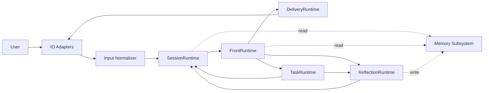
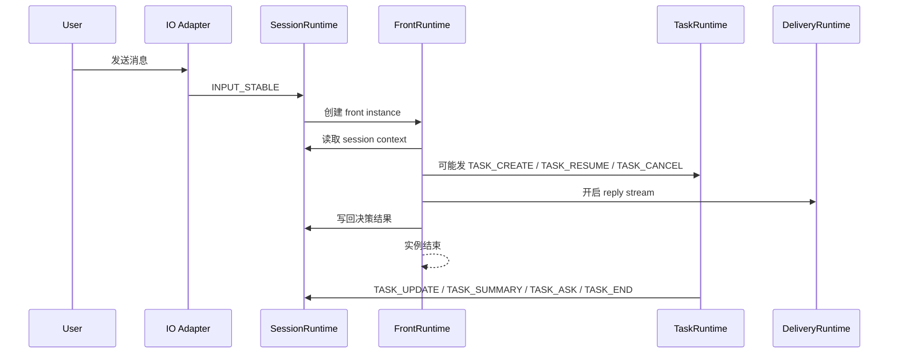
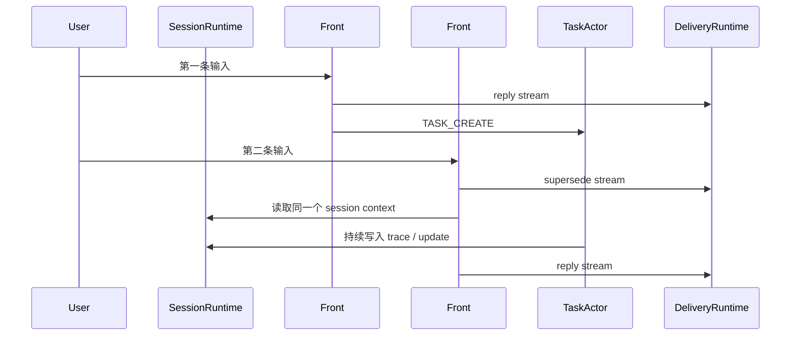

# EmotiCoreBot 双全工重构设计文档

适用目标：`陪伴 + 复杂任务`

文档性质：`目标架构 / 非兼容重构 / 实施设计`

这份文档不是对当前实现的修补建议，也不是兼容迁移说明。

它直接回答一个问题：

`如果完全按双全工重做 EmotiCoreBot，新的运行结构应该长什么样。`

这版设计明确只覆盖 `当前进程内` 的双全工能力：

- 不做持久化
- 不做跨进程恢复
- 进程退出后，session / task / trace / memory 全部失效

---

## 1. 设计目标

这次重构只追求四个结果：

1. 用户在等待 AI 返回时，仍然可以继续输入
2. 新输入可以抢占前台回复流，但不会默认杀掉后台任务
3. 复杂任务可以独立持续运行，并持续把细节回流给主脑
4. 同一套架构可以同时支撑聊天、语音通话、视频通话

一句话：

`前台可重入，副路可持续，session 可续接，细节可回流。`

---

## 2. 硬约束

这份设计建立在下面这些硬约束之上。

### 2.1 用户侧硬约束

- 用户发完一条消息，不需要等 AI 完全说完，下一条消息就可以继续进入
- 用户新的输入，优先影响前台当前回复权
- 用户新的输入，不应该默认影响后台任务生存权
- 用户看到的主体始终是同一个陪伴主脑，而不是内部多个角色轮流说话

### 2.2 系统侧硬约束

- 前台处理必须短生命周期，不能做成一个越来越重的常驻大脑实例
- session 上下文必须外置，不能绑在某个前台实例内存里
- 任务副路必须独立于前台实例存在
- 任务细节回流必须是主链路能力，不是补丁能力
- 事件面必须稳定，不允许再靠不断扩张事件名表达内部流程

### 2.3 生命周期硬约束

- `前台实例` 可以退出
- `session context` 不能在仍有活跃副路时被归档或回收
- `task actor` 必须能在没有前台实例存活时继续运行

---

## 3. 三层对象模型

这次重构必须先把对象层级拆清楚。

### 3.1 Session

`session` 是上下文容器，不是前台实例，不是任务。

它承载：

- 当前会话摘要
- 当前活跃任务索引
- 当前等待任务索引
- 最近前台决策结果
- 最近对用户的回复摘要
- 轻记忆快照
- trace 索引

对不同交互形态，`session` 可以对应为：

- 聊天软件中的一段连续会话
- 一通电话
- 一次视频会话

### 3.2 Front Instance

`front instance` 是一次短生命周期的前台处理实例。

它可以由两种来源触发：

1. `用户输入`：新的稳定输入事件到来
2. `任务事件`：task actor 发出需要主动对用户说话的事件（如 `TASK_ASK`、`TASK_END`）

无论哪种触发源，front instance 都执行同一条处理管道：

- 读取 session context
- 理解当前触发原因
- 判断直接回复 / 创建任务 / 恢复任务 / 取消任务
- 决定当前如何对用户表达
- 写回本次处理结果

它处理结束后即可退出。

一个 session 内会有很多个 front instance。

### 3.3 Task Actor

`task actor` 是任务副路中的独立执行实体。

它负责：

- 接收任务创建请求
- 接收恢复请求
- 维护任务状态
- 驱动实际执行
- 持续产出 trace 和阶段事件
- 最终结束任务

它不依赖某个具体 front instance 存活。

### 3.4 三者关系

正确关系必须是：

- `session` 是容器
- `front instance` 是短命控制单元
- `task actor` 是独立持续单元

错误关系包括：

- 把整个 session 做成一个永久 front instance
- 把 task actor 做成某个 front instance 的子流程
- 把 session context 散落在很多临时对象里

---

## 4. 输入建模

双全工要成立，首先要把“什么算一次输入”定义清楚。

### 4.1 稳定输入事件

系统内部只接受 `稳定输入事件`，而不是所有底层流片段。

稳定输入事件的定义：

- 这次输入已经足够让主脑做一次完整判断
- 这次输入可以触发一个新的 front instance
- 这次输入会写入同一个 session

### 4.2 不同形态的稳定输入定义

| 交互形态 | 什么算一次稳定输入 |
| --- | --- |
| 文本聊天 | 一条消息 |
| 语音通话 | 一句稳定转写的话 |
| 视频通话 | 一次稳定的多模态输入轮次 |

### 4.3 必须避免的两种错误

1. 不要把整个 session 只当成一次输入
2. 不要把音频 chunk、视频帧、VAD 边缘信号都当成一次输入

否则：

- 前者会让前台处理过重
- 后者会让前台实例风暴化

---

## 5. 顶层运行结构

这次重构后的顶层运行结构，只保留四个核心运行体。

1. `SessionRuntime`
2. `FrontRuntime`
3. `TaskRuntime`
4. `ReflectionRuntime`

另外保留三个外围基础设施：

- `DeliveryRuntime`
- `IO Adapters`
- `Memory Subsystem`

### 5.1 目标结构图



### 5.2 结构含义

- `IO Adapters` 只负责和聊天、语音、视频渠道打交道
- `Input Normalizer` 负责把底层输入聚合成稳定输入事件
- `SessionRuntime` 负责 session context 的创建、读取、更新、归档控制
- `FrontRuntime` 负责每次新的 front instance
- `TaskRuntime` 负责任务 actor 生命周期
- `ReflectionRuntime` 负责轻反思和重反思
- `DeliveryRuntime` 负责真正的对外回复投递和流式控制
- `Memory Subsystem` 提供统一的进程内记忆读写和检索能力

这里要注意：

- `Memory Subsystem` 是服务依赖层，不是事件流中的主动 runtime
- 它主要被 `SessionRuntime` / `FrontRuntime` 读取
- 它主要接收 `ReflectionRuntime` 的写入

---

## 6. FrontRuntime 设计

FrontRuntime 是“陪伴主脑控制面”，不是永久推理实例。

### 6.1 FrontRuntime 的职责

- 接收新的稳定输入事件（来自用户输入）
- 接收 SessionRuntime 转发的主动回复请求（来自 task 事件）
- 为触发源创建新的 front instance
- 读取 session context 和活跃任务信息
- 生成当前前台回复策略
- 组织用户可见表达
- 对用户可见表达做同步 guard / safety 检查
- 发出任务控制事件

### 6.2 Front Instance 生命周期

每个 front instance 都遵循同一条路径：

1. 载入 session context
2. 载入活跃 task 摘要
3. 读取必要记忆摘要
4. 进行本次前台判断
5. 组织表达并同步执行 guard
6. 开启回复流或发任务事件
7. 写回 session context
8. 结束实例

### 6.3 Front Instance 不负责什么

- 不持有长期上下文
- 不维持活跃任务执行循环
- 不直接成为任务执行器
- 不负责长期调度

### 6.4 前台可重入原则

当新的稳定输入到来时：

- 必须允许创建新的 front instance
- 新实例可以抢占旧的前台回复流
- 旧实例可以被停止或自然结束
- 但 task actor 不能因此默认被取消

### 6.5 Guard / Safety 的放置位置

回复安全审核不建议做成独立 runtime，也不建议再扩一层业务事件面。

初版设计里，guard 应放在 `FrontRuntime` 内部，作为这条同步管道的一部分：

`decision -> expression -> guard -> open reply stream`

这样做的好处是：

- guard 紧贴用户可见表达
- 不需要额外的 guard 业务事件
- 不需要独立的 safety runtime
- 不会让事件面再次膨胀

`DeliveryRuntime` 只负责投递，不负责决定“这句话能不能说”。

如果未来需要工具执行安全约束，也应该放在 task executor 内部处理，而不是让回复 guard 和任务安全混成同一层。

### 6.6 任务触发的主动 front instance

front instance 不仅由用户输入触发，也可以由 task 事件触发。

当 task actor 发出某些事件时，系统需要主动对用户说话，而不能等用户下次开口。

#### 触发规则

| 事件 | 是否触发主动 front instance | 原因 |
| --- | --- | --- |
| `TASK_UPDATE` | 否 | 只写 session，等下次 front 读取 |
| `TASK_SUMMARY` | 可选 | SessionRuntime 判断是否值得主动播报 |
| `TASK_ASK` | **是** | 必须主动问用户 |
| `TASK_END` | **是** | 必须主动告知结果 |

#### 触发流程

```text
TaskRuntime ──TASK_ASK──▶ SessionRuntime
                              │
                    检测到：这是需要主动对用户说的事件
                              │
                              ▼
                    触发 FrontRuntime 创建新 front instance
                    （origin: task, task_id: xxx）
                              │
                              ▼
                    front instance 读 session context
                    看到 waiting task + question
                    组织表达（用主脑人格说话）
                    guard → 开启 reply stream → 投递
```

#### 设计要点

1. front instance 的处理管道不变，和用户输入触发时完全一样
2. 主脑统一对外表达的原则不破——不管是用户问的还是任务主动说的，都经过同一个人格和 guard
3. 如果用户输入和 task 事件几乎同时到达，按 §8.5 的串行提交规则排队处理
4. `TASK_SUMMARY` 是否触发主动回复由 SessionRuntime 内部策略决定，不硬编码

---

## 7. Reply Stream 设计

双全工里，真正被新输入抢占的应该是 `reply stream`，而不是 `task actor`。

### 7.1 每个 session 的前台回复规则

一个 session 在任意时刻：

- 可以有多个历史 front instance
- 可以有多个活跃 task actor
- 但只应该有一个“当前主前台回复流”

### 7.2 Reply Stream 状态

Delivery 层的回复流建议只保留四个状态：

- `open`
- `delta`
- `close`
- `superseded`

这四个状态只属于投递协议层，不属于任务业务事件层。

### 7.3 新输入到来时的规则

如果当前 session 仍有前台回复流正在输出，而新输入到来：

1. 新 front instance 创建
2. 旧前台回复流被标记为 `superseded`
3. 新 front instance 获得当前回复权
4. 活跃 task actor 保持不变，除非明确收到取消语义

### 7.4 为什么要这么设计


因为聊天、电话、视频场景里，用户打断的通常是“你现在怎么说”，而不是“后台任务是否继续做”。

### 7.5 语音 / 视频信道适配

语音通话和视频通话里，信道是持续占有的。这和文本聊天"发一条等一条"的模式不同。

但这不意味着需要一个永久的 front instance。

#### 什么是"一直占着的"

| 组件 | 文本聊天 | 语音/视频通话 |
| --- | --- | --- |
| Session | 存在但不活跃 | 整通电话都活着 |
| IO Adapter | 按消息收发 | **持续在线**（一直在听） |
| Input Normalizer | 消息进来就是稳定输入 | **持续运行**（VAD → 转写 → 攒成一句稳定输入） |
| Delivery Channel | 发一条消息就关闭 | **持续打开**（随时可以说话） |
| Front Instance | 短命 | **仍然短命** |
| Task Actor | 独立 | 独立，不变 |

关键结论："一直占着的"是 IO 层和 Delivery 通道，不是 Front Instance。

#### 语音/视频里 front instance 仍然是短命的

电话里一句话对应一个 front instance，和文本聊天里一条消息对应一个 front instance 是同一个模型。

触发频率更高，但生命周期模型不变。

用户没说话、任务也没事的时候，系统只是安静地听着，没有活跃的 front instance。

#### 语音里的 supersede = 打断说话

```text
系统正在说话（reply stream in delta state）
     |
用户插嘴（VAD 检测到用户开始说话）
     |
IO Adapter -> INPUT_STABLE(barge_in=true) -> SessionRuntime
     |
     +-- 当前 reply stream -> superseded（停止 TTS）
     +-- 新 front instance 启动 -> 读 session -> 处理用户新说的话
```

这和文本聊天里"旧消息被新消息抢占"是同一个机制，只是介质不同。

#### TASK_ASK / TASK_END 在语音里的表现

用户打电话时，让 AI 帮忙做一个复杂任务。任务跑着跑着需要问用户：

```text
TaskRuntime --TASK_ASK--> SessionRuntime
                              |
                    触发主动 front instance (origin: task)
                              |
                    组织表达："刚才你让我查的那个，需要确认一下……"
                              |
                    DeliveryRuntime -> TTS -> 扬声器 -> 用户听到
```

如果此刻用户正好也在说话，按 §8.5 的串行提交规则排队处理。

#### 信道差异的封装层

FrontRuntime 以上的所有东西（session、task、reflection、events）不感知信道差异。

"一直占着"的复杂性全部封装在 IO Adapter 和 Delivery Channel 里：

| 层 | 文本聊天 | 语音通话 | 视频通话 |
| --- | --- | --- | --- |
| IO Adapter | HTTP/WebSocket | 持续音频流 + VAD + ASR | 音频流 + 视频流 + 多模态融合 |
| Input Normalizer | 一条消息 = INPUT_STABLE | 一句稳定转写 = INPUT_STABLE | 一轮多模态输入 = INPUT_STABLE |
| Delivery Channel | 发消息 API | 持续 TTS 输出流 | TTS + 视觉输出流 |
| Reply Stream | 一条消息的生命周期 | 一句话的 TTS 播放周期 | 一轮回应的播放周期 |
| Supersede | 停止打字，发新消息 | 停止 TTS，开始说新的 | 停止当前输出，切到新回应 |

这也是 §4 把 Input Normalizer 单独拎出来的原因——消化不同信道的连续性差异，让上层始终只看到离散的稳定输入事件。

---

## 8. SessionRuntime 设计

SessionRuntime 是整个新架构的锚点。

### 8.1 它负责什么

- 创建 session context
- 提供 session 读取接口
- 提供 session 更新接口
- 维护 session 和 task 的绑定关系
- 控制 session 是否允许归档
- 订阅 task 事件（`TASK_UPDATE / TASK_SUMMARY / TASK_ASK / TASK_END`），更新 session context
- 检测到 `TASK_ASK` 或 `TASK_END` 时，触发 FrontRuntime 创建主动 front instance

### 8.2 Session Context 建议字段

| 字段 | 类型 | 说明 |
| --- | --- | --- |
| `session_id` | `str` | 会话唯一标识 |
| `channel_kind` | `str` | chat / voice / video |
| `session_summary` | `str` | 当前会话摘要 |
| `last_front_instance_id` | `str | None` | 最近一次前台实例 |
| `active_reply_stream_id` | `str | None` | 当前回复流 |
| `active_task_ids` | `list[str]` | 当前运行中的 task |
| `waiting_task_ids` | `list[str]` | 当前等待恢复的 task |
| `last_user_input` | `str | None` | 最近一次稳定输入 |
| `last_assistant_output` | `str | None` | 最近一次用户可见输出摘要 |
| `memory_snapshot` | `dict | None` | 进程内轻记忆快照 |
| `trace_cursor` | `dict[str, str]` | 各任务最近消费到的 trace 位置 |
| `archived` | `bool` | 是否已归档 |

### 8.3 Session 归档规则

只要满足任一条件，session 都不得归档：

- `active_task_ids` 非空
- `waiting_task_ids` 非空
- 当前仍有未完成的前台回复流

只有同时满足下面三条，才允许归档：

- `active_task_ids` 为空
- `waiting_task_ids` 为空
- 当前没有活跃回复流

### 8.4 Session 不是进程

这里的 session 是数据和上下文实体，不要求有一个永远活着的进程或 actor 附着在上面。

### 8.5 前台实例并发时的 session 写冲突

双全工允许新输入在旧前台回复还没结束时继续进入，但这不代表多个 front instance 可以随意并发写 session。

初版建议采用：

- `per-session single writer`
- `front control 串行提交`

具体规则：

1. 新的稳定输入可以立刻进入 session mailbox
2. 新的 front instance 可以被创建为待执行实例
3. 但同一时刻只允许一个 front instance 持有 session 写权限
4. 旧 front instance 必须在失去写权限后停止提交 session 更新
5. 新 front instance 只有在拿到新的写权限后，才能读取最新已提交的 session context 并开始决策

这意味着：

- 输入进入可以并发
- reply stream 抢占可以很快发生
- session context 的读写仍然是串行的

这是初版推荐方案，因为它比乐观锁更简单，也更容易保证一致性。

后续如果确实需要更高并发，再演进到：

- session version
- optimistic concurrency control
- conflict retry

但那不应该是第一版的默认复杂度。

---

## 9. TaskRuntime 设计

TaskRuntime 是第二核心。

它必须是独立持续的，不再从属于某个 front instance。

### 9.1 TaskRuntime 的职责

- 创建 task actor
- 恢复 task actor
- 取消 task actor
- 调度 task actor 执行
- 接收 executor 产出的 trace
- 把阶段信息写回 session

### 9.2 Task Actor 状态

任务状态只保留三态：

| 状态 | 说明 |
| --- | --- |
| `running` | 任务正在执行 |
| `waiting` | 任务等待用户补充 |
| `done` | 任务已结束 |

结束结果通过 `result` 表达：

| result | 说明 |
| --- | --- |
| `success` | 正常完成 |
| `failed` | 执行失败 |
| `cancelled` | 被取消 |

### 9.3 Task Actor 建议字段

| 字段 | 类型 | 说明 |
| --- | --- | --- |
| `task_id` | `str` | 任务唯一标识 |
| `session_id` | `str` | 所属 session |
| `state` | `running | waiting | done` | 当前状态 |
| `result` | `success | failed | cancelled | none` | 结束结果 |
| `request` | `dict` | 原始任务请求 |
| `summary` | `str` | 当前摘要 |
| `latest_ask` | `dict | None` | 最近一次补充请求 |
| `trace_count` | `int` | 已记录 trace 数量 |
| `created_at` | `str` | 创建时间 |
| `updated_at` | `str` | 更新时间 |
| `ended_at` | `str | None` | 结束时间 |

### 9.4 Task Actor 内部可以复杂，外部必须简单

内部可以有：

- planner
- worker
- reviewer
- tool executor
- 多步 plan

但这些都不允许变成主链路事件语义。

外部只能看到：

- 创建
- 恢复
- 更新
- 总结
- 询问
- 取消
- 结束

---

## 10. ReflectionRuntime 与 Memory 设计

ReflectionRuntime 和 Memory Subsystem 要分工明确。

### 10.1 ReflectionRuntime 的职责

- 消费 `REFLECT_LIGHT`
- 低频触发 `REFLECT_DEEP`
- 整理会话、任务、人格层面的稳定洞察
- 把当前进程内仍需保留的稳定信息写入 memory subsystem

### 10.2 REFLECT_DEEP 的触发者

新架构里不再使用旧的 scheduler 作为 deep reflection 触发者。

初版建议：

- `ReflectionRuntime` 自己内部维护一个低频定时器

可选增强：

- `SessionRuntime` 在检测到 session 空闲时，把空闲 session 交给 `ReflectionRuntime` 扫描

但这不需要引入新的总线事件。

也就是说：

- 初版由 `ReflectionRuntime` 自己定时触发 `REFLECT_DEEP`
- 空闲 session 只作为内部查询条件，不作为新的事件类型

### 10.3 Memory Subsystem 的归属

memory 不应该消失，也不应该被随便塞进 session 或 reflection 目录里。

建议保留独立 `memory/` 模块，作为共享的进程内记忆服务层被上层复用。

职责拆分建议如下：

- `SessionRuntime` 只持有 session 内短期状态和轻记忆快照，不负责记忆治理
- `FrontRuntime` 只读取必要的轻量记忆摘要
- `ReflectionRuntime` 负责把稳定洞察整理后写入进程内稳定记忆
- `Memory Subsystem` 负责进程内存储、检索和统一访问接口，不负责落盘

### 10.4 Memory Subsystem 建议组成

`memory/` 目录建议至少保留：

- `service.py`
- `facade.py`
- `index.py`
- `models.py`

其中：

- `service.py` 负责维护进程内记忆记录和生命周期
- `facade.py` 负责给 front/session/reflection 提供统一访问接口
- `index.py` 负责可选的进程内检索索引
- `models.py` 负责记忆数据模型

### 10.5 轻记忆和进程内稳定记忆的边界

初版建议这样划分：

- 轻记忆读写：由 `SessionRuntime` 管 session 内的短期状态和 `memory_snapshot`
- 进程内稳定记忆整合：由 `ReflectionRuntime` 调用 `memory/` 模块完成
- 检索索引：作为 `memory/` 模块内部的可选进程内能力存在

这样既不会让 session 变成 memory manager，也不会让 reflection 背存储细节。

这里要明确：

- `memory/` 不是持久层
- `memory/` 只在当前进程生命周期内有效
- 进程退出后，所有记忆内容都直接失效

---

## 11. 事件面设计

这次重构严格把事件分成三层。

### 11.1 总线事件分层

如果把输入层也算入总线，那么初版总线事件总数是 `10` 个。

分层如下：

| 层 | 数量 | 事件 |
| --- | --- | --- |
| 输入层 | 1 | `INPUT_STABLE` |
| 任务层 | 7 | `TASK_CREATE` `TASK_RESUME` `TASK_UPDATE` `TASK_SUMMARY` `TASK_CANCEL` `TASK_ASK` `TASK_END` |
| 反思层 | 2 | `REFLECT_LIGHT` `REFLECT_DEEP` |

也就是说：

- `总线事件总数 = 10`
- `业务核心事件 = 9`

这里的“业务核心事件”指的是：

- 任务层 7 个
- 反思层 2 个

### 11.2 业务核心事件

| 事件 | 方向 | 触发主动 front instance | 用途 |
| --- | --- | --- | --- |
| `TASK_CREATE` | front -> task | — | 创建任务 |
| `TASK_RESUME` | front -> task | — | 恢复等待任务 |
| `TASK_UPDATE` | task -> session | 否 | 持续更新 |
| `TASK_SUMMARY` | task -> session | 可选 | 阶段总结 |
| `TASK_CANCEL` | front -> task | — | 请求取消 |
| `TASK_ASK` | task -> session | **是** | 请求用户补充 |
| `TASK_END` | task -> session | **是** | 最终结束 |
| `REFLECT_LIGHT` | front/task -> reflection | — | 轻反思 |
| `REFLECT_DEEP` | reflection(timer) -> reflection | — | 重反思 |

这里的消费关系要明确成：

- `SessionRuntime` 是 `TASK_UPDATE / TASK_SUMMARY / TASK_ASK / TASK_END` 的真正总线订阅者
- `SessionRuntime` 在收到 `TASK_ASK` 或 `TASK_END` 时，触发 `FrontRuntime` 创建主动 front instance
- `FrontRuntime` 不需要长期订阅 task 事件
- front instance 只在被触发时（用户输入或 task 事件），从 session context 和未消费 trace 中读取任务最新状态

### 11.3 输入事件

输入层建议统一成一种业务输入事件：

- `INPUT_STABLE`

它只表示：

- 新的稳定输入已经形成
- 可以创建新的 front instance

底层文本、语音、视频差异，都在输入归一化层消化，不进入主业务事件面。

### 11.4 投递流协议

投递流协议不再和任务业务事件混在一起。

它只关心：

- `reply_stream_id`
- `front_instance_id`
- `stream_state`
- `content_delta`

这部分可以走独立 delivery channel，不必污染任务事件定义。

---

## 12. Trace 设计

Trace 不是补充信息，而是主链路能力。

### 12.1 Trace 的定位

- 事件表达阶段
- trace 表达连续事实

主脑要“知道一切细节”，不应该靠几十个事件名，而应该靠 trace 流。

### 12.2 Trace Record 建议字段

| 字段 | 类型 | 说明 |
| --- | --- | --- |
| `trace_id` | `str` | trace 记录 ID |
| `task_id` | `str` | 所属任务 |
| `session_id` | `str` | 所属 session |
| `ts` | `str` | 时间戳 |
| `kind` | `str` | info / progress / tool / ask / summary / warning / error |
| `message` | `str` | 简短事实描述 |
| `data` | `dict` | 结构化细节 |

### 12.3 Trace 回流规则

task actor 产生新 trace 后，必须立刻：

1. 追加到 task trace store
2. 通过 `TASK_UPDATE / TASK_SUMMARY / TASK_ASK / TASK_END` 发送给 `SessionRuntime`
3. 由 `SessionRuntime` 更新 session 内可见状态和 trace cursor

### 12.4 主脑怎么消费 Trace

front instance 被新输入唤起时：

- 读取 session 内活跃 task 的新 trace
- 只消费未读部分
- 再做本轮前台判断

也就是说：

- front instance 不直接订阅 task 事件
- front instance 通过读取 session 间接消费 task 细节

这样前台实例即使是短生命周期，也不会丢掉副路细节。

---

## 13. 抢占与恢复规则

这是双全工最容易做错的部分。

### 13.1 新输入到来时

新输入到来，默认执行下面规则：

1. 创建新的 front instance
2. 抢占旧的前台回复流
3. 不取消任何 task actor
4. 从 session 重新读取所有活跃 task 摘要和 trace
5. 重新判断当前该怎么对用户说

### 13.2 什么时候发 TASK_RESUME

只有当满足下面条件时，才发 `TASK_RESUME`：

- session 内存在 `waiting` 任务
- 用户当前输入是在补充该任务所缺信息
- 主脑判断这次输入的主要目标是让该任务继续

### 13.3 什么时候发 TASK_CANCEL

只有当满足下面条件时，才发 `TASK_CANCEL`：

- 用户明确要求停掉某个任务
- 或主脑明确决定抢占该任务
- 或系统策略要求终止该任务

### 13.4 一条关键规则

`新的输入 != 默认取消任务`

这条必须写进设计基线。

---

## 14. 模块拆分建议

这次重构不建议继续把所有东西塞进一个大 runtime 包里。

### 14.1 建议的新目录结构

```text
emoticorebot/
├── front/
│   ├── controller.py
│   ├── instance.py
│   ├── decision.py
│   └── reply_stream.py
├── session/
│   ├── manager.py
│   ├── context_store.py
│   └── models.py
├── task/
│   ├── runtime.py
│   ├── actor.py
│   ├── trace_store.py
│   ├── executor.py
│   └── models.py
├── reflection/
│   ├── runtime.py
│   └── models.py
├── memory/
│   ├── facade.py
│   ├── service.py
│   ├── index.py
│   └── models.py
├── io/
│   ├── adapters.py
│   ├── normalizer.py
│   └── models.py
├── delivery/
│   ├── runtime.py
│   └── stream.py
└── protocol/
    ├── events.py
    ├── session_models.py
    ├── task_models.py
    └── trace_models.py
```

### 14.2 旧模块如何处理

下面这些旧模块不建议继续作为目标设计核心：

- `runtime/state_machine.py`
- `runtime/scheduler.py`
- `runtime/service.py`
- `execution/team.py` 的外部语义层
- `brain/executive.py` 作为唯一总控制器的现实现态

它们可以在重构过程中暂存，但不应继续作为新设计的骨架。

---

## 15. 关键数据流

### 15.1 文本聊天



### 15.2 用户中途再发一条消息



关键点：

- 被抢占的是 `reply stream #1`
- 没有被默认取消的是 `TaskActor`

---

## 16. 进程内状态边界

### 16.1 当前范围内真正维护的对象

- session context
- task actor 状态
- task trace
- delivery stream cursor
- reflection outputs
- memory subsystem 中的进程内记忆记录

这些对象都只要求在 `当前进程内` 成立，不要求落盘。

### 16.2 进程退出时的语义

如果进程退出、崩溃、被重启或被重新部署：

- 当前进程里的 session context 全部丢失
- 当前进程里的 task actor 全部终止
- 当前进程里的 trace 缓冲全部丢失
- 当前进程里的 memory 内容全部丢失
- 系统不承诺任何跨进程恢复语义

也就是说，当前设计就是明确接受：

`双全工只在当前进程存活期间成立。`

### 16.3 为什么当前版本不做持久化

原因不是“不重要”，而是当前版本优先级不同。

初版先把复杂度集中在这三件真正关键的事情上：

- 前台可重入
- 副路可并行
- 细节可持续回流

如果过早把精力投到持久化和重启恢复，系统很容易再次被存储、补偿、恢复状态机拖重。

所以这版设计刻意收口为：

- 当前进程内成立
- 不处理跨进程连续性
- 不处理 task actor 热恢复
- 不处理 checkpoint 恢复

### 16.4 进程内实现原则

建议实现时保持下面几个原则：

- `SessionRuntime` 使用进程内 context store
- `TaskRuntime` 使用进程内 actor registry 和 trace buffer
- `ReflectionRuntime` 输出进程内稳定记忆记录
- `Memory Subsystem` 只做进程内读写和检索，不引入落盘依赖

如果未来真要支持持久化，那应该是下一版单独设计，而不是混进当前这版基线。

---

## 17. 实施顺序

虽然这次不讲兼容，但仍然建议按下面顺序落地。

### 17.1 第一阶段

- 建立 `SessionRuntime`
- 建立进程内 session context store
- 建立 `INPUT_STABLE` 入口

### 17.2 第二阶段

- 建立 `FrontRuntime`
- 改成每次稳定输入创建 front instance
- 建立 reply stream supersede 机制

### 17.3 第三阶段

- 建立 `TaskRuntime`
- 建立 task actor
- 完成 `TASK_CREATE / RESUME / CANCEL / END`

### 17.4 第四阶段

- 建立进程内 trace store
- 让 task actor 持续回流 `trace_append`
- 让 front instance 读未消费 trace

### 17.5 第五阶段

- 把轻反思和重反思拆进 `ReflectionRuntime`
- 清理旧 runtime 大状态机和大事件面

---

## 18. 验收标准

重构完成后，只看下面这些行为是否成立。

### 18.1 聊天场景

- 用户发第一条消息，前台开始回复
- 用户在 AI 还没说完时，继续发第二条消息
- 第二条消息能够立刻进入
- 第一条前台回复流被 supersede
- 第一条触发的后台任务继续运行
- 第二条 front instance 能读到该后台任务最新状态

### 18.2 语音场景

- 一句稳定转写的话可以独立触发新的 front instance
- 新一句话到来可以打断旧前台说话（supersede = 停止 TTS）
- 但不会默认取消后台任务
- IO Adapter 和 Delivery Channel 持续在线，Front Instance 仍然短命
- 用户沉默时没有活跃 front instance，系统只是安静地听着

### 18.3 视频场景

- 新的多模态稳定输入轮次可以触发新的 front instance
- session context 能把视频轮次和任务状态接起来
- 信道差异封装在 IO Adapter 和 Delivery Channel 里，FrontRuntime 以上不感知

### 18.4 主动回复场景

- `TASK_ASK` 到达时，SessionRuntime 触发主动 front instance，主脑主动问用户
- `TASK_END` 到达时，SessionRuntime 触发主动 front instance，主脑主动告知结果
- 主动 front instance 和用户输入触发的 front instance 走同一条管道（读 session → 决策 → guard → 投递）
- 语音场景下，主动回复直接通过 TTS 输出到持续打开的 Delivery Channel
- 用户输入和 task 事件几乎同时到达时，按串行提交规则排队处理

### 18.5 生命周期场景

- session 在存在 `running / waiting` task 时不能归档
- 所有 task 完结后，session 才允许归档

### 18.6 架构场景

- 总线事件总数是 `10`（含 `INPUT_STABLE`）
- 任务状态只有 `running / waiting / done`
- 任务对外事件只有 7 个
- 反思对外事件只有 2 个
- trace 是主链路能力，不是补丁能力
- 语音/视频的信道差异不上总线，封装在 IO / Delivery 层

### 18.7 进程边界场景

- 当前版本不保证任何重启恢复
- 进程退出后，session / task / trace / memory 全部失效
- 这不算异常行为，而是当前版本的设计边界

---

## 19. 最终结论

这次双全工重构的本质，不是把“主脑做大”，而是把三件事分开：

- `session` 做容器
- `front instance` 做短命前台控制
- `task actor` 做独立持续副路

只要这三者没分开，系统就会继续在：

- 前台抢占
- 任务误取消
- 上下文断裂
- 细节回流不足

之间反复打架。

一句话定稿：

`新的架构里，session 是容器，稳定输入触发前台实例，副路任务独立持续；新输入只抢前台回复权，不默认抢副路生存权，而且这一切只要求在当前进程内成立。`
