# EmotiCoreBot v3 最终版大脑架构设计

适用分支：`v3`

这份文档描述的是项目下一阶段应收敛到的目标终态，不是当前代码现状复述。

目标不是继续把系统做成“会聊天的任务代理”，而是收敛成一个可长期演进的 `大脑内核`：

- 有唯一主体
- 有统一任务状态机
- 有带优先级的发布订阅总线
- 有少量专用 agent team
- 有安全与敏感信息过滤
- 能自然扩展到具身机器人

---

## 1. 设计目标

### 1.1 核心目标

系统最终应支持以下能力：

1. `一个主脑` 统一承担用户关系连续性、人格、情绪、最终表达和高层决策。
2. `复杂任务执行` 由专用 agent team 承担，支持并发执行、评审、恢复和取消。
3. `实时性` 通过优先级事件总线和快慢通道隔离保证，而不是靠到处手写并发。
4. `长期演进` 通过统一 memory governor 和 reflection pipeline 沉淀稳定知识，不让执行层直接污染人格。
5. `具身扩展` 在后续可接 perception、control、safety，而不推翻主脑架构。

### 1.2 非目标

以下内容不属于本阶段目标：

1. 不追求“所有 agent 自由协商”的自治群体架构。
2. 不追求让每个 worker 持有用户关系和人格。
3. 不用总线替代状态机。
4. 不把 Deep Agents 或任何单一执行框架直接当作整个脑架构。

---

## 2. 终态原则

### 2.1 唯一主体原则

只有 `ExecutiveBrain` 是用户可感知的主体。

- 只有主脑能决定是否回复用户
- 只有主脑能决定是否创建任务
- 只有主脑能决定是否追问、取消、恢复任务
- 只有主脑能决定是否触发反思和长期记忆写入

`planner`、`worker`、`reviewer` 都不是主体，只是执行角色。

### 2.2 状态集中原则

`Runtime` 是任务真实状态的唯一来源。

- 总线传播的是事件，不是真实状态
- worker 只发结果和进度，不直接修改最终状态
- UI、channel、brain、reflection 一律读取 runtime 归一化状态

### 2.3 总线解耦原则

系统只保留 `一个物理总线`，但逻辑上必须分 topic、event type、priority。

- 一个 bus 实现
- 多 topic
- 统一 envelope
- 统一优先级
- 命令尽量定向
- 事件可以广播

### 2.4 安全前置原则

在真正接具身执行前，先把 `Guard Layer / Safety Layer` 接入总线。

当前阶段即使先运行在放行模式，也必须具备：

- 统一入站/出站扫描
- 敏感信息过滤
- 统一拒绝/脱敏/放行决策
- 可观测日志和回执事件

### 2.5 具身兼容原则

未来加入机器人身体时，只新增：

- perception
- embodied runtime
- motor/control
- safety enforcement

不重写 brain、runtime、memory、bus 的核心边界。

---

## 3. 目标终态总览

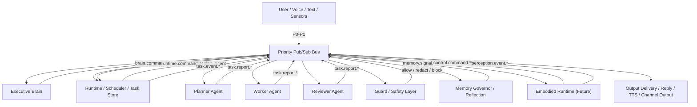

---

## 4. 核心层次设计

### 4.1 Executive Brain

`brain/` 目录负责：

1. 用户意图判断
2. 对话策略选择
3. 是否创建任务
4. 是否继续等待或取消任务
5. 最终用户回复生成
6. 反思触发判断
7. 人格和情绪的高层一致性维护

`brain` 不负责：

1. 直接持有 live task handle
2. 直接调度 worker
3. 直接写长期记忆底层存储
4. 直接执行具身动作

### 4.2 Runtime / Scheduler

`runtime/` 目录是整个系统的执行控制内核。

它负责：

1. 接收主脑命令
2. 创建和更新任务
3. 选择 planner/worker/reviewer
4. 维护唯一任务状态机
5. 处理恢复、超时、取消、幂等
6. 将 agent 原始事件归一化为 runtime 事件

它不负责：

1. 生成最终用户回复
2. 自行读取人格和用户关系锚点
3. 直接把内部结果暴露给外部用户

### 4.3 Agent Team

终态先只保留 3 类专用 agent：

1. `planner`
   负责复杂任务拆解、制定步骤、明确缺失信息。
2. `worker`
   负责实际执行工具调用、文件修改、检索、分析、产出结果。
3. `reviewer`
   负责高风险任务的审核、校验、一致性检查、回归检查。

默认策略：

1. 简单任务直接给 `worker`
2. 高复杂任务先给 `planner` 再给 `worker`
3. 高风险或高价值结果再经过 `reviewer`

### 4.4 Guard / Safety Layer

`safety/` 在当前阶段不是机器人控制安全，而是统一的保护层。

短期必须落地：

1. 出站敏感信息过滤
2. 工具结果过滤
3. 秘钥和凭证识别
4. 统一 allow/redact/block 决策
5. 事件化记录

长期扩展：

1. 具身动作门控
2. 危险命令拦截
3. 紧急停止
4. 物理世界风险控制

### 4.5 Memory Governor / Reflection

`memory/` 不只是存储层，还要成为治理层。

必须做到：

1. 人格锚点与用户锚点分层
2. 长期记忆、任务经验、工具经验分层
3. 高置信记忆和低置信观察分层
4. 反思可以提议写入，但不能无限制污染人格层
5. 支持版本、冲突解决、回滚

### 4.6 Embodied Runtime

`embodiment/` 在本阶段可以先以占位实现接入，但接口必须固定。

它未来负责：

1. perception 输入归一化
2. control 命令执行
3. 物理动作安全闸门
4. 低延迟反馈闭环

---

## 5. 统一目录结构

以下是目标终态目录，而不是当前仓库现状。

```text
emoticorebot/
├── bootstrap.py
├── app.py
│
├── protocol/
│   ├── envelope.py
│   ├── priorities.py
│   ├── topics.py
│   ├── commands.py
│   ├── events.py
│   ├── task_models.py
│   ├── task_result.py
│   ├── safety_models.py
│   └── memory_models.py
│
├── bus/
│   ├── pubsub.py
│   ├── priority_queue.py
│   ├── router.py
│   ├── interceptor.py
│   ├── subscriptions.py
│   ├── dedupe.py
│   └── backpressure.py
│
├── brain/
│   ├── executive.py
│   ├── dialogue_policy.py
│   ├── task_policy.py
│   ├── reply_builder.py
│   ├── event_interpreter.py
│   ├── companion_state.py
│   └── reflection_trigger.py
│
├── runtime/
│   ├── scheduler.py
│   ├── state_machine.py
│   ├── task_store.py
│   ├── assignment.py
│   ├── recovery.py
│   ├── timeout.py
│   ├── intake.py
│   └── session_store.py
│
├── agents/
│   ├── base.py
│   ├── registry.py
│   ├── planner.py
│   ├── worker.py
│   ├── reviewer.py
│   ├── lc_agent.py
│   └── result_normalizer.py
│
├── safety/
│   ├── guard_layer.py
│   ├── inbound_guard.py
│   ├── outbound_guard.py
│   ├── tool_result_guard.py
│   ├── secret_filter.py
│   ├── pii_filter.py
│   ├── policy.py
│   └── embodied_gate.py
│
├── memory/
│   ├── store.py
│   ├── retrieval.py
│   ├── governor.py
│   ├── reflection.py
│   ├── persona.py
│   ├── emotion.py
│   └── indexing.py
│
├── embodiment/
│   ├── runtime.py
│   ├── world_state.py
│   ├── perception/
│   │   ├── asr.py
│   │   ├── vad.py
│   │   ├── vision.py
│   │   └── sensors.py
│   └── control/
│       ├── tts.py
│       ├── motion.py
│       ├── manipulation.py
│       └── emergency_stop.py
│
├── adapters/
│   ├── channels/
│   ├── inbound/
│   └── outbound/
│
├── tools/
├── skills/
├── config/
└── tests/
    ├── test_protocol_bus.py
    ├── test_runtime_state_machine.py
    ├── test_brain_policies.py
    ├── test_agent_assignment.py
    ├── test_guard_layer.py
    ├── test_memory_governor.py
    └── test_embodied_gate.py
```

---

## 6. 事件总线模型

### 6.1 总线协议目标

总线模型必须满足：

1. 一个物理实现
2. 发布订阅
3. 优先级
4. topic/type 明确
5. 幂等
6. 可恢复
7. 可观测
8. 支持 interceptor chain（前置拦截链）

#### 6.1.1 Pub/Sub 与 Interceptor 共存模型

总线同时支持两种消费模式：

1. **subscriber（普通订阅者）**
   标准发布订阅，事件发布后并行扇出到所有匹配的订阅者。适用于大多数组件（brain、memory、delivery 等）。

2. **interceptor（前置拦截者）**
   注册在特定 topic 上的拦截链，事件发布后先串行经过拦截链，拦截者可以 allow（放行）、redact（改写）、block（阻断）。只有通过拦截链的事件才会继续扇出到普通订阅者。

执行顺序：

```text
publisher → priority queue → interceptor chain → subscriber fan-out
```

interceptor 的约束：

- 每个 interceptor 必须在有限时间内返回决策
- interceptor 不能发起新的需要自己拦截的事件（防止死锁）
- interceptor 的决策结果作为 `safety.event.*` 记录到总线供可观测使用
- 一个 topic 上可注册多个 interceptor，按优先级串行执行

#### 6.1.2 外层 TransportBus 与内层 Priority Pub/Sub Bus 的边界

为避免歧义，这里明确：

1. **系统内部真正的业务事件总线只有一条**，就是 `Priority Pub/Sub Bus`。
2. Brain、Runtime、Planner、Worker、Reviewer、Safety、Memory、Delivery 之间流转的，都是 typed envelope 事件，统一走这条内部总线。
3. 渠道接入层还需要一个很薄的**传输适配层**，用于承接聊天平台的入站消息和出站消息。这一层在代码中可以命名为 `TransportBus`，但它不是第二条业务事件总线。

可以把两层理解为：

```text
Channel / CLI / Gateway
    ⇅
TransportBus            # 只承接 InboundMessage / OutboundMessage
    ⇅
ConversationGateway / Delivery adapter
    ⇅
Priority Pub/Sub Bus    # 真正的业务事件总线
    ⇅
Brain / Runtime / Agent Team / Safety / Memory
```

边界规则：

1. `TransportBus` 不承载 `brain.command.*`、`task.event.*`、`memory.signal.*` 这类内部业务事件。
2. `TransportBus` 只处理渠道收发对象，例如 `InboundMessage`、`OutboundMessage`。
3. `ConversationGateway` 负责把外部输入桥接为内部 `input.event.*`。
4. `Delivery` 负责把内部已放行的 `output.event.reply_approved` / `output.event.reply_redacted` 转换为外部 `OutboundMessage`。
5. 因此，“一个总线”的原则在业务层仍然成立；外层 `TransportBus` 只是 I/O bridge，不参与业务编排。

职责视图：

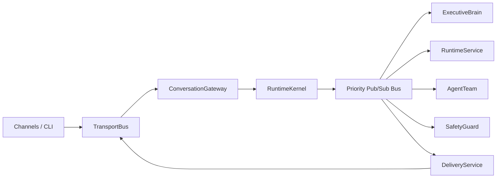

时序视图：

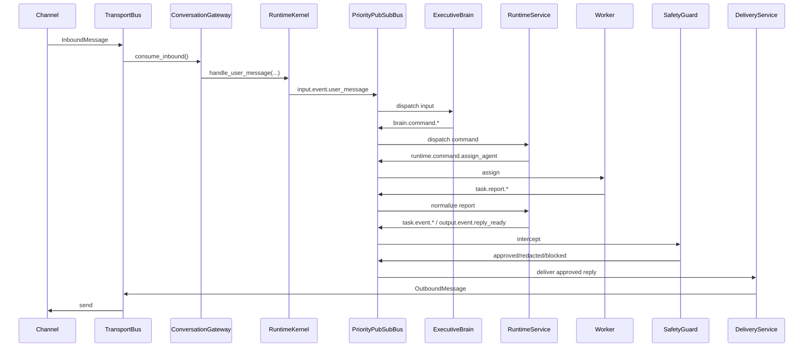

### 6.2 Envelope

所有事件统一走同一个 `BusEvent` 包头：

```python
class BusEvent(TypedDict, total=False):
    event_id: str
    topic: str
    event_type: str
    priority: int
    session_id: str
    turn_id: str
    task_id: str
    source: str
    target: str
    correlation_id: str
    causation_id: str
    emitted_at: str
    dedupe_key: str
    payload: dict[str, Any]
```

字段语义：

1. `event_id`
   当前事件唯一 ID。
2. `topic`
   高层主题路由，如 `task.event`。
3. `event_type`
   具体事件类型，如 `task.event.result`。
4. `priority`
   优先级，`0` 最高。
5. `session_id`
   会话级隔离键。
6. `turn_id`
   当前用户回合 ID。
7. `task_id`
   当前任务 ID。
8. `source`
   发送方，如 `brain`、`runtime`、`worker`。
9. `target`
   目标消费者，可为 `broadcast`、`runtime`、`brain`、具体 agent role。
10. `correlation_id`
    同一链路关联键，通常绑定 task。
11. `causation_id`
    标记该事件由哪个上游事件触发。
12. `dedupe_key`
    用于去重和幂等。
13. `payload`
    具体业务内容。

### 6.3 Topic 设计

终态只保留少量稳定 topic：

1. `input.event`
2. `brain.command`
3. `runtime.command`
4. `task.report`
5. `task.event`
6. `output.event`
7. `memory.signal`
8. `safety.event`
9. `control.command`
10. `perception.event`
11. `system.signal`

### 6.4 Event Type 设计

第一版全量事件类型如下：

#### input.event

- `input.event.user_message`
- `input.event.interrupt`
- `input.event.voice_chunk`
- `input.event.channel_attachment`

#### brain.command

- `brain.command.create_task`
- `brain.command.cancel_task`
- `brain.command.resume_task`
- `brain.command.reply`
- `brain.command.ask_user`

#### runtime.command

- `runtime.command.assign_agent`
- `runtime.command.resume_agent`
- `runtime.command.cancel_agent`
- `runtime.command.archive_task`

#### task.report

- `task.report.started`
- `task.report.progress`
- `task.report.need_input`
- `task.report.plan_ready`
- `task.report.result`
- `task.report.approved`
- `task.report.rejected`
- `task.report.failed`
- `task.report.cancelled`

#### task.event

- `task.event.created`
- `task.event.assigned`
- `task.event.started`
- `task.event.progress`
- `task.event.need_input`
- `task.event.planned`
- `task.event.result`
- `task.event.reviewing`
- `task.event.approved`
- `task.event.rejected`
- `task.event.failed`
- `task.event.cancelled`

#### output.event

- `output.event.reply_ready`
- `output.event.reply_approved`
- `output.event.reply_redacted`
- `output.event.reply_blocked`
- `output.event.replied`
- `output.event.delivery_failed`

#### memory.signal

- `memory.signal.reflect_turn`
- `memory.signal.reflect_deep`
- `memory.signal.write_request`
- `memory.signal.write_committed`
- `memory.signal.update_persona`
- `memory.signal.update_user_model`

#### safety.event

- `safety.event.allowed`
- `safety.event.redacted`
- `safety.event.blocked`
- `safety.event.warning`

#### control.command

- `control.command.speak`
- `control.command.move`
- `control.command.stop`
- `control.command.manipulate`

#### perception.event

- `perception.event.wake_word`
- `perception.event.vision_detected`
- `perception.event.proximity_alert`
- `perception.event.localization_updated`

#### system.signal

- `system.signal.timeout`
- `system.signal.backpressure`
- `system.signal.health_warning`
- `system.signal.warning`

### 6.4.1 字段冻结原则

从这一节开始，字段定义视为协议源事实，后续 `protocol/` 代码必须与这里对齐。

统一约束：

1. 所有时间字段使用 ISO 8601 UTC 字符串。
2. 所有 ID 字段使用字符串，不使用整数自增。
3. 所有 `reason` 字段用于机器可读简述，面向用户的文案不放在 `reason`。
4. 所有 `summary` 字段用于人类可读短摘要，长度应可控。
5. 所有 `metadata` 字段只放非核心扩展信息，不可承载关键业务语义。
6. 运行态权威快照只允许由 `runtime` 发布。
7. 除 `input.event.*` 外，所有进入业务主链的事件都必须带 `session_id`。

### 6.4.2 Envelope 字段必填规则

| 字段 | 类型 | 必填 | 说明 |
|---|---|---|---|
| `event_id` | `str` | 是 | 当前事件唯一 ID |
| `topic` | `str` | 是 | 一级主题，如 `task.event` |
| `event_type` | `str` | 是 | 二级具体类型，如 `task.event.result` |
| `priority` | `int` | 是 | `0-4`，越小越高 |
| `session_id` | `str` | 大多数事件必填 | 会话隔离键；仅极少数全局系统事件可为空 |
| `turn_id` | `str` | 输入、回复、任务事件建议必填 | 当前用户回合 ID |
| `task_id` | `str` | task/runtime 相关事件必填 | 任务主键 |
| `source` | `str` | 是 | 发送者，如 `brain`、`runtime`、`worker` |
| `target` | `str` | 是 | `broadcast`、`runtime`、`brain`、具体 role |
| `correlation_id` | `str` | 建议必填 | 同一业务链路关联键 |
| `causation_id` | `str` | 建议必填 | 上游触发事件 ID |
| `emitted_at` | `str` | 是 | 发出时间 |
| `dedupe_key` | `str` | 建议必填 | 幂等去重键 |
| `payload` | `dict[str, Any]` | 是 | 业务载荷 |

建议 ID 命名：

- `event_id`: `evt_*`
- `turn_id`: `turn_*`
- `task_id`: `task_*`
- `reply_id`: `reply_*`
- `assignment_id`: `assign_*`
- `plan_id`: `plan_*`
- `review_id`: `review_*`

### 6.4.3 共享片段模型

以下片段在多个 payload 中复用。

#### ContentBlock

```python
class ContentBlock(TypedDict, total=False):
    type: str                  # text | image | audio | file
    text: str                  # 当 type=text 时必填
    url: str                   # 远程资源地址
    path: str                  # 本地文件路径
    mime_type: str
    name: str
    size_bytes: int
    sha256: str
    metadata: dict[str, Any]
```

#### MessageRef

```python
class MessageRef(TypedDict, total=False):
    channel: str
    chat_id: str
    sender_id: str
    message_id: str
    reply_to_message_id: str
    timestamp: str
```

#### InputRequest

```python
class InputRequest(TypedDict, total=False):
    field: str
    question: str
    required: bool
    expected_type: str
    choices: list[str]
    validation_hint: str
```

#### PlanStep

```python
class PlanStep(TypedDict, total=False):
    step_id: str
    title: str
    description: str
    role: str                  # planner / worker / reviewer / control
    status: str                # pending / running / done / failed / skipped
    depends_on: list[str]
    expected_output: str
    tools: list[str]
```

#### ReviewItem

```python
class ReviewItem(TypedDict, total=False):
    item_id: str
    severity: str              # low / medium / high / critical
    label: str
    reason: str
    required_action: str
    evidence: list[str]
```

#### ReplyDraft

```python
class ReplyDraft(TypedDict, total=False):
    reply_id: str
    kind: str                  # answer / ask_user / safety_fallback / status
    plain_text: str
    content_blocks: list[ContentBlock]
    safe_fallback: bool
    language: str
    style_hint: str
    reply_to_message_id: str
    metadata: dict[str, Any]
```

#### TaskStateSnapshot

```python
class TaskStateSnapshot(TypedDict, total=False):
    task_id: str
    state_version: int
    status: str                # created / assigned / running / planned / waiting_input / reviewing / done / failed / cancelled / archived
    title: str
    summary: str
    error: str
    assignee: str
    plan_id: str
    review_required: bool
    last_progress: str
    input_request: InputRequest
    updated_at: str
```

#### TaskRequestSpec

```python
class TaskRequestSpec(TypedDict, total=False):
    title: str
    request: str
    goal: str
    expected_output: str
    constraints: list[str]
    success_criteria: list[str]
    history_context: str
    content_blocks: list[ContentBlock]
    memory_refs: list[str]
    skill_hints: list[str]
    review_policy: str         # skip / optional / required
    preferred_agent: str       # planner / worker
```

#### ProvidedInputItem

```python
class ProvidedInputItem(TypedDict, total=False):
    field: str
    value_text: str
    value_json: str
    attachments: list[ContentBlock]
    source: str                # user_message / upload / sensor / system
    provided_at: str
```

#### ProvidedInputBundle

```python
class ProvidedInputBundle(TypedDict, total=False):
    plain_text: str
    items: list[ProvidedInputItem]
    attachments: list[ContentBlock]
    source_message: MessageRef
    source_event_id: str
```

#### AgentInputContext

```python
class AgentInputContext(TypedDict, total=False):
    latest_user_message: MessageRef
    latest_user_text: str
    latest_attachments: list[ContentBlock]
    provided_inputs: ProvidedInputBundle
    missing_fields: list[str]
    dialogue_summary: str
```

#### ReviewerContext

```python
class ReviewerContext(TypedDict, total=False):
    review_id: str
    review_policy: str
    candidate_summary: str
    candidate_result_text: str
    candidate_result_blocks: list[ContentBlock]
    candidate_artifacts: list[ContentBlock]
    candidate_confidence: float
    acceptance_criteria: list[str]
    prior_findings: list[ReviewItem]
```

#### ControlParameters

```python
class ControlParameters(TypedDict, total=False):
    text: str
    voice: str
    tone: str
    target_pose: str
    target_location: str
    speed: float
    duration_ms: int
    object_id: str
    grip_mode: str
    emergency: bool
```

#### PerceptionData

```python
class PerceptionData(TypedDict, total=False):
    transcript: str
    speaker_id: str
    labels: list[str]
    bounding_boxes: list[str]
    position: str
    velocity: str
    map_ref: str
    raw_ref: str
```

### 6.4.4 input.event payload

#### input.event.user_message

```python
class UserMessagePayload(TypedDict, total=False):
    message: MessageRef
    plain_text: str
    content_blocks: list[ContentBlock]
    attachments: list[ContentBlock]
    is_interrupt: bool
    is_follow_up: bool
    detected_language: str
    metadata: dict[str, Any]
```

必填：

- `message.channel`
- `message.chat_id`
- `message.message_id`
- `plain_text` 或 `content_blocks`

#### input.event.interrupt

```python
class InterruptPayload(TypedDict, total=False):
    message: MessageRef
    interrupt_type: str        # user_stop / wake_word / safety_stop / system_stop
    plain_text: str
    target_task_id: str
    urgent: bool
    metadata: dict[str, Any]
```

#### input.event.voice_chunk

```python
class VoiceChunkPayload(TypedDict, total=False):
    message: MessageRef
    stream_id: str
    chunk_index: int
    audio: ContentBlock
    is_final_chunk: bool
    vad_state: str              # speech / silence / end
    partial_transcript: str
    metadata: dict[str, Any]
```

#### input.event.channel_attachment

```python
class ChannelAttachmentPayload(TypedDict, total=False):
    message: MessageRef
    attachments: list[ContentBlock]
    attachment_count: int
    extracted_text: str
    metadata: dict[str, Any]
```

### 6.4.5 brain.command payload

#### brain.command.create_task

```python
class BrainCreateTaskPayload(TypedDict, total=False):
    command_id: str
    title: str
    request: str
    goal: str
    expected_output: str
    constraints: list[str]
    success_criteria: list[str]
    history_context: str
    content_blocks: list[ContentBlock]
    memory_refs: list[str]
    skill_hints: list[str]
    review_policy: str         # skip / optional / required
    preferred_agent: str       # planner / worker
    origin_message: MessageRef
    metadata: dict[str, Any]
```

必填：

- `command_id`
- `request`
- `origin_message`

#### brain.command.resume_task

```python
class BrainResumeTaskPayload(TypedDict, total=False):
    command_id: str
    task_id: str
    user_input: str
    provided_inputs: ProvidedInputBundle
    origin_message: MessageRef
    resume_reason: str
    metadata: dict[str, Any]
```

必填：

- `command_id`
- `task_id`
- `user_input` 或 `provided_inputs`

#### brain.command.cancel_task

```python
class BrainCancelTaskPayload(TypedDict, total=False):
    command_id: str
    task_id: str
    reason: str
    user_visible_reason: str
    hard_stop: bool
    origin_message: MessageRef
    metadata: dict[str, Any]
```

#### brain.command.reply / brain.command.ask_user

```python
class BrainReplyPayload(TypedDict, total=False):
    command_id: str
    reply: ReplyDraft
    related_task_id: str
    origin_message: MessageRef
    metadata: dict[str, Any]
```

必填：

- `command_id`
- `reply.reply_id`
- `reply.kind`
- `reply.plain_text` 或 `reply.content_blocks`

### 6.4.6 runtime.command payload

#### runtime.command.assign_agent

```python
class AssignAgentPayload(TypedDict, total=False):
    assignment_id: str
    task_id: str
    agent_role: str            # planner / worker / reviewer
    task_state: TaskStateSnapshot
    task_request: TaskRequestSpec
    plan_steps: list[PlanStep]
    input_context: AgentInputContext
    reviewer_context: ReviewerContext
    deadline_at: str
    metadata: dict[str, Any]
```

#### runtime.command.resume_agent

```python
class ResumeAgentPayload(TypedDict, total=False):
    assignment_id: str
    task_id: str
    agent_role: str
    task_state: TaskStateSnapshot
    resume_input: ProvidedInputBundle
    resume_message: MessageRef
    metadata: dict[str, Any]
```

#### runtime.command.cancel_agent

```python
class CancelAgentPayload(TypedDict, total=False):
    task_id: str
    agent_role: str
    reason: str
    hard_stop: bool
    deadline_ms: int
    metadata: dict[str, Any]
```

#### runtime.command.archive_task

```python
class ArchiveTaskPayload(TypedDict, total=False):
    task_id: str
    archive_reason: str
    final_state: TaskStateSnapshot
    metadata: dict[str, Any]
```

### 6.4.7 task.report payload

#### task.report.started

```python
class TaskStartedReportPayload(TypedDict, total=False):
    task_id: str
    agent_role: str
    assignment_id: str
    started_at: str
    summary: str
    metadata: dict[str, Any]
```

#### task.report.progress

```python
class TaskProgressReportPayload(TypedDict, total=False):
    task_id: str
    agent_role: str
    assignment_id: str
    summary: str
    detail: str
    progress: float
    current_step_id: str
    next_step: str
    metadata: dict[str, Any]
```

#### task.report.need_input

```python
class TaskNeedInputReportPayload(TypedDict, total=False):
    task_id: str
    agent_role: str
    assignment_id: str
    input_request: InputRequest
    summary: str
    partial_result: str
    metadata: dict[str, Any]
```

#### task.report.plan_ready

```python
class TaskPlanReadyReportPayload(TypedDict, total=False):
    task_id: str
    assignment_id: str
    plan_id: str
    summary: str
    steps: list[PlanStep]
    reviewer_hint: str
    metadata: dict[str, Any]
```

#### task.report.result

```python
class TaskResultReportPayload(TypedDict, total=False):
    task_id: str
    agent_role: str
    assignment_id: str
    summary: str
    result_text: str
    result_blocks: list[ContentBlock]
    artifacts: list[ContentBlock]
    confidence: float
    reviewer_required: bool
    metadata: dict[str, Any]
```

#### task.report.approved

```python
class TaskApprovedReportPayload(TypedDict, total=False):
    task_id: str
    review_id: str
    summary: str
    notes: str
    metadata: dict[str, Any]
```

#### task.report.rejected

```python
class TaskRejectedReportPayload(TypedDict, total=False):
    task_id: str
    review_id: str
    summary: str
    rejection_reason: str
    findings: list[ReviewItem]
    metadata: dict[str, Any]
```

#### task.report.failed

```python
class TaskFailedReportPayload(TypedDict, total=False):
    task_id: str
    agent_role: str
    assignment_id: str
    reason: str
    summary: str
    retryable: bool
    metadata: dict[str, Any]
```

#### task.report.cancelled

```python
class TaskCancelledReportPayload(TypedDict, total=False):
    task_id: str
    agent_role: str
    assignment_id: str
    reason: str
    cancelled_at: str
    metadata: dict[str, Any]
```

### 6.4.8 task.event payload

所有 `task.event.*` 至少包含：

```python
class TaskEventBasePayload(TypedDict, total=False):
    task_id: str
    state: TaskStateSnapshot
    summary: str
    assignee: str
    input_request: InputRequest
    plan_id: str
    review_required: bool
    metadata: dict[str, Any]
```

事件补充字段：

| event_type | 额外字段 |
|---|---|
| `task.event.created` | `task_request`, `origin_message` |
| `task.event.assigned` | `assignment_id`, `agent_role` |
| `task.event.started` | `assignment_id`, `agent_role`, `started_at` |
| `task.event.progress` | `progress`, `detail`, `current_step_id`, `next_step` |
| `task.event.need_input` | `input_request`, `partial_result` |
| `task.event.planned` | `plan_id`, `steps` |
| `task.event.reviewing` | `review_id`, `reviewer_role` |
| `task.event.approved` | `review_id`, `notes` |
| `task.event.rejected` | `review_id`, `rejection_reason`, `findings` |
| `task.event.result` | `result_text`, `result_blocks`, `artifacts`, `confidence` |
| `task.event.failed` | `reason`, `retryable` |
| `task.event.cancelled` | `reason`, `cancelled_by` |

说明：

1. `task_request` 必须使用 `TaskRequestSpec`。
2. `origin_message`、`input_request`、`steps`、`findings` 等复合字段必须复用本节共享子模型，不得重新定义平行结构。

### 6.4.9 output.event payload

#### output.event.reply_ready / reply_approved / reply_redacted

```python
class ReplyReadyPayload(TypedDict, total=False):
    reply: ReplyDraft
    origin_message: MessageRef
    related_task_id: str
    related_event_id: str
    channel_override: str
    chat_id_override: str
    delivery_mode: str         # chat / tts / multimodal
    metadata: dict[str, Any]
```

说明：

1. 安全降级标记放在 `reply.safe_fallback`，而不是顶层 payload。
2. `reply_ready` 表示“回复草稿已准备完成，尚未通过 safety 审批，也尚未实际投递”。

#### output.event.reply_blocked

```python
class ReplyBlockedPayload(TypedDict, total=False):
    reply: ReplyDraft
    block_reason: str
    policy_name: str
    redaction_hint: str
    metadata: dict[str, Any]
```

#### output.event.replied

```python
class RepliedPayload(TypedDict, total=False):
    reply_id: str
    delivery_message: MessageRef
    delivery_mode: str
    delivered_at: str
    metadata: dict[str, Any]
```

#### output.event.delivery_failed

```python
class DeliveryFailedPayload(TypedDict, total=False):
    reply_id: str
    reason: str
    retryable: bool
    metadata: dict[str, Any]
```

### 6.4.10 memory.signal payload

#### memory.signal.reflect_turn / reflect_deep

```python
class ReflectSignalPayload(TypedDict, total=False):
    trigger_id: str
    reason: str
    source_event_id: str
    task_id: str
    recent_context_ids: list[str]
    metadata: dict[str, Any]
```

实现约束：

1. 顶层字段保持冻结，不再额外扩顶层 schema。
2. 当前实现允许在 `metadata` 中携带 `reflection_input` 这类**规范化反思输入快照**，供 `MemoryGovernor` 在收到 `output.event.replied` 后执行逐轮/深反思。
3. 这种做法属于 `metadata` 扩展语义，不改变协议主字段，也不允许把未归一化的原始日志直接塞入 `metadata`。

#### memory.signal.write_request

```python
class MemoryWriteRequestPayload(TypedDict, total=False):
    request_id: str
    memory_type: str           # persona / user_model / episodic / task_experience / tool_experience
    summary: str
    content: str
    confidence: float
    evidence_event_ids: list[str]
    source_component: str
    metadata: dict[str, Any]
```

#### memory.signal.write_committed

```python
class MemoryWriteCommittedPayload(TypedDict, total=False):
    request_id: str
    memory_id: str
    memory_type: str
    committed_at: str
    metadata: dict[str, Any]
```

#### memory.signal.update_persona / update_user_model

```python
class MemoryUpdatePayload(TypedDict, total=False):
    update_id: str
    target: str                # persona / user_model
    summary: str
    content: str
    confidence: float
    source_memory_ids: list[str]
    metadata: dict[str, Any]
```

### 6.4.11 safety.event payload

```python
class SafetyAuditPayload(TypedDict, total=False):
    decision_id: str
    decision: str              # allowed / redacted / blocked / warning
    intercepted_event_type: str
    policy_name: str
    reason: str
    match_spans: list[str]
    redaction_count: int
    metadata: dict[str, Any]
```

### 6.4.12 control.command payload

```python
class ControlCommandPayload(TypedDict, total=False):
    command_id: str
    action: str                # speak / move / stop / manipulate
    target: str
    parameters: ControlParameters
    safety_level: str
    metadata: dict[str, Any]
```

### 6.4.13 perception.event payload

```python
class PerceptionEventPayload(TypedDict, total=False):
    sensor_id: str
    perception_type: str       # wake_word / vision / proximity / localization
    summary: str
    data: PerceptionData
    confidence: float
    observed_at: str
    metadata: dict[str, Any]
```

### 6.4.14 system.signal payload

```python
class SystemSignalPayload(TypedDict, total=False):
    signal_id: str
    signal_type: str           # timeout / backpressure / health_warning / warning
    reason: str
    related_event_id: str
    related_task_id: str
    severity: str
    metadata: dict[str, Any]
```

### 6.4.15 实现约束

协议实现阶段必须满足：

1. `protocol/` 内部使用 `Pydantic BaseModel` 或等价强类型模型，而不是裸 `dict`。
2. `task.report.*` 与 `task.event.*` 必须分开建模，不得复用同一个类。
3. `output.event.reply_ready` 与 `output.event.reply_blocked` 必须是不同 payload 模型。
4. `ReplyDraft`、`InputRequest`、`TaskStateSnapshot` 必须作为共享模型单独抽出。
5. 所有 payload 模型都必须支持 `model_validate` 和 `model_dump`。
6. 除 envelope 顶层 `payload` 和各模型的 `metadata` 外，协议模型中不得再出现裸 `dict[str, Any]`。

### 6.5 优先级模型

建议固定，不做动态评分。

| Priority | 说明 | 典型事件 |
|---|---|---|
| `P0` | 立即处理 | `input.event.interrupt`, `control.command.stop` |
| `P1` | 主路径控制事件 | `input.event.user_message`, `brain.command.create_task`, `task.event.need_input` |
| `P2` | 关键结果事件 | `task.event.result`, `task.event.failed`, `output.event.reply_ready` |
| `P3` | 普通运行反馈 | `task.report.progress`, `task.event.started` |
| `P4` | 后台整理事件 | `memory.signal.reflect_turn`, `memory.signal.write_request` |

### 6.6 总线职责边界

总线只负责：

1. 接收事件
2. 按优先级排队
3. 按 topic/target 路由
4. 执行 interceptor chain（如果该 topic 注册了 interceptor）
5. 将通过拦截链的事件发布给普通订阅者
6. 幂等去重
7. 提供背压和指标

总线不负责：

1. 任务真实状态判定
2. 业务规则执行
3. 替代 runtime 的 state store
4. interceptor 的业务决策逻辑（由 safety 等组件自行实现）

---

## 7. 任务状态机

### 7.1 状态定义

最终以 `Runtime` 为准，任务生命周期状态收敛为：

```text
created
assigned
running
planned
waiting_input
reviewing
done
failed
cancelled
archived
```

说明：

1. `blocked` 不再作为任务生命周期状态，而是 scheduler 的队列元数据。
2. “系统当前没有活动任务”属于 session/runtime 级空闲态，不属于 task 状态，因此移除 `idle`。
3. `planned` 表示 planner 已产出执行计划，等待 runtime 分配 worker 执行。
4. `reviewing` 表示 worker 已产出结果，正在由 reviewer 审核。

### 7.2 状态迁移

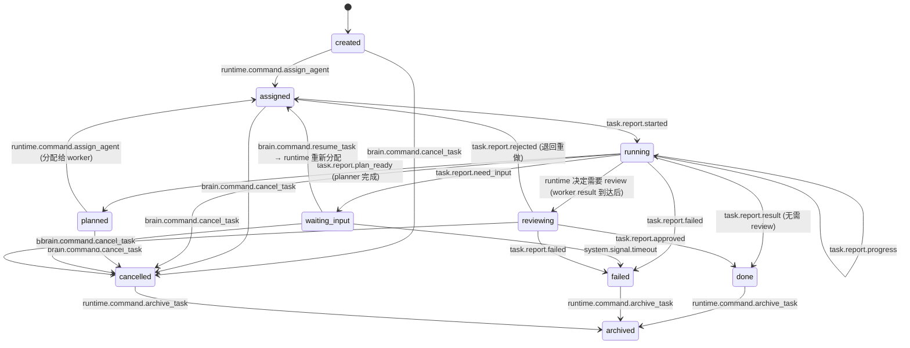

说明：

1. `running → reviewing` 不是由 agent 直接触发，而是 runtime 收到 `task.report.result` 后根据 review policy 决定。如果不需要 review，直接迁移到 `done`。
2. `waiting_input → assigned` 语义修正：resume 后 runtime 通过 `runtime.command.resume_agent` 或 `runtime.command.assign_agent` 将用户补充信息传递给 agent，因此经过 `assigned` 状态。
3. `failed` 是终态，不支持重试。brain 收到 `task.event.failed` 后直接通过 `brain.command.reply` 告知用户失败，然后 runtime 归档。

### 7.3 状态管理规则

1. 只有 `runtime` 能做状态迁移。
2. `brain` 只能发命令，不能直接改状态。
3. `agent` 只能发 `task.report.*`，不能直接改状态。
4. `output`、`reflection`、`memory` 只读归一化状态。

### 7.4 task.report 与 task.event 的二重化设计理由

系统刻意保留 `task.report.*`（agent 上报）和 `task.event.*`（runtime 归一化发布）两套事件类型。虽然子类型存在对应关系，但它们的语义不同：

| 维度 | task.report.* | task.event.* |
|---|---|---|
| 发布者 | agent（不可信来源） | runtime（唯一权威） |
| 语义 | "我认为发生了 X" | "系统确认 X 已发生" |
| 字段完整性 | 可能缺字段、格式不标准 | runtime 补全 timestamp、state version、correlation |
| 合法性 | 可能违反状态机约束 | 经过状态机校验，无效迁移被拒绝 |
| 消费者 | 仅 runtime | brain、memory、safety、delivery 等所有下游 |

这层归一化的核心价值：

1. **信任边界**：agent 是外部执行者，其上报不应被直接信任。runtime 做校验和补全后再广播。
2. **防止无效迁移**：如 agent 对已取消的任务发 `task.report.result`，runtime 应丢弃而不是广播。
3. **字段标准化**：runtime 统一补全 `task_id`、`session_id`、`turn_id`、状态版本号等元数据。
4. **解耦演进**：agent 协议和下游消费协议可以独立演进，runtime 做适配层。

---

## 8. 角色与订阅模型

### 8.1 Executive Brain

`brain` 订阅：

- `input.event.*`
- `task.event.need_input`
- `task.event.result`
- `task.event.failed`
- `task.event.cancelled`
- `output.event.reply_blocked`
- `safety.event.blocked`
- `memory.signal.update_persona`
- `memory.signal.update_user_model`

`brain` 发布：

- `brain.command.create_task`
- `brain.command.cancel_task`
- `brain.command.resume_task`
- `brain.command.reply`
- `brain.command.ask_user`
- `memory.signal.reflect_turn`
- `memory.signal.reflect_deep`

设计说明：

1. Brain 只对执行控制发布 `brain.command.*`。反思触发不走 `brain.command`，而是直接发 `memory.signal.reflect_turn` / `memory.signal.reflect_deep`。
2. 所有用户可见输出通过 `brain.command.reply` 和 `brain.command.ask_user` 统一走 runtime 转发。
3. Brain 订阅 `task.event.cancelled` 以便在任务被取消后告知用户。

### 8.2 Runtime

`runtime` 订阅：

- `brain.command.*`
- `task.report.*`
- `runtime.command.archive_task`
- `system.signal.timeout`
- `output.event.delivery_failed`
- `safety.event.*`

`runtime` 发布：

- `task.event.created`
- `task.event.assigned`
- `task.event.started`
- `task.event.progress`
- `task.event.need_input`
- `task.event.planned`
- `task.event.reviewing`
- `task.event.approved`
- `task.event.rejected`
- `task.event.result`
- `task.event.failed`
- `task.event.cancelled`
- `runtime.command.assign_agent`
- `runtime.command.resume_agent`
- `runtime.command.cancel_agent`
- `runtime.command.archive_task`
- `output.event.reply_ready`

设计说明：

1. Runtime 收到 `brain.command.reply` / `brain.command.ask_user` 后，转化为 `output.event.reply_ready` 发布到总线（经 safety interceptor 审批后送达 delivery）。这确保 brain 不直接跨 topic 发布。
2. `runtime.command.resume_agent` 用于在 `waiting_input → assigned` 恢复时，将用户补充信息传递给 agent。
3. `task.event.created`、`task.event.assigned`、`task.event.started`、`task.event.progress` 主要供可观测性消费（日志、指标、调试 UI），不要求有业务订阅者。
4. `runtime.command.archive_task` 是 runtime 发给自己的延迟归档命令，经总线回到 runtime 执行真正归档。
5. `output.event.delivery_failed` 由 runtime 消费，用于重试、告警或归档补偿；brain 不直接处理传输层重试。

### 8.3 Planner

`planner` 订阅：

- `runtime.command.assign_agent`，且 `target=planner`

`planner` 发布：

- `task.report.started`
- `task.report.progress`
- `task.report.need_input`
- `task.report.plan_ready`
- `task.report.failed`
- `task.report.cancelled`

说明：

1. planner 完成后发 `task.report.plan_ready`（而非 `task.report.result`），以区分"产出了执行计划"和"任务最终完成"。Runtime 收到后将任务迁移到 `planned` 状态，再分配给 worker。
2. `task.report.cancelled` 是协作式取消确认，仅用于审计，不驱动状态迁移。

### 8.4 Worker

`worker` 订阅：

- `runtime.command.assign_agent`，且 `target=worker`
- `runtime.command.resume_agent`，且 `target=worker`

`worker` 发布：

- `task.report.started`
- `task.report.progress`
- `task.report.need_input`
- `task.report.result`
- `task.report.failed`
- `task.report.cancelled`

说明：

1. worker 额外订阅 `runtime.command.resume_agent` 以接收用户补充信息恢复执行。
2. `task.report.cancelled` 是协作式取消确认，仅用于审计，不驱动状态迁移。

### 8.5 Reviewer

`reviewer` 订阅：

- `runtime.command.assign_agent`，且 `target=reviewer`

`reviewer` 发布：

- `task.report.started`
- `task.report.progress`
- `task.report.approved`
- `task.report.rejected`
- `task.report.failed`
- `task.report.cancelled`

说明：

1. reviewer 审核后发 `approved`（通过）或 `rejected`（退回）。退回时 payload 携带拒绝原因，runtime 将任务状态回退到 `assigned` 并重新分配给 worker。
2. `task.report.cancelled` 是协作式取消确认，仅用于审计，不驱动状态迁移。

### 8.6 Guard Layer

`safety` 有两种工作模式，对应 6.1.1 节定义的总线消费模式：

1. **interceptor（前置拦截者）**
   注册在特定 topic 上，事件发布后先经过 safety 审批链，决策完成前不扇出到普通订阅者。
2. **subscriber（普通订阅者）**
   对具身控制命令等做常规旁路订阅。

#### safety 作为 interceptor 注册的 topic：

- `output.event.reply_ready`
- `task.event.result`
- `task.event.failed`

interceptor 执行流程：

```text
事件到达 → safety interceptor 检查 → allow/redact/block 决策
  ├─ allow  → 事件原样继续扇出到普通订阅者
  ├─ redact → 改写 payload 后继续扇出（发布 safety.event.redacted 记录）
  └─ block  → 阻断，不再扇出（发布 safety.event.blocked 记录）
```

针对 `output.event.reply_ready` 的特殊处理：

- allow → 将事件改写为 `output.event.reply_approved` 后扇出
- redact → 将事件改写为 `output.event.reply_redacted` 后扇出
- block → 将事件改写为 `output.event.reply_blocked` 后扇出（brain 订阅此事件以触发安全降级回复）

安全降级回复规则：

1. Brain 在收到 `output.event.reply_blocked` 后，只能从预定义的安全话术模板集中选择回复，不允许自由生成。
2. 这类安全话术由 runtime 在发布 `output.event.reply_ready` 时写入 `payload.reply.safe_fallback=true`。
3. Safety interceptor 对 `reply.safe_fallback=true` 的回复只做最小校验，不允许再次进入普通 block 流程。
4. 如果最小校验仍失败，则直接丢弃回复并记录 `system.signal.warning`，不再循环重试。

#### safety 作为 subscriber 订阅：

- `control.command.*`

#### safety 发布（审计与回执）：

- `safety.event.allowed`
- `safety.event.redacted`
- `safety.event.blocked`
- `safety.event.warning`

#### safety 改写后重新发布：

- `output.event.reply_approved`
- `output.event.reply_redacted`
- `output.event.reply_blocked`

说明：`task.event.result` 和 `task.event.failed` 经 safety allow/redact 后保持原 topic 继续扇出，不需要改写 topic 类型。只有 `output.event.reply_ready` 需要转换为 approved/redacted/blocked 三种明确的终态事件。

### 8.7 Output Delivery

`delivery` 订阅：

- `output.event.reply_approved`
- `output.event.reply_redacted`

`delivery` 发布：

- `output.event.replied`
- `output.event.delivery_failed`

### 8.8 Memory Governor / Reflection

`memory governor` 订阅：

- `memory.signal.reflect_turn`
- `memory.signal.reflect_deep`
- `memory.signal.write_request`
- `task.event.result`
- `task.event.failed`
- `task.event.cancelled`
- `output.event.replied`

`memory governor` 发布：

- `memory.signal.update_persona`
- `memory.signal.update_user_model`
- `memory.signal.write_committed`
- `system.signal.warning`

设计说明：

1. 原 `memory.signal.write_memory` 拆分为 `write_request`（外部提议写入）和 `write_committed`（governor 确认写入完成）。避免 governor 同时订阅和发布同一事件类型导致无限循环。
2. 新增订阅 `task.event.cancelled`，以便归档取消任务的经验。
3. `memory.signal.write_request` 的生产者是 reflection/write planner 子阶段；如果当前实现尚未把 governor 拆成多个子组件，可视为 governor 内部桥接事件。

---

## 9. 主脑决策内核

### 9.1 决策职责

主脑每轮只做 5 种核心决策：

1. `answer`
   直接回答用户（通过 `brain.command.reply`）
2. `ask_user`
   追问必要信息（通过 `brain.command.ask_user`，runtime 转化为 `output.event.reply_ready` 送达用户）
3. `create_task`
   委托给 runtime 创建任务
4. `resume_task`
   用户补充信息后恢复任务
5. `cancel_task`
   用户要求停止

说明：

1. 任务失败（`task.event.failed`）后 brain 直接通过 `answer` 告知用户失败原因，不做自动重试。`failed` 是任务终态。
2. 安全阻断（`output.event.reply_blocked`）后 brain 通过 `answer` 发出预设安全话术，不做循环重写。

### 9.2 决策输入

主脑可读取：

1. 最近对话历史
2. 最近内部历史摘要
3. 任务状态快照
4. 长期记忆摘要
5. 用户锚点和人格锚点
6. 当前 PAD 情绪状态
7. safety 结果和 runtime 结果

### 9.3 决策边界

主脑不直接读取：

1. 工具原始日志
2. worker 原始推理链
3. 大量未归一化中间输出

一切都先过 runtime 和 guard 归一化。

---

## 10. Safety Layer 设计

### 10.1 当前阶段目标

当前必须优先实现的是信息安全，不是动作安全。

首批规则：

1. API key
2. token
3. access key
4. secret
5. password
6. cookie
7. private key
8. 常见 PII

### 10.2 决策类型

统一输出以下三种决策：

1. `allow`
2. `redact`
3. `block`

### 10.3 执行策略

#### allow

- 正常放行
- 记录匹配结果

#### redact

- 对敏感片段做脱敏
- 向总线发出 `safety.event.redacted`

#### block

- 直接阻断
- 返回标准安全提示
- 向总线发出 `safety.event.blocked`

### 10.4 具身门控预留

`embodied_gate.py` 当前可以先跑在 `observe` 或 `soft_guard` 模式。

模式定义：

1. `observe`
   只记录，不拦截。
2. `soft_guard`
   记录并拦截明显非法命令。
3. `enforce`
   强制执行完整策略。

---

## 11. Memory Governor 设计

### 11.1 分层

长期记忆至少拆成以下逻辑层：

1. `persona`
   自我风格与稳定人格约束
2. `user_model`
   用户稳定偏好、关系结论
3. `episodic_memory`
   近期互动事件
4. `task_experience`
   任务经验和错误模式
5. `tool_experience`
   工具成功失败经验
6. `world_state`
   未来具身环境状态

### 11.2 治理规则

1. planner/worker/reviewer 不直接写人格层
2. 反思可以提议写入，但最终由 governor 决定
3. 高置信用户信息与低置信观察不能混存
4. 人格修正必须可回滚

---

## 12. 典型时序

### 12.1 普通简单任务（无 review）

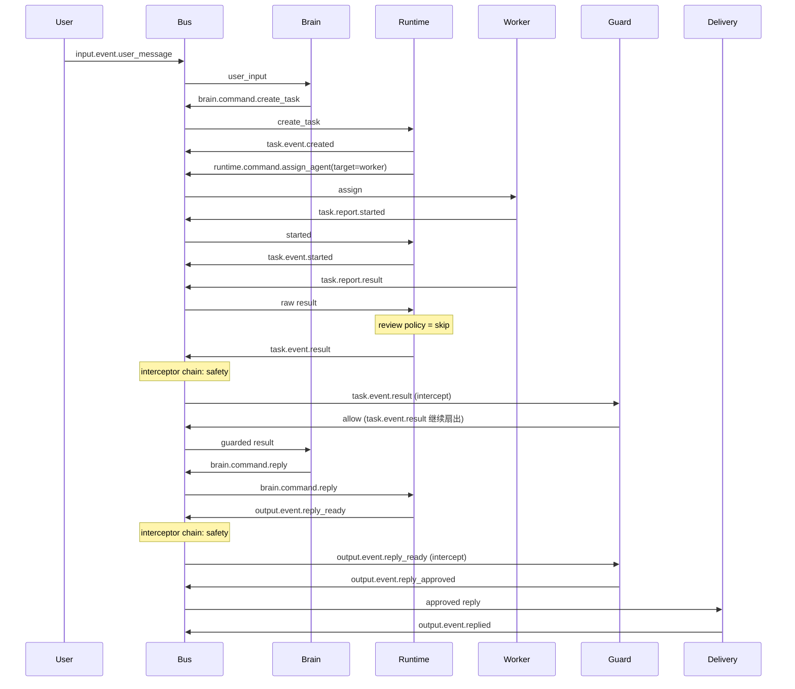

### 12.2 复杂任务（planner → worker → reviewer 全链路）

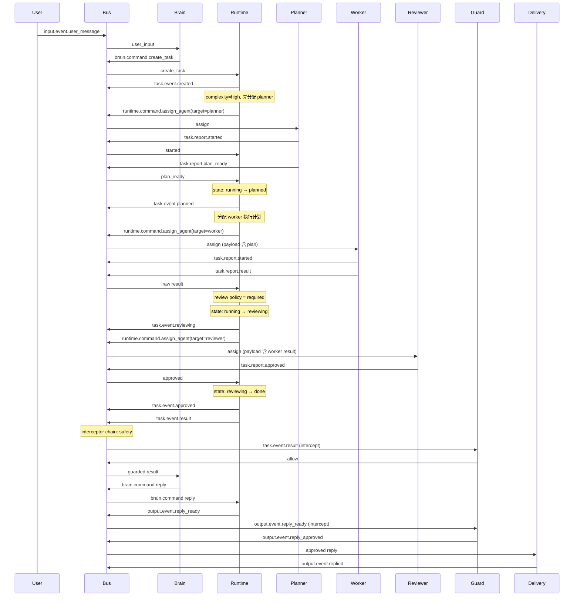

### 12.3 任务缺信息

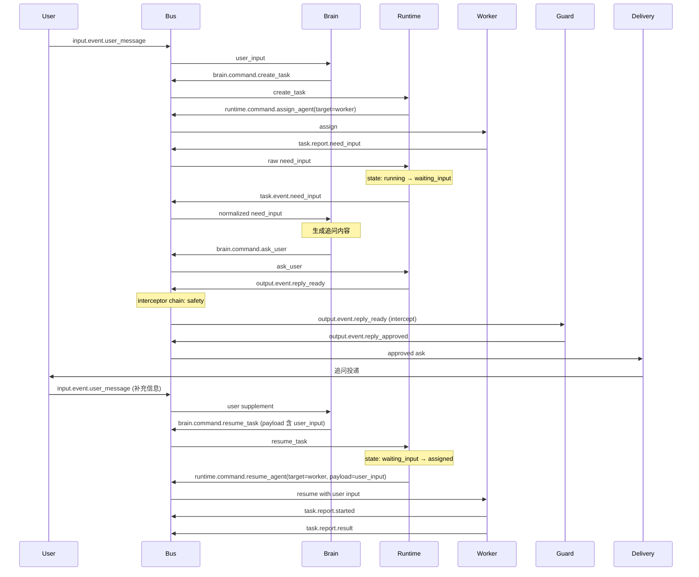

### 12.4 中断

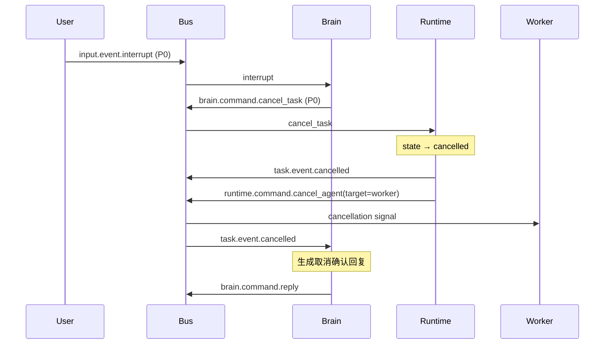

### 12.5 安全阻断

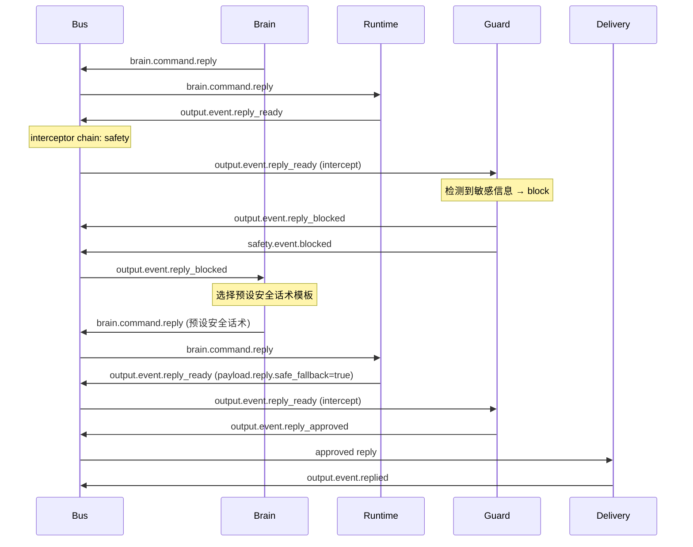

### 12.6 Reviewer 退回

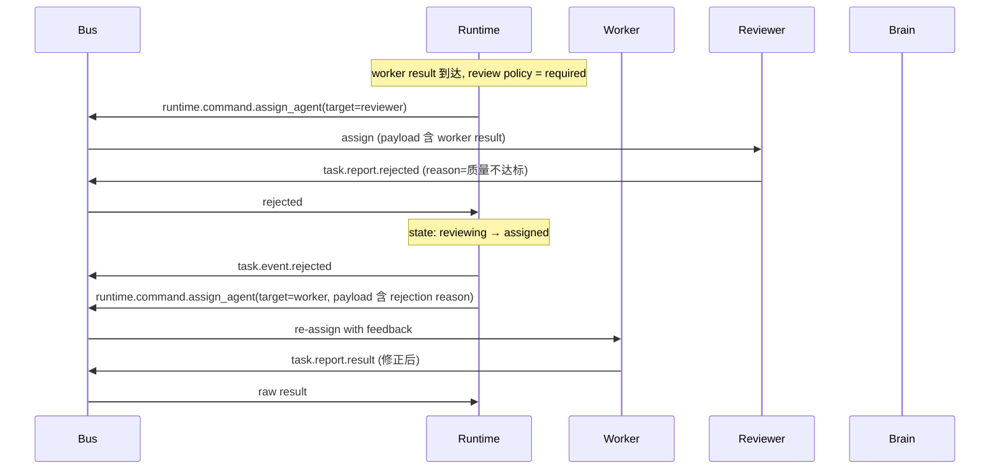

### 12.7 未来具身执行

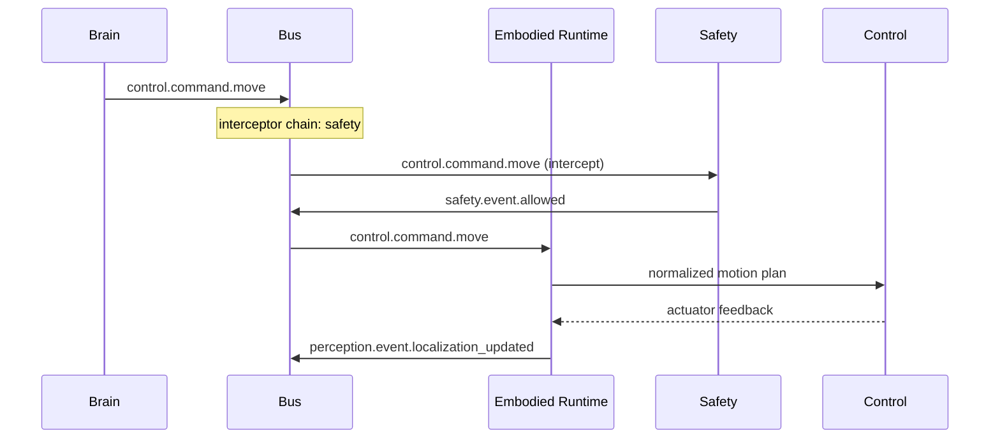

---

## 13. 可观测性与测试

### 13.1 必备指标

1. 各 priority 队列长度
2. 各 topic 消费延迟
3. 任务创建到完成耗时
4. need_input 次数
5. cancel/timeout 次数
6. redact/block 次数
7. agent 成功率与 reviewer 退回率

### 13.2 必备测试

1. envelope 校验测试
2. bus 优先级顺序测试
3. dedupe 幂等测试
4. runtime 状态机测试
5. brain 命令边界测试
6. worker -> runtime 事件归一化测试
7. safety redact/block 测试
8. 未来 embodied gate 占位测试

---

## 14. 执行阶段

以下阶段按“先定协议，再换主链路，再扩功能”的顺序推进。

### Phase 0: 协议冻结

目标：

1. 冻结 `BusEvent` envelope
2. 冻结 topic/event_type
3. 冻结 priority 模型
4. 冻结 task 状态机

产出：

1. `protocol/envelope.py`
2. `protocol/topics.py`
3. `protocol/priorities.py`
4. `runtime/state_machine.py`

验收：

1. 所有新逻辑不再定义裸 `dict event`
2. 测试对协议常量直接断言

### Phase 1: 引入 Priority Pub/Sub Bus

目标：

1. 替换当前简单 inbound/outbound queue
2. 支持 topic、priority、target
3. 支持 dedupe 和 backpressure
4. 支持 interceptor chain（前置拦截链）

产出：

1. `bus/pubsub.py`
2. `bus/priority_queue.py`
3. `bus/router.py`
4. `bus/interceptor.py`
5. `tests/test_protocol_bus.py`

验收：

1. `P0` 中断能抢占普通进度事件
2. 同一事件可定向路由到 brain/runtime/worker
3. interceptor 可以 allow/redact/block 事件，block 后普通订阅者收不到该事件

### Phase 2: Runtime 状态真相化

目标：

1. 让 runtime 成为唯一任务状态来源
2. Brain 只发命令，不再直接碰 live task
3. Worker 只发事件，不直接改任务状态

产出：

1. `runtime/task_store.py`
2. `runtime/scheduler.py`
3. `runtime/assignment.py`
4. `runtime/recovery.py`

验收：

1. 所有状态迁移只发生在 runtime
2. `need_input -> resume -> running` 链路完整可测

### Phase 3: Brain 内核重构

目标：

1. 收敛主脑职责
2. 统一 answer / ask_user / create_task / resume_task / cancel_task 五种决策
3. Brain 只发布 `brain.command.*`，不跨 topic 发布
4. Runtime 负责将 `brain.command.reply` / `brain.command.ask_user` 转化为 `output.event.reply_ready`
5. 任务失败和安全阻断均为终态处理，不做自动重试或循环重写

产出：

1. `brain/executive.py`
2. `brain/dialogue_policy.py`
3. `brain/task_policy.py`
4. `brain/reply_builder.py`

验收：

1. 用户可见回复只来自 brain（通过 `brain.command.reply` → runtime → safety → delivery）
2. 任务命令只来自 brain
3. Brain 的 bus 发布列表中不出现 `output.event.*` 或 `memory.signal.*`
4. 任务失败后 brain 直接告知用户，safety block 后 brain 发出预设安全话术

### Phase 4: Agent Team 收敛

目标：

1. 引入 `planner` / `worker` / `reviewer`
2. 默认简单任务直达 worker
3. 高复杂任务走 planner
4. reviewer 按策略触发，不默认全量介入

产出：

1. `agents/planner.py`
2. `agents/worker.py`
3. `agents/reviewer.py`
4. `agents/lc_agent.py`

验收：

1. 至少有一条任务链路能走 planner → worker → reviewer 全链路
2. planner 完成后发 `task.report.plan_ready`，runtime 迁移到 `planned` 状态并自动分配 worker
3. reviewer 退回（`task.report.rejected`）后 runtime 回退到 `assigned` 并重新分配 worker
4. 简单任务跳过 planner/reviewer 直接由 worker 完成

### Phase 5: Guard Layer 接入

目标：

1. 出站回复过滤
2. 工具结果过滤
3. 敏感信息识别

产出：

1. `safety/guard_layer.py`
2. `safety/outbound_guard.py`
3. `safety/tool_result_guard.py`
4. `safety/secret_filter.py`
5. `safety/pii_filter.py`

验收：

1. API key/私钥/password 可被 redact 或 block
2. 过滤结果有标准事件回执

### Phase 6: Memory Governor 收敛

目标：

1. 把人格、用户模型、任务经验、工具经验分层
2. 让 reflection 变成提案者，不是直接无限写入者

产出：

1. `memory/governor.py`
2. `memory/persona.py`
3. `memory/reflection.py`

验收：

1. persona/user model 写入有治理逻辑
2. 任务经验和人格记忆不混淆

### Phase 7: Embodied 占位接入

目标：

1. 固化 `control.command.*` 和 `perception.event.*`
2. 接入 `embodied_gate.py` 占位层
3. 默认运行在 `observe` 或 `soft_guard`

产出：

1. `embodiment/runtime.py`
2. `safety/embodied_gate.py`
3. `protocol` 中具身事件类型

验收：

1. 控制命令能被统一门控
2. 感知事件能进入 bus

### Phase 8: 文档与测试收口

目标：

1. README 更新
2. 架构边界测试补齐
3. 可观测性指标接入

产出：

1. 架构图
2. 状态机图
3. 测试矩阵

验收：

1. 项目主文档不再描述旧架构
2. 关键协议、状态机、guard 都有测试

---

## 15. 与当前 v3 的关系

当前 v3 已经基本进入本文档定义的主路径：

1. `ExecutiveBrain -> RuntimeKernel -> PriorityPubSubBus -> AgentTeam -> SafetyGuard -> DeliveryService -> MemoryGovernor` 主链已经落地。
2. `protocol/` 已经具备 envelope、commands、events、task models、memory/safety models 等冻结字段。
3. `runtime/` 已经以 `RuntimeKernel + RuntimeService + Scheduler + TaskStore + StateMachine` 作为状态真相层。
4. `execution/` 已从单执行器模型收敛为 `planner / worker / reviewer` 团队，当前 `worker` 由 `DeepAgentExecutor` 驱动。
5. `safety/guard.py`、`delivery/service.py`、`memory/governor.py` 已经接入总线闭环。

当前仍需持续收敛的点：

1. `worker` 的内部执行实现仍可继续简化，未来不一定长期依赖 deepagents 形态。
2. Memory Governor 目前已接线，但后续仍可继续细化反思子阶段与写入治理。
3. Embodied Runtime / Safety 仍主要是占位与协议预留，尚未进入真实执行期。

已经明确淘汰的旧思路：

1. `CompanionBrain -> SessionRuntime -> CentralExecutor` 单线串联模型
2. 只有 inbound/outbound 双队列的总线模型
3. 执行层直接与主脑耦合 live state
4. worker 层隐式写人格和长期记忆
5. 以运行日志代替结构化事件协议

---

## 16. 最终验收标准

当以下条件都成立时，说明架构已经收敛：

1. 用户只感知到一个稳定主体
2. 所有复杂任务都能通过 runtime 状态机追踪
3. 所有 agent 行为都通过统一 bus 和统一协议流转
4. 敏感信息可以被 guard 层过滤
5. 反思和记忆写入受 governor 控制
6. 接入具身 perception/control 时，不需要推翻主脑和 runtime

一句话验收标准：

`一个主脑做决策，一个 runtime 持状态，一个 bus 传事件，一组 agent 做执行，一个 safety 层守边界。`
