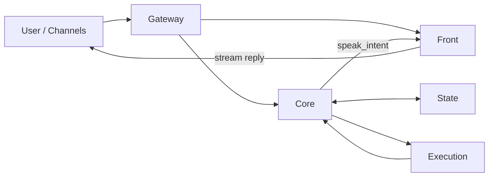

# Front + Core 重构文档

这份文档定义新的唯一架构。

目标只有一个：

- 完全放弃旧的 `Brain / Executor / World Model / ReflectionGovernor / Bus-heavy` 体系
- 不做兼容
- 不写过渡层
- 不保留旧协议语义
- 直接重建为 `Front / Core / Execution / State`

如果后续实现与本文冲突，以本文为准。

---

## 1. 架构结论

新的系统只有四个核心模块：

- `Front`
- `Core`
- `Execution`
- `State`

其中：

- `Front` 是唯一直接对用户说话的模块
- `Core` 是唯一主脑
- `Execution` 是唯一执行重任务的模块
- `State` 是唯一状态事实源

### 1.1 总体结构



### 1.2 时序原则

时序固定为：

1. 用户消息先进入 `Gateway`
2. `Gateway` 立即把消息投给 `Front`
3. `Front` 先对用户流式回复
4. 同一条消息再投给 `Core`
5. `Core` 后台处理状态、任务、记忆、反思、执行派发
6. 如需补充说明，`Core` 产出 `speak_intent`，再由 `Front` 发给用户

一句话：

`Front` 永远在前，`Core` 永远在后。

---

## 2. 模块职责

## 2.1 Front

`Front` 只负责用户体验。

允许做的事：

- 接收用户输入
- 快速流式回复
- 读取少量轻量上下文
- 接收 `Core` 的 `speak_intent`
- 把 `speak_intent` 翻译成自然用户可见文本

禁止做的事：

- 不维护任务真相
- 不直接调用重工具
- 不更新长期记忆
- 不决定任务规划
- 不直接触发执行层

`Front` 是嘴，不是脑。

## 2.2 Core

`Core` 是唯一主脑。

`Core` 内部包含两个子角色：

- `Main Agent`
- `Reflection Agent`

但这两个子角色都属于 `Core` 内部，不是新的顶层主体。

### 2.2.1 Core Main Agent

负责：

- 理解用户输入
- 读取记忆和世界状态
- 判断当前是闲聊、任务、继续任务、结束任务、切换焦点
- 生成认知层 / 长期层的最小记忆 patch
- 生成状态 patch
- 生成执行请求
- 决定是否触发反思
- 生成 `speak_intent`

### 2.2.2 Core Reflection Agent

负责：

- 浅反思
- 深反思
- 结晶
- 更新长期记忆
- 更新用户画像
- 更新 soul
- 必要时给 Main Agent 一个建议性 patch

禁止：

- 不直接对用户说话
- 不直接抢主任务控制权
- 不直接发执行任务

## 2.3 Execution

`Execution` 负责干活，不负责想。

允许做的事：

- 接收 `Core` 派发的重任务 / check
- 并发运行多个 job
- 调工具
- 执行代码、读写文件、跑命令、调用外部能力
- 返回终态结果

禁止做的事：

- 不直接对用户说话
- 不写长期记忆
- 不改主任务目标
- 不修改焦点任务
- 不做反思

`Execution` 是手脚，不是脑。

## 2.4 State

`State` 是唯一事实源。

`State` 存两类内容：

- `memory`
- `world_state`

注意：

- `memory` 不等于任务状态
- `world_state` 不等于聊天记录

---

## 3. 状态设计

## 3.1 Memory

这版架构只承认 3 个记忆本体层：

- 原始层
- 认知层
- 长期层

另外有 3 个辅助层：

- 检索索引层
- 用户画像 / 灵魂锚点层
- 当前状态层

原则：

- 只有 3 个记忆本体层算事实源
- 辅助层只能从记忆本体层推导，不能反过来当事实源
- `Execution` 不直接写长期记忆
- `Front` 不直接写记忆文件

### 3.1.1 记忆本体层

#### 原始层

文件：

- `session/<thread_id>/brain.jsonl`
- `session/<thread_id>/executor.jsonl`

用途：

- 保存原始对话
- 保存原始执行记录
- 作为最底层留痕

规则：

- append-only
- 不做语义总结
- 不在这里写用户画像
- 不在这里写长期结论

#### 认知层

文件：

- `memory/cognitive_events.jsonl`

用途：

- 保存每轮认知事件
- 保存浅反思结果
- 保存任务结果的认知摘要
- 记录当前轮是否需要继续深反思

规则：

- 以事件流方式追加
- 可以保留 outcome、reason、needs_deep_reflection 这类认知字段
- 这是短期认知层，不是长期画像层

#### 长期层

文件：

- `memory/memory.jsonl`

用途：

- 保存稳定长期事实
- 保存用户画像沉淀
- 保存角色风格沉淀
- 保存执行经验和反思结论

建议结构：

```json
{
  "summary": "",
  "memory_candidates": [
    {
      "memory_type": "relationship|fact|working|execution|reflection",
      "summary": "",
      "detail": "",
      "confidence": 0.0,
      "stability": 0.0,
      "tags": [],
      "metadata": {
        "subtype": "",
        "importance": 1
      }
    }
  ],
  "user_updates": [],
  "soul_updates": []
}
```

规则：

- 长期层才是稳定记忆唯一事实源
- 浅反思和深反思都可以产出长期候选
- `user_updates` 和 `soul_updates` 先进入长期层，再投影到锚点文件

### 3.1.2 辅助层

#### 检索索引层

文件：

- `memory/vector/`

用途：

- 给长期层做向量检索加速

规则：

- 不是事实源
- 可以从长期层重建
- 不允许直接写业务语义

#### 用户画像 / 灵魂锚点层

文件：

- `USER.md`
- `SOUL.md`

用途：

- 给 `Front` 和 `Core` 提供轻量可读的人格锚点
- 展示当前稳定的用户画像和角色内核

规则：

- 是长期层的投影结果
- 不是独立记忆层
- 不能绕过长期层直接成为系统真相

#### 当前状态层

文件：

- `current_state.md`

用途：

- 保存当前情绪、驱动和运行状态

规则：

- 它是状态，不是记忆
- 可以参与提示词拼装，但不参与长期记忆定义

### 3.1.3 长期层字段解释

单条 `memory_candidates` 结构：

```json
{
  "memory_type": "relationship|fact|working|execution|reflection",
  "summary": "",
  "detail": "",
  "confidence": 0.0,
  "stability": 0.0,
  "tags": [],
  "metadata": {
    "subtype": "",
    "importance": 1
  }
}
```

字段定义：

- `memory_type`
  - 记忆大类
- `summary`
  - 一句话摘要
- `detail`
  - 稍长正文
- `confidence`
  - 这条记忆是否可靠
- `stability`
  - 这条记忆是否长期稳定
- `tags`
  - 检索标签
- `metadata.subtype`
  - 更细的业务子类
- `metadata.importance`
  - 重要程度，建议 `1-5`

建议解释：

- `relationship`
  - 与用户关系状态
- `fact`
  - 稳定事实
- `working`
  - 长期仍有参考价值的工作背景
- `execution`
  - 执行层可复用经验
- `reflection`
  - 反思沉淀

### 3.1.4 读写权限

| 模块 | 原始层 | 认知层 | 长期层 | 辅助层 |
|------|--------|--------|--------|--------|
| `Front` | 不直接写，只读窗口摘要 | 不直接写 | 不直接读全量，只拿检索摘要 | 读 `USER.md` / `SOUL.md` / `current_state.md` |
| `Core Main Agent` | 只读最近窗口 | 读 | 读 | 读 |
| `Core Reflection Agent` | 读 | 追加 | 追加 / 合并 / 压缩 | 触发刷新投影 |
| `Execution` | 不直接访问 | 不直接访问 | 不直接访问 | 不直接访问 |
| `Runtime` | 负责原始层落盘 | 负责反思结果落盘 | 负责长期层落盘 | 负责索引和锚点刷新 |

### 3.1.5 记忆 patch 结构

`Core` 或 `Reflection` 不要回写整份 memory，只回 patch：

```json
{
  "cognitive_append": [],
  "long_term_append": [],
  "user_updates": [],
  "soul_updates": []
}
```

规则：

- 原始层由 runtime 自动追加，不通过 agent patch 写入
- `cognitive_append` 写认知层
- `long_term_append` 写长期层
- `user_updates` 和 `soul_updates` 先入长期层，再刷新 `USER.md` / `SOUL.md`
- `vector` 必须由长期层重建，不能单独成为第二事实源

## 3.2 World State

`world_state` 只存任务真相和运行状态。

建议结构：

```json
{
  "focus_task_id": "",
  "tasks": {
    "task_xxx": {
      "task_id": "",
      "title": "",
      "goal": "",
      "status": "running|done|failed",
      "plan": [],
      "current_step": "",
      "checks": [
        {
          "check_id": "",
          "title": "",
          "instructions": [],
          "workspace": "",
          "status": "pending|running|done|failed",
          "job_id": ""
        }
      ],
      "last_result": "",
      "artifacts": []
    }
  },
  "running_jobs": {
    "job_xxx": {
      "job_id": "",
      "task_id": "",
      "check_id": "",
      "status": "running"
    }
  },
  "updated_at": ""
}
```

规则：

- `Core` 是唯一 `world_state` 写入者
- `Execution` 只能返回结果，不能直接改状态
- 并发发生在 job 执行，不发生在状态写入

### 3.2.1 顶层字段解释

- `focus_task_id`
  - 当前用户主线焦点任务
  - `Front` 对用户说话时默认围绕它展开
- `tasks`
  - 所有活动任务池
- `running_jobs`
  - 当前执行层正在跑的 job
- `updated_at`
  - 最后更新时间

### 3.2.2 单个 task 字段解释

- `task_id`
  - 任务唯一 id
- `title`
  - 任务短标题
- `goal`
  - 任务最终目标
- `status`
  - `running|done|failed`
- `plan`
  - 当前任务的阶段列表
- `current_step`
  - 当前正在推进的阶段
- `checks`
  - 可交给执行层的小检查列表
- `last_result`
  - 最近一次重要结果摘要
- `artifacts`
  - 文件、链接、报告等产物

### 3.2.3 单个 check 字段解释

- `check_id`
  - check 唯一 id
- `title`
  - check 标题
- `instructions`
  - 执行指令列表
- `workspace`
  - 执行目录
- `status`
  - `pending|running|done|failed`
- `job_id`
  - 当前绑定的执行 job id

### 3.2.4 单个 running_job 字段解释

- `job_id`
  - job 唯一 id
- `task_id`
  - 归属任务
- `check_id`
  - 归属 check
- `status`
  - 当前运行态，建议至少支持 `running`

### 3.2.5 world_state patch 结构

`Core Main Agent` 不回整份状态，只回最小 patch：

```json
{
  "focus_task_id": "",
  "upsert_tasks": [],
  "remove_task_ids": [],
  "upsert_checks": [],
  "remove_check_ids": [],
  "upsert_running_jobs": [],
  "remove_job_ids": []
}
```

建议语义：

- `focus_task_id`
  - 只在确实切换焦点时填写
- `upsert_tasks`
  - 新建或覆盖任务
- `remove_task_ids`
  - 删除任务
- `upsert_checks`
  - 更新 check
- `remove_check_ids`
  - 删除 check
- `upsert_running_jobs`
  - 写入新的运行中 job
- `remove_job_ids`
  - job 完成或取消后移除

---

## 4. 事件流

系统只保留最少事件类型。

### 4.0 事件类型

- `user_event`
  - 用户输入
- `front_hint`
  - `Core` 给 `Front` 的补充说话意图
- `execution_request`
  - `Core` 派给 `Execution` 的任务
- `execution_result`
  - `Execution` 返回给 `Core` 的终态结果
- `reflection_request`
  - `Core Main Agent` 触发 `Reflection Agent`
- `reflection_result`
  - `Reflection Agent` 返回给 `Core Main Agent`

## 4.1 用户热路径

```text
User
  -> Gateway
  -> Front
  -> User
```

要求：

- 不等 `Core`
- 不等 `Execution`
- 先把用户体验做出来

## 4.2 后台主路径

```text
User Event
  -> Core Main Agent
  -> read State
  -> produce patch / speak_intent / dispatch_checks / run_reflection
  -> write State
  -> trigger Execution if needed
  -> trigger Reflection if needed
  -> emit speak_intent to Front if needed
```

## 4.3 执行路径

```text
Core
  -> Execution
  -> run job / check
  -> result
  -> Core
  -> apply state patch
```

## 4.4 反思路径

```text
Core Main Agent
  -> Reflection Agent
  -> read memory + world_state
  -> write memory patch
  -> optional suggestion back to Main Agent
```

---

## 5. Core 输出协议

`Core Main Agent` 每轮不要返回大而全的世界快照。

只返回增量动作：

```json
{
  "state_patch": {},
  "memory_patch": {},
  "dispatch_checks": [],
  "speak_intent": "",
  "run_reflection": false
}
```

解释：

- `state_patch`
  - 对 `world_state` 的最小变更
- `memory_patch`
  - 对认知层 / 长期层的最小变更，不涉及原始层
- `dispatch_checks`
  - 需要交给 `Execution` 的任务
- `speak_intent`
  - 需要 `Front` 转达给用户的话术意图
- `run_reflection`
  - 是否触发 `Reflection Agent`

不要做的事：

- 不返回完整 `world_state`
- 不返回完整 `memory`
- 不生成十几层嵌套的 JSON
- 不把工具执行细节塞回输出协议

### 5.1 Core Main Agent 输入

建议输入结构：

```json
{
  "trigger": {
    "event_type": "user_event|execution_result|reflection_result",
    "payload": {}
  },
  "memory": {
    "raw_layer": {
      "recent_dialogue": [],
      "recent_execution": []
    },
    "cognitive_layer": [],
    "long_term_layer": {
      "summary": "",
      "records": []
    },
    "projections": {
      "user_anchor": "",
      "soul_anchor": ""
    },
    "current_state": ""
  },
  "world_state": {},
  "front_observation": {
    "latest_user_text": "",
    "latest_front_reply": ""
  }
}
```

规则：

- 输入可以是结构化 JSON
- 但输出必须是小 patch，不要整份快照

### 5.2 `speak_intent` 结构

`Core` 不直接对用户说话，只给 `Front` 一个说话意图：

```json
{
  "mode": "none|reply|followup",
  "text": "",
  "priority": "low|normal|high"
}
```

字段：

- `mode`
  - `none` 不说
  - `reply` 正常补充
  - `followup` 后台结果回来的追加说明
- `text`
  - 建议转达内容
- `priority`
  - 给 `Front` 一个轻量优先级参考

### 5.3 `dispatch_checks` 结构

```json
[
  {
    "job_id": "",
    "task_id": "",
    "check_id": "",
    "goal": "",
    "instructions": [],
    "workspace": ""
  }
]
```

规则：

- `Core` 只派发 check，不派发完整任务
- 一次可以派发多个 check
- 但状态写入仍由 `Core` 串行完成

---

## 6. Execution 协议

输入：

```json
{
  "job_id": "",
  "task_id": "",
  "check_id": "",
  "goal": "",
  "instructions": [],
  "workspace": ""
}
```

输出：

```json
{
  "job_id": "",
  "task_id": "",
  "check_id": "",
  "status": "done|failed",
  "summary": "",
  "artifacts": [],
  "error": ""
}
```

规则：

- `Execution` 只能回传结果
- `Execution` 不返回用户可见话术
- `Execution` 不返回主线规划
- `Execution` 不直接写 `State`

### 6.1 Execution 输入字段解释

- `job_id`
  - 执行实例 id
- `task_id`
  - 所属任务
- `check_id`
  - 所属 check
- `goal`
  - 此次执行目标
- `instructions`
  - 明确执行指令
- `workspace`
  - 运行目录

### 6.2 Execution 输出字段解释

- `job_id`
  - 回填关联
- `task_id`
  - 回填关联
- `check_id`
  - 回填关联
- `status`
  - `done|failed`
- `summary`
  - 一句话结果摘要
- `artifacts`
  - 文件、报告、链接
- `error`
  - 失败时错误信息

### 6.3 artifacts 结构

```json
[
  {
    "type": "file|doc|link|report|note",
    "name": "",
    "value": ""
  }
]
```

---

## 7. Sleep-time 设计

`sleep-time` 是 `Core Reflection Agent` 的后台模式，不是新的顶层主体。

触发条件建议：

- 空闲一段时间
- 某轮任务结束
- 连续失败
- 上下文过长
- 明确要求反思

输出内容：

- 长期记忆更新
- 用户画像更新
- soul 更新
- 认知层压缩或合并

禁止：

- 不直接向用户发消息
- 不直接替换主任务
- 不直接派发执行任务

### 7.1 Reflection 输入结构

```json
{
  "reason": "idle|task_finished|repeated_failures|context_pressure|manual",
  "memory": {},
  "world_state": {},
  "recent_session": []
}
```

### 7.2 Reflection 输出结构

```json
{
  "memory_patch": {},
  "world_state_suggestion": {},
  "mode": "light|deep|crystallize|stop"
}
```

字段语义：

- `memory_patch`
  - 真正要落到记忆中的更新
- `world_state_suggestion`
  - 对 Main Agent 的建议，不直接强写
- `mode`
  - 本轮反思停在哪个阶段

### 7.3 反思阶段建议

- `light`
  - 当前轮的快速整理
- `deep`
  - 对反复问题、长期模式、关系演变做更深分析
- `crystallize`
  - 把深反思结论固化为长期结构
- `stop`
  - 本轮结束，不继续升级

---

## 8. 技术选型

新的实现只允许下面这套：

- `Front`
  - `LangChain` 直接模型调用
- `Core Main Agent`
  - `LangChain`
- `Core Reflection Agent`
  - `LangChain`
- `Execution`
  - `DeepAgents`
- `State`
  - 自己实现，建议 `SQLite + JSON`
- 调度
  - 原生 `asyncio`

明确不采用：

- 不把 `LangGraph` 作为总框架
- 不把旧 `brain/executor/session/runtime` 继续包壳复用
- 不为了兼容旧协议写 adapter 层

---

## 9. 目录结构

新的目录建议直接砍成：

```text
emoticorebot/
  front/
  core/
  execution/
  state/
  tools/
  skills/
  templates/
```

其中：

- `front/`
  - 用户可见回复逻辑
- `core/`
  - `main_agent`
  - `reflection_agent`
  - `core_runtime`
- `execution/`
  - `deepagent_runner`
  - `job_queue`
- `state/`
  - `memory_store`
  - `world_state_store`
  - `reducers`

### 9.1 目录落地建议

```text
emoticorebot/
  front/
    service.py
    prompt.py
    stream.py
  core/
    runtime.py
    main_agent.py
    reflection_agent.py
    schemas.py
    reducers.py
  execution/
    runtime.py
    deepagents_runner.py
    schemas.py
  state/
    memory_store.py
    world_state_store.py
    schemas.py
  tools/
  skills/
  templates/
```

### 9.2 文件职责建议

- `front/service.py`
  - 用户热路径主入口
- `front/prompt.py`
  - 前台提示词拼装
- `front/stream.py`
  - 流式输出收敛
- `core/runtime.py`
  - `Core` 调度主入口
- `core/main_agent.py`
  - 主脑调用和输出解析
- `core/reflection_agent.py`
  - 反思调用和输出解析
- `core/schemas.py`
  - `Core` 输入输出协议
- `core/reducers.py`
  - patch 应用逻辑
- `execution/runtime.py`
  - 执行派发和结果回收
- `execution/deepagents_runner.py`
  - `DeepAgents` 实际调用
- `execution/schemas.py`
  - 执行输入输出协议
- `state/memory_store.py`
  - 记忆读写
- `state/world_state_store.py`
  - 世界状态读写
- `state/schemas.py`
  - 状态 schema

---

## 10. 删除策略

这次重构不允许兼容旧架构。

允许做的事：

- 直接删除旧模块
- 直接删除旧测试
- 直接删除旧事件协议
- 直接删除旧文档

不允许做的事：

- 写兼容 adapter
- 写旧协议到新协议的 shim
- 旧 runtime 套新 runtime
- 为了保住旧测试而污染新架构

一句话：

`删旧的，不包旧的。`

---

## 11. 测试策略

只测新主线，不写兼容测试。

最小测试集合：

1. `Front` 可以流式回复
2. `Core Main Agent` 能产出 `state_patch / memory_patch / dispatch_checks / speak_intent`
3. `Execution` 能接收 check 并返回终态
4. `Core` 能在执行结果回来后再次更新状态
5. `Reflection Agent` 能把更新写入记忆

不要再写：

- 旧事件总线兼容测试
- 旧模块契约兼容测试
- 旧目录遗留行为测试

---

## 12. 迁移顺序

按下面顺序重建：

1. 先建 `state/`
2. 再建 `front/`
3. 再建 `core/main_agent`
4. 再建 `execution/`
5. 再建 `core/reflection_agent`
6. 最后接 `Gateway`

原因：

- 先把状态和边界立住
- 再接前台
- 再接主脑
- 最后接执行和反思

### 12.1 每一步产出物

1. `state/`
  - 能读写 `memory` 和 `world_state`
2. `front/`
  - 能独立流式回复
3. `core/main_agent`
  - 能产出 `state_patch / memory_patch / dispatch_checks / speak_intent`
4. `execution/`
  - 能执行 check 并返回 `execution_result`
5. `core/reflection_agent`
  - 能产出 `memory_patch`
6. `gateway`
  - 能把完整事件流串起来

---

## 13. 代码规则

为了避免代码再次变臭变长，强制遵守下面规则：

- 一个能力一个文件
- 不要 `adapter -> client -> runtime -> manager -> service` 五层套娃
- 一个模块最多一层薄包装
- patch 统一走一个入口
- 执行结果统一走一个入口
- 前台发言统一走一个入口

禁止：

- 为了“以后扩展”先加抽象层
- 为了“兼容老代码”先加桥接层
- 为了“测试方便”复制一套旧协议

---

## 14. 一句话结论

新的唯一架构就是：

`Front 先说，Core 后想，Execution 干活，State 记住一切。`

除此之外，不再保留第二套叙事。
