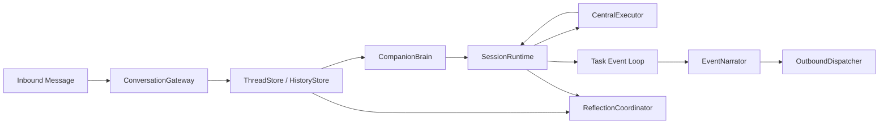

# EmotiCoreBot Non-Compatible Runtime Refactor

## Status

The `v3-max` branch now runs on the refactored architecture as its only production path.

The repository intentionally no longer keeps:

- compatibility wrappers for the previous runtime shape
- dual old/new runtime execution paths
- legacy task-system modules as pass-through shells

## Final Architecture

## Layer Responsibilities

### CompanionBrain

- owns user-turn interpretation
- decides whether to answer directly, ask for clarification, or create/resume a task
- remains the only user-facing subject

### RuntimeHost

- acts as the top-level application host
- wires gateway, brain, runtime manager, reflection, tools, and background services together
- does not replace `SessionRuntime`; it assembles it

### SessionRuntime

- owns per-session live execution state
- manages the task table, running handles, and input gate
- emits typed runtime events

### CentralExecutor

- executes one delegated task instance end to end
- integrates Deep Agents, tools, skills, and checkpoint-backed continuation
- returns structured `TaskExecutionResult`

### EventNarrator

- converts runtime events into companion-friendly narration inputs
- prevents low-level execution details from leaking into user-visible replies

### ThreadStore

- persists dialogue history and internal history
- provides reflection-ready and LLM-ready history windows
- does not store live runtime handles

## Runtime Contracts

The refactor moved runtime contracts into the `protocol/` package:

- `events.py`
- `submissions.py`
- `task_models.py`
- `task_result.py`

This is the core reason the runtime no longer depends on ad-hoc event dictionaries.

## Persistent Data Model

| Layer | Location | Purpose |
|------|----------|---------|
| dialogue history | `sessions/<session_key>/dialogue.jsonl` | user-visible conversation |
| internal history | `sessions/<session_key>/internal.jsonl` | compact brain/runtime/execution facts |
| central checkpoint | `sessions/_checkpoints/central.pkl` | execution continuation state |
| long-term memory | `memory/*.jsonl` | stable self, relation, and insight memory |
| skills | `skills/<name>/SKILL.md` | reusable execution instructions |

## Enforced Invariants

- one `SessionRuntime` owns all live state for a session
- `RunningTask` contains live handles only
- `RuntimeTaskState` remains serializable
- only one task can actively wait for user input at a time
- user-visible task events must pass through narration
- reflection consumes normalized input rather than runtime byproducts

## Cleanup Outcome

The cleanup phase removed the remaining legacy code shells and narrowed the repository to the final architecture.

The codebase now keeps:

- `bootstrap.py` for top-level application assembly
- `brain/` for user-turn decisions and narration
- `runtime/` for live execution control
- `execution/` for the Deep Agents execution kernel
- `session/` for thread persistence

## Verification

The refactor is guarded by focused tests covering:

- architecture boundaries
- runtime state transitions
- thread store behavior

The branch goal can now be summarized in one sentence:

`CompanionBrain decides, SessionRuntime executes, ThreadStore remembers.`
