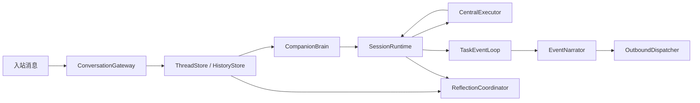

# EmotiCoreBot Runtime 非兼容重构终态文档

## 1. 当前状态

`v3-max` 分支已经切到新架构主通路，仓库内不再保留兼容层、双轨运行时或旧任务系统壳。

本次重构的最终目标已经落地为一句话：

`CompanionBrain 负责决策，SessionRuntime 负责执行，ThreadStore 负责记忆。`

## 2. 最终主通路

主线含义非常明确：

1. `ConversationGateway` 接住用户输入并准备上下文
2. `CompanionBrain` 决定直接回复、追问，还是创建/续跑任务
3. `SessionRuntime` 持有 session 级 live state，并驱动任务执行
4. `CentralExecutor` 负责复杂任务执行与工具调用
5. `TaskEventLoop` 消费 runtime event
6. `EventNarrator` 决定哪些事件需要转述给用户
7. `OutboundDispatcher` 负责真正发出消息
8. `ReflectionCoordinator` 在首响之后异步沉淀记忆与反思

## 3. 分层职责

### 3.1 CompanionBrain

职责：

- 理解用户意图
- 保持关系连续性与陪伴语气
- 决定是否委托执行
- 决定如何对用户表达最终结果

非职责：

- 不持有任务表
- 不管理运行句柄
- 不直接消费底层执行轨迹

### 3.1.1 RuntimeHost

职责：

- 作为顶层应用宿主，装配 gateway、brain、runtime manager、reflection、tools 和后台服务
- 提供 `run/process_direct/stop` 这类应用级入口

边界：

- 不替代 `SessionRuntime`
- 不承担 session 级执行内核职责

### 3.2 SessionRuntime

职责：

- 持有单个 session 的全部 live execution state
- 管理 task table、running handles、input gate
- 处理任务创建、恢复、取消、等待输入、完成与失败
- 发出 typed runtime events

### 3.3 CentralExecutor

职责：

- 执行单次复杂任务
- 对接 Deep Agents、工具、技能和 checkpoint
- 将执行结果收敛为 `TaskExecutionResult`

边界：

- 不直接写外发通道
- 不接管陪伴表达
- 不拥有 session 级调度权

### 3.4 EventNarrator

职责：

- 把 runtime 的高层事件转成可叙述输入
- 过滤不该直接暴露给用户的内部执行细节

### 3.5 ThreadStore

职责：

- 持久化对话历史
- 持久化内部历史
- 为脑层与反思层提供 LLM-ready window

边界：

- 不持有 live runtime handle
- 不存放 runner / future / 输入门控对象

## 4. 协议层

运行时协议已经统一收拢到 `emoticorebot/protocol/`：

- `events.py`
- `submissions.py`
- `task_models.py`
- `task_result.py`

这一步的意义是：

- runtime 不再依赖裸 `dict event`
- 任务输入输出字段有明确契约
- 状态机和边界测试可以围绕协议编写

## 5. 运行时不变量

当前架构默认保证以下不变量：

1. 一个 `SessionRuntime` 持有一个 session 的全部 live state
2. `RunningTask` 只保留 live handle，不承担可序列化公开状态
3. `RuntimeTaskState` 保持可序列化，可持久化，可测试
4. 同时只有一个任务可以处于主动等待用户输入的状态
5. 用户可见的任务事件必须经过 narrator 层
6. reflection 只消费规范化输入，不消费临时副产物

## 6. 持久化模型

| 层级 | 位置 | 用途 |
|------|------|------|
| 对话历史 | `sessions/<session_key>/dialogue.jsonl` | 用户可见对话 |
| 内部历史 | `sessions/<session_key>/internal.jsonl` | 主脑决策、任务摘要、规范化执行事实 |
| 中央执行断点 | `sessions/_checkpoints/central.pkl` | Deep Agents 恢复状态 |
| 长期记忆 | `memory/*.jsonl` | 自我、关系、洞察、认知事件 |
| 技能 | `skills/<name>/SKILL.md` | 可复用执行工作流 |

## 7. 异步执行语义

`RunningTask` 对应的是一次 live 异步执行实例。

它的语义不是“一次简单同步调用”，而是：

- 可启动
- 可持续上报进度
- 可被输入门控暂停
- 可在用户补充信息后恢复
- 可完成、失败或取消

因此 runtime 里的“running task”本质上就是 session 级异步执行单元。

## 8. 清理结果

这一轮收口完成后，仓库中的旧残留已经被进一步清理：

- 执行层技能加载与 Deep Agents 接线统一迁到 `execution/`
- 脑层文案改为 `SessionRuntime` 语义
- README 与重构文档改写为终态视角
- 生成缓存与旧壳目录进入清理范围

系统装配宿主已经外移到 `emoticorebot/bootstrap.py`，`runtime/` 目录只保留执行内核。

## 9. 测试与验证

当前分支已经用以下方向做边界验证：

- 架构边界测试
- runtime 状态机测试
- thread store 测试

目标不是证明“历史实现还能跑”，而是固化“新架构只能按新边界工作”。

## 10. 最终结论

这次非兼容重构的结果不是把旧系统换个目录，而是把职责彻底重新归位：

- `bootstrap.py` 只管系统装配宿主
- `brain/` 只管决策与叙述
- `runtime/` 只管 live execution control
- `execution/` 只管复杂任务执行
- `session/` 只管历史持久化

这也是当前仓库最重要的结构结论。
