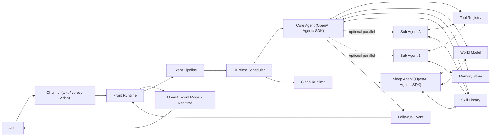

# OpenAI Agents 架构文档

## 1. 目标

这版架构直接面向下面的目标：

- 前台快
- 后台强
- 不要旧的 `task / check / execution runtime`
- 不要让 `runtime` 再请求 LLM 生成任务
- 不要让 `core` 每轮输出大 JSON patch
- 保留三层记忆
- 保留世界模型
- 保留异步 `sleep agent`
- 允许按需启用并行子 agent，但不把它做成默认主线

一句话：

`前台负责说话，runtime 负责调度，core 负责思考，sleep 负责沉淀。`

---

## 2. 总览

最终模块只有这些：

- `Front Runtime`
- `Runtime Scheduler`
- `Core Agent`
- `Sleep Runtime`
- `Sleep Agent`
- `Memory Store`
- `World Model`
- `Skill Library`
- `Tool Registry`

其中：

- `Front Runtime`
  - 用户可见层
- `Runtime Scheduler`
  - 事件调度层
- `Core Agent`
  - 唯一主脑
- `Sleep Agent`
  - 后台反思脑

---

## 3. 架构图



---

## 4. 核心原则

### 4.1 前台不是主脑

前台只负责：

- 流式输出
- 语音输入输出
- 陪伴感
- 用户可见回复

前台不负责：

- 任务规划
- 工具循环
- 记忆写入
- 世界模型更新

### 4.2 runtime 不是脑子

`Runtime Scheduler` 只负责：

- 接收事件
- 路由事件
- 维护并发边界
- 调用 `Core Agent`
- 调用 `Sleep Agent`
- 转发 followup 给前台

`Runtime Scheduler` 不负责：

- 请求 LLM 生成任务
- 请求 LLM 生成 patch
- 自己做决策

一句话：

`runtime 只跑流程，不产生命令。`

### 4.3 Core Agent 是唯一主脑

`Core Agent` 是唯一负责决策的模块。

它负责：

- 读取用户事件
- 读取记忆
- 读取世界模型
- 自己做 tool loop
- 决定是否继续调用工具
- 决定是否触发 followup
- 决定是否按需启动子 agent
- 决定是否触发 sleep

它不负责：

- 自己直接写底层存储文件
- 自己承担前台流式交互

### 4.4 Sleep Agent 是后台异步脑

`Sleep Agent` 只负责：

- 认知整理
- 长期沉淀
- 用户画像更新
- soul 更新
- 对世界模型提出后台建议或直接更新允许写入的部分

`Sleep Agent` 不负责：

- 直接回复用户
- 抢当前前台主线

---

## 5. 为什么选 OpenAI Agents SDK

这版架构里：

- `Core Agent` 使用 `OpenAI Agents SDK`
- `Sleep Agent` 也可以使用 `OpenAI Agents SDK`

原因：

- 不需要旧的 `execution runtime`
- `Core` 不再输出大 JSON patch
- `Core` 可以直接做 tool loop
- 后续若要加 handoff 或子 agent，可以按需扩展

这里要明确：

- 前台不是 `Agents SDK`
- 前台仍然是普通流式模型或 `Realtime`
- 后台才是 agent runtime

一句话：

`前台用 OpenAI 的实时交互能力，后台用 OpenAI Agents SDK。`

---

## 6. 主线流程

### 6.1 用户热路径

```text
User
  -> Front Runtime
  -> Front Model / Realtime
  -> User
```

要求：

- 优先快
- 优先流式
- 不等后台完成

### 6.2 后台主线

```text
Front Runtime
  -> Event Pipeline
  -> Runtime Scheduler
  -> Core Agent
  -> Tool Registry / Memory / World Model / Skills
  -> optional Followup Event
  -> Front Runtime
```

### 6.3 Sleep 路径

```text
Runtime Scheduler
  -> Sleep Runtime
  -> Sleep Agent
  -> Memory Store
  -> World Model
```

---

## 7. 事件管道

这版不要任务系统，只保留轻量事件流。

建议事件类型：

- `user_event`
  - 用户输入事件
- `core_run`
  - runtime 调度 core
- `tool_call`
  - core 发起工具调用
- `tool_result`
  - 工具结果返回
- `front_followup`
  - core 需要补一句给用户
- `sleep_trigger`
  - 触发 sleep
- `sleep_result`
  - sleep 完成后的更新

如果需要运行态跟踪，只保留极小字段：

```json
{
  "run_id": "",
  "thread_id": "",
  "source_event_id": "",
  "status": "running|done",
  "updated_at": ""
}
```

这不是任务系统，只是运行态追踪。

---

## 8. Core 并发规则

### 8.1 同一线程

同一个 `thread / session`：

- 只允许一个 `Core Agent` 在跑

原因：

- 避免抢世界模型
- 避免抢记忆
- 避免两套口径同时解释给用户

### 8.2 不同线程

不同线程可以并行多个 `Core Agent`。

例如：

- 文本会话
- 语音会话
- 视频会话

### 8.3 子 agent

`Sub Agent` 是可选能力，不是默认主线。

规则：

- 默认不用
- 只有重任务才按需拉起
- 并行由 `runtime` 控制，不让 prompt 里硬编排
- `Core` 仍然是唯一主脑

一句话：

`主脑单线，手脚按需并行。`

---

## 9. 世界模型

这版世界模型必须极小，不再维护 `task / check / running_jobs`。

建议结构：

```json
{
  "focus": "",
  "mode": "chat|acting|waiting",
  "recent_intent": "",
  "last_tool_result": "",
  "open_threads": [],
  "updated_at": ""
}
```

字段说明：

- `focus`
  - 当前注意力焦点
- `mode`
  - 当前状态
- `recent_intent`
  - 最近一轮主要意图
- `last_tool_result`
  - 最近一次工具结果摘要
- `open_threads`
  - 仍在继续的上下文线索
- `updated_at`
  - 更新时间

建议双存：

- `state/world_model.json`
  - 代码事实源
- `world_model` memory block
  - 给 `Core Agent` 看见的上下文镜像

规则：

- 事实源在代码层
- LLM 不直接生成整份世界模型
- runtime 控制落盘

---

## 10. 记忆设计

三层记忆继续保留：

- 原始层
- 认知层
- 长期层

辅助层继续保留：

- 向量索引
- 用户画像
- soul
- 当前状态

建议文件：

- `session/<thread_id>/brain.jsonl`
- `session/<thread_id>/tool.jsonl`
- `memory/cognitive_events.jsonl`
- `memory/memory.jsonl`
- `USER.md`
- `SOUL.md`

规则：

- 前台不直接写长期记忆
- `Core Agent` 可以触发认知写入
- `Sleep Agent` 负责深度沉淀

---

## 11. Skills

`OpenAI Agents SDK` 不会自动加载 `skills/`。

因此这版架构里：

- `skills` 由 runtime 自己检索和注入

推荐做法：

### 11.1 Prompt 注入型

适合：

- 风格
- 规则
- 工作流
- 结晶经验

流程：

1. runtime 根据用户输入、世界模型、记忆检索相关 skills
2. 取摘要或正文
3. 注入给 `Core Agent` 或 `Sleep Agent`

### 11.2 Tool 型

适合：

- 结构化经验包
- 某类固定技能入口

原则：

- `Skill` 不是 agent
- `Skill` 是经验包

---

## 12. 工具层

工具层不再单独命名为 `Execution Runtime`。

这版只有：

- `Tool Registry`

它可以包含：

- `read_file`
- `write_file`
- `exec`
- `web_search`
- `fetch_webpage`
- `memory_search`
- `memory_write`
- `world_model_read`
- `world_model_write`
- `skill_search`

`Core Agent` 直接调工具。

不再有：

- 任务派发层
- check 层
- execution patch 层

---

## 13. Sleep Agent

`Sleep Agent` 采用单 agent 方案，不保留原始 Letta 多 agent group 抽象。

虽然提取出来的 `kernel` sleeptime 来源于 multi-agent 架构，但在当前项目中应压平成单实例：

- 一个 `Sleep Runtime`
- 一个 `Sleep Agent`

保留的东西：

- 频率门控
- transcript 构造
- last processed message 跟踪

删除的东西：

- group
- manager agent
- 多个 sleeptime agent 列表
- 多播调度

一句话：

`来源可以是多 agent，当前实现必须压平为单 sleep agent。`

---

## 14. Front

前台允许用 OpenAI，但用的是交互能力，不是 agent runtime。

前台可以有两种模式：

- 文本前台
  - 普通流式模型调用
- 语音前台
  - Realtime / speech pipeline

前台规则：

- 先回复用户
- 回复要轻
- 不等待后台全部完成
- 不主动进入工具循环

一句话：

`前台用模型，后台用 agent。`

---

## 15. 目录建议

建议目录：

```text
emoticorebot/
  front/
  runtime/
  core/
  sleep/
  state/
  tools/
  skills/
  templates/
```

建议职责：

- `front/`
  - 用户可见交互
- `runtime/`
  - 事件管道和调度
- `core/`
  - `OpenAI Agents SDK` 主脑封装
- `sleep/`
  - sleep runtime 和 sleep agent 封装
- `state/`
  - memory store / world model store
- `tools/`
  - 工具注册
- `skills/`
  - 经验包
- `templates/`
  - prompt 模板

---

## 16. 明确不要的东西

这版明确不要：

- 不要旧的 `task / check / running_jobs`
- 不要旧的 `execution runtime`
- 不要 runtime 再请求 LLM 生成任务
- 不要 `Core` 再输出大 JSON patch
- 不要多个主脑同时抢同一线程
- 不要把 Letta 整坨继续当内核底座

只保留 Letta 值得借鉴的思想：

- memory block
- sleeptime
- 长期记忆
- 世界模型意识

---

## 17. 最终结论

最终方案：

- `Front`
  - OpenAI 实时/流式交互能力
- `Runtime`
  - 纯调度
- `Core`
  - `OpenAI Agents SDK`
- `Sleep`
  - `OpenAI Agents SDK`
- `Memory / World Model / Skills`
  - 自己掌控

一句话最终版：

`Front 负责即时交互，Core 负责直接动手，Sleep 负责事后沉淀，Runtime 只负责把这一切串起来。`
